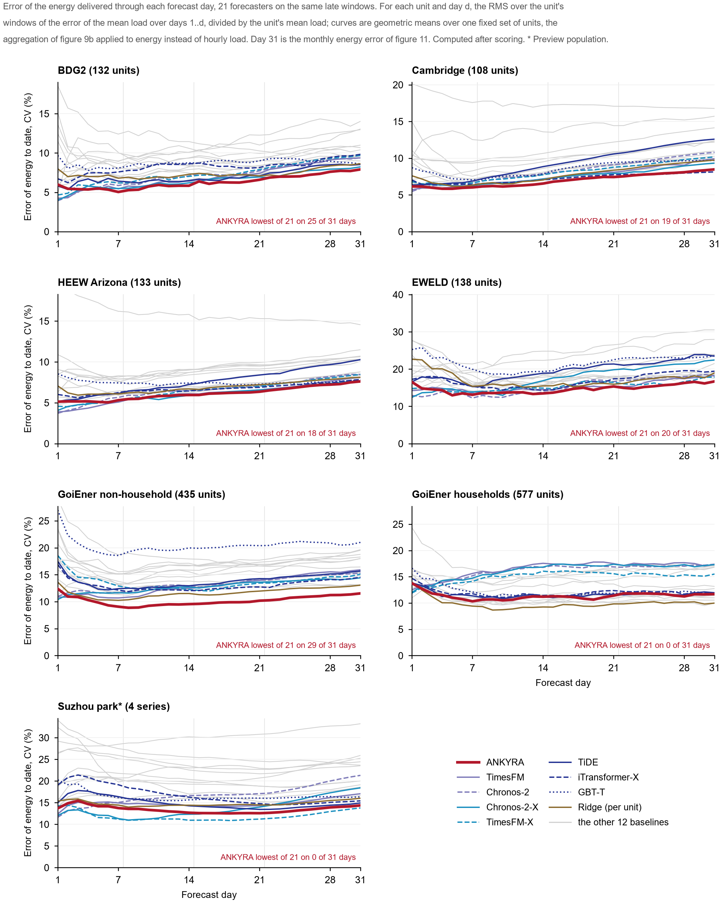

# ANKYRA

**Anchoring a time-series foundation model to each unit's own history for month-ahead load forecasting**

[中文说明](README.zh-CN.md) · [Method](docs/METHOD.md) · [Theory](theory/) · [Evaluation](docs/EVALUATION.md) · [Results data](results/)

**Version 2.0.0** — all three blocks anchored to the unit's own history (the within-day shape since 2.0). The 1.x
results are kept in [`results/ankyra_1x/`](results/ankyra_1x/); `within_anchor=False` reproduces 1.x.


Pretrained time-series foundation models reproduce the shape of a day well, but over a 31-day horizon their monthly
level follows the last few days and drifts. A supply point's own history anchors the month, but reacts slowly and cannot
represent a load that has switched off. **ANKYRA** (Greek *ἄγκυρα*, anchor) uses each source where it is reliable, and
lets the unit's own forecast record decide where that is.

- A 744-hour forecast splits exactly into a **level**, a **centred daily path** and a **within-day shape**. The blocks are
  orthogonal, so their squared errors add.
- The level and daily path come from six historical candidates plus the foundation model's own level. Each unit's
  errors at earlier pseudo-origins weight them, and the **same errors decide how much of the month to hand over** to
  the foundation model.
- The within-day shape starts from **TimesFM 2.5** (zero-shot). Since **2.0** it is anchored too: the unit's own
  analog-day shape competes with the model's, with a weight set by the unit's errors at three completed pseudo-origins,
  shrunk towards the model and capped at one half. All three blocks are now anchored the same way.
- A unit that has been **off for a week** is handed to the foundation model entirely.
- **Nothing is trained on the target series.** Every weight is a function of the unit's completed pseudo-forecasts.
- Three **readout operators** reuse the same computation:
  - energy from the level;
  - a monthly peak from a historical excursion envelope;
  - a prediction interval from pseudo-forecast residuals.
- The design choices and their limits are explained by **exact properties**: identities, bounds and the counterexamples
  that mark where they stop. They are kept in their own folder, [theory/](theory/), apart from the forecaster in
  [ankyra/](ankyra/): each has a proof, an operator and a numerical check.

## What changed in 2.0

- **Within-day anchoring.** 1.x took the foundation model's within-day shape unchanged, although that block carries
  36–45% of the hourly squared error on buildings. 2.0 lets the unit's own analog days (same calendar type, within
  ±14 days of the same day of year, same daylight-saving state; up to eight, chosen by temperature) correct it, by the
  same error-weighted rule the other blocks use. Level, daily path, energy and peak readouts are unchanged.
- **Effect** (post-cutoff test windows, 2.0 against 1.x): Cambridge +2.9%, GoiEner non-household +3.8%, BDG2 +0.9%,
  HEEW +0.8% (all resolved), EWELD +0.4%, households −0.1% (not resolved); Oslo +4.2%, Drammen +3.4%, CINELDI +2.0%,
  Suzhou park +2.9% on all windows (all resolved). No extra foundation-model call.
- **Evidence status.** The 2.0 rule was developed after the test populations had been scored for 1.x, selected on the
  three development populations and on the pre-cutoff windows of the test cohorts, and evaluated once on the
  post-cutoff windows under a frozen protocol. Those windows had been read before; the 2.0 test numbers are a
  re-evaluation, not a first read ([details](docs/EVALUATION.md#within-day-anchoring-20)). LCL stays unread.
- `forecast(..., within_anchor=False)` reproduces 1.x exactly; `foundation=None` gives a history-only configuration.
  The 1.x result files are kept in [`results/ankyra_1x/`](results/ankyra_1x/).

## No information after the origin

At an origin, ANKYRA uses only what is known at that moment.

- **Inputs.** It receives:
  - load and temperature up to the origin;
  - the calendar of the forecast month (weekday or public-holiday type);
  - the unit's category.

  The interface has no argument for future load or weather.
- **Weather.** Future temperature enters only as an expectation formed before the origin: an annual harmonic of past
  temperatures plus a fixed anomaly scale. Observed future weather is never used.
- **Weights.** Every weight is estimated at pseudo-origins inside the record, whose targets end by the origin. Each
  level pseudo-forecast uses only data before its own pseudo-origin.
- **Foundation model.** TimesFM receives only the 1,344 hours before each origin or pseudo-origin.
- **Checked by tests.** [`tests/test_no_future_information.py`](tests/test_no_future_information.py) changes every value
  after the origin, or after each pseudo-origin. It checks that the forecast, the model's inputs, the pseudo-origin
  errors and the interval stay bit-identical.
- **Evaluation.**
  - The baselines receive the same information set, with leakage assertions on feature and lag time indices,
    normalisation statistics and training-target ends.
  - Trained baselines are scored only after their training cutoff.
  - The six test populations were scored once for 1.x, after the model was fixed, and nothing was tuned on them. The
    2.0 within-day rule was then developed on the pre-cutoff windows of the same cohorts and re-evaluated on the
    post-cutoff windows under a frozen protocol ([details](docs/EVALUATION.md#within-day-anchoring-20)).

**What the tests show, and what they do not.** The tests establish input isolation in the implementation: nothing
recorded after the origin reaches the computation. They do not by themselves show that the inputs are free of later
information. Three sources lie outside the implementation:

- the providers' data preparation, such as gap filling (imputed or zero-filled hours are masked where documented);
- weather archives, whose past values may have been quality-controlled later;
- the pretraining corpora of TimesFM 2.5 and Chronos-2, which may contain some evaluation series (seven BDG2 sites are
  listed in them). This could favour every forecaster built on these models, ANKYRA included
  ([limitations](docs/EVALUATION.md#limitations)).

The information set is detailed in [docs/METHOD.md](docs/METHOD.md#information-at-the-origin).

## Inputs and features: one information set for every forecaster

A comparison is only meaningful when the forecasters are given the same information. The shared information set was
fixed in writing before the baselines were run. ANKYRA receives it as the raw record (load, temperature, day types,
category) and forms its own quantities from it; the same-information baselines receive it as engineered features.
**Nothing in the set is observed after the origin.**

**Hourly features** (past = the 1,344-hour context, future = the 744-hour horizon):

| # | Feature | Past | Future | Construction | What ANKYRA makes of it |
|---|---|:---:|:---:|---|---|
| 1 | load | observed | — | per-unit z-score; statistics from the context or from before the training cutoff | level and daily-path candidates, analog-day shapes, pseudo-origin errors, the foundation model's context |
| 2 | temperature | observed | climatology | horizon values are an annual harmonic fitted on pre-origin temperature; **observed future temperature is never used** | weather-adjusted level and path candidates, analog-day selection |
| 3 | load one year earlier | ✓ | ✓ | $t-8{,}736$ h (52 weeks, weekday-aligned; always before the origin), 0 where missing | the annual level and path candidates |
| 4 | availability of 3 | ✓ | ✓ | 1 where feature 3 is observed | annual candidates switched off without support |
| 5–6 | hour of day | sin, cos | sin, cos | period 24 | the hour grid of every block |
| 7–8 | weekday | sin, cos | sin, cos | period 7 | day types Monday … Sunday |
| 9–10 | day of year | sin, cos | sin, cos | period 365.25 | climatology phase, analog-day window (±14 days) |
| 11 | holiday / non-working day | ✓ | ✓ | public holiday or Saturday/Sunday | day type 7 in every day-typed quantity |

That is 11 past and 10 future dimensions (features 2–11). **Static features** (6 dimensions): the unit's category
(Industrial, Office, Public, Residential, Commercial; one-hot) and the log ratio of its long-history mean to its
context mean. ANKYRA 2.0 has one further input, the daylight-saving rule of the region (EU, US or none), a calendar
fact used only to keep analog days in the same daylight-saving state.

**How each forecaster receives the set**

| Forecaster | Receives | Not accepted by the architecture |
|---|---|---|
| ANKYRA | the raw record behind all 11 + 10 + 6 features, plus the foundation model's forecasts at the origin and pseudo-origins | — |
| TiDE | 11 past, 10 future, 6 static | — |
| iTransformer-X | 11 past as variable channels, 6 static as constant channels | future covariates |
| GBT-T | 21 features per forecast hour derived from the set (load aggregates, features 3–4, temperature, calendar, lead time, static) | raw sequences |
| Chronos-2-X | features 2–11 as past and known-future covariates | static features |
| TimesFM-X | features 2–11 through its linear covariate regression, the category as a categorical covariate | nonlinear covariate effects |
| PatchTST | the same channels, but it is channel-independent: its load forecast equals the load-only one | information between channels |
| load-only models (TimesFM, Chronos-2, DLinear, iTransformer, LSTM, Holt–Winters, MSTL, naive and profile forecasters) | feature 1 only | — |
| per-unit ridge | calendar and climatological temperature, refitted at every origin | — |

**Deliberately excluded everywhere:** observed future weather; humidity and other meteorological variables
(available for one population only); hand-made signal transforms (smoothing, wavelet, Fourier or EMD decompositions),
which add no information and are a common source of look-ahead. Every feature's time index is checked by assertions
(lags, normalisation statistics and training-target ends before the origin or the cutoff). The full specification is
in [docs/METHOD.md](docs/METHOD.md#inputs-and-features-the-shared-information-set).

## Results on six test populations

Five of the 20 baselines were given **ANKYRA's information set**: past load and temperature, climatological future
temperature, the load one year earlier, calendar features and unit category. They are per-population trained TiDE,
iTransformer-X and a gradient-boosting model (GBT-T), and covariate-conditioned Chronos-2 and TimesFM.

Each uses the part its architecture accepts:

- iTransformer-X takes no future covariates;
- Chronos-2-X takes no static features;
- TimesFM-X uses the covariates through a linear regression;
- GBT-T receives 21 features derived from the set. Its first implementation mis-scaled flat or all-zero contexts; the
  corrected version is reported ([details](docs/EVALUATION.md#correction-of-the-gbt-t-baseline)).

PatchTST is channel-independent, so its forecast is the same with or without these inputs. The six test populations
were scored **once, after the model had been fixed**, for 1.x; the 2.0 numbers below are the re-evaluation described
above.

**Primary estimand.** The primary estimand is the unit-equal log RMS ratio, with 95% intervals from resampling units
and months. A contrast is *resolved* when its interval excludes zero. The mean per-unit rank is a secondary summary: it
stays defined when some units have zero error, but it does not replace the ratio.

| Test population | Country | Units / windows | Resolved better than (of 20) | …of them, same-information (of 5) | Resolved worse than | Rank among 21 |
|---|---|---:|:---:|:---:|:---:|:---:|
| BDG2 2017 (commercial and institutional meters) | USA / Europe | 142 / 474 | 10 | 2 | — | 1 |
| University of Cambridge estate | UK | 108 / 730 | 17 | 2 | — | 1 |
| HEEW, Arizona State University campus | USA | 138 / 658 | 17 | 4 | — | 1 |
| EWELD industrial and commercial meters | China | 197 / 523 | 18 | 5 | — | 1 |
| GoiEner non-household supply points | Spain | 481 / 890 | 17 | 4 | — | 1 |
| GoiEner households | Spain | 696 / 696 | 16 | 3 | TimesFM (3.9%) | 2 |

Windows are those after each population's training cutoff, where all 21 forecasters are available. (ANKYRA 1.x: 10,
16, 16, 18, 15, 16 resolved wins; ranks 1, 2, 1, 1, 1, 2.)

- On the test populations **ANKYRA is never resolvably worse than any baseline given its information set**.
- Among those five baselines, it is resolvably better than:
  - TiDE on all six populations;
  - GBT-T on five;
  - iTransformer-X and TimesFM-X on four;
  - Chronos-2-X on one (EWELD).
- Among the load-only statistical models, it is resolvably better than Holt–Winters on all six and MSTL on five.
- Its only resolved deficit on a test population is against zero-shot **TimesFM on households** (3.9%), where the
  within-day anchoring does not act.
- Mean per-unit rank over the six populations: **5.51** (1.x: 6.00). Next are the per-unit ridge (7.30), Chronos-2-X
  (7.84) and iTransformer-X (8.17).


**Loss metrics against every baseline.** The figure below gives the conventional losses of all 21 forecasters on the
same late windows, for the six test populations and the Suzhou industrial park (a preview population with four
aggregate series). The ordering depends on the metric:

- **RMSE** (mean over units): ANKYRA is lowest on BDG2 and the Suzhou park and second on the other five. The lower
  ones are iTransformer-X (Cambridge), GBT-T (HEEW), Chronos-2 (EWELD), Chronos-2-X (GoiEner non-household) and the
  per-unit ridge (households, by 0.1%).
- **MAE and WAPE** are minimised by the median of the predictive distribution, squared-error metrics by its mean. On
  them, zero-shot Chronos-2 or TimesFM variants are lower than ANKYRA on EWELD and on both GoiEner populations, where
  ANKYRA ranks second to fifth.
- **CV(RMSE) at the median unit**: ANKYRA is lowest on EWELD and second on the other six.
- Across the four metrics and seven populations ANKYRA ranks between first and fifth of 21, and no baseline is lower on
  all of them. These metrics weight units differently from the primary estimand
  ([details](docs/EVALUATION.md#loss-metrics-of-every-forecaster)).


**Energy as the month accumulates.** The figure below follows, for all 21 forecasters on the same late windows, the
error of the energy delivered through each forecast day (the mean load over days 1 to *d*), averaged geometrically
over a fixed set of units, the scale of the primary estimand. This is the quantity ANKYRA's level and daily path act
on, and day 31 is the monthly energy error.

- **ANKYRA has the lowest error of the 21 forecasters** on 29 of the 31 days on GoiEner non-household, 25 on BDG2,
  20 on EWELD, 19 on Cambridge and 18 on HEEW. At day 31 it is first on four of the six test populations (GoiEner
  non-household 11.5% against 13.1% for the next forecaster; BDG2, HEEW, EWELD) and second on Cambridge.
- **From the second week it is below all four zero-shot foundation-model variants** on every day on Cambridge and on
  both GoiEner populations, and on 18–22 of the 24 days on BDG2, HEEW and EWELD. The foundation models' energy error
  grows as their level drifts; the historical anchor keeps ANKYRA's flat.
- On GoiEner households ANKYRA's energy error (11.7% at day 31) is a third below the foundation models' (15.5–17.4%),
  but the per-unit ridge and three profile forecasters are lower still (10.0–11.4%), so it ranks sixth there. On the
  Suzhou park (four series) covariate-conditioned TimesFM is lower on every day.
- **Hourly loss by forecast day is a different picture**, because the hourly error is dominated by the within-day
  shape, which is still mostly the foundation model's. There ANKYRA is among the six lowest of 21 on every day and
  lowest on 9–16 of the 31 days on BDG2, Cambridge, HEEW and the Suzhou park, but the zero-shot foundation models are
  lower on the first day everywhere and on every day on GoiEner households (Figures 9b and 10 in
  [docs/EVALUATION.md](docs/EVALUATION.md#loss-by-forecast-day)).



**Where ANKYRA is strongest: monthly energy.** A month's energy error is 744 times the level error (P3). ANKYRA's
design acts on that quantity: its level and daily path come from the unit's own history, while its within-day shape is
TimesFM's.

- On all seven populations ANKYRA is never resolvably worse than any of the 20 baselines on monthly energy error. It is
  resolvably better than 4–17 of them: 17 on GoiEner non-household, 14 on Cambridge and EWELD, 11 on households.
- On GoiEner households, where the zero-shot foundation models have the lower hourly error on every day, ANKYRA's
  monthly energy error is 22–27% lower than all four of them, each resolved.
- Against TimesFM, whose within-day shape it uses, the energy error is 4–25% lower on six populations, resolved on
  Cambridge and both GoiEner sets. On BDG2 the unit means are dominated by three near-zero meters; without them the
  energy error is 12% lower (not resolved).
- The energy comparison was computed after scoring, as a description
  ([details](docs/EVALUATION.md#monthly-energy-error)).


**Consistency across populations.** ANKYRA 2.0 is first of the 21 forecasters on five of the six test populations
and second on households. No other forecaster is in the top two on more than two of them. On the four preview
populations it is 1st (CINELDI), 1st (Suzhou park), 2nd (Drammen) and 3rd (Oslo); 1.x was 3rd, 1st, 7th and 5th.
Positions use the mean per-unit rank, the secondary summary.


**Rank tests.** The standard tests of the forecasting literature agree. On per-unit RMSE over the 1,762 units of the
six test populations, Friedman's test rejects equal ranks; ANKYRA's mean rank (6.04) is separated from every other
forecaster's by more than the Nemenyi critical difference (0.75; the next is the per-unit ridge at 7.07), and
Holm-corrected Wilcoxon tests put it ahead of all 20. Per population it is significantly better than 17–20 of the 20
baselines on the test populations. Three baselines are significantly better somewhere: the per-unit ridge on
households, GBT-T on Oslo and Chronos-2-X on Drammen ([details](docs/EVALUATION.md#rank-significance-tests)).


**Where ANKYRA falls behind.** We report these as findings, not footnotes.

- **Norwegian schools** (Oslo; a preview population). GBT-T, a cross-unit trained model with calendar features, is
  still better, by 12.8% (1.x: 18%); iTransformer-X's lead (4.4%) is no longer resolved. On Drammen no model is
  resolvably better than 2.0.
  - Diagnostics point to the **activity level of individual days** (holidays, closure-like days, bridge days) rather
    than to the shape of the day.
  - Closure-like days are shared across units and recur from year to year.
  - The diagnosis rests on an oracle bound and on correlations. It narrows down the cause but does not identify the
    operating reasons.
- **Households.** Zero-shot TimesFM is better (see above). The within-day anchoring finds no reliable analog-day
  signal there (mean trust 0.08) and leaves the forecast as in 1.x.
  By per-unit rank the per-unit ridge is ahead of ANKYRA there, significantly so in a paired test; by block, the
  deficit to TimesFM sits in the daily path (−9%), not in the within-day shape.
- **Short histories.** With less than two years of history ANKYRA is not separated from the foundation model alone
  (−0.8% and −1.4% in the two shortest strata, pooled over ten populations); with two or more years it is 6–8% better,
  resolved ([details](docs/EVALUATION.md#history-length)).
- **A single large spike in the context.** A stress test on corrupted contexts shows ANKYRA at least as robust as the
  foundation model to gaps, zero-filled blocks and clock shifts, and exactly scale-equivariant; but one spike at ten
  times the context maximum raises its hourly error by 17% (TimesFM: 3%) and ruins the peak readout, which takes the
  largest recent excursion. A spike guard that removes the effect is described in the evaluation but is not part of
  the released forecaster ([details](docs/EVALUATION.md#robustness-to-corrupted-contexts)).
- **BDG2.** Three meters read about 0.0002 kW, above the off-state threshold, and dominate the unit-mean ratios. The
  full result is kept, with a sensitivity analysis alongside:
  - with the three meters, ANKYRA's point estimate against TimesFM is −53.4% (late windows);
  - without them (11 windows), it is +2.5%;
  - either way the interval stays wide, because other low-load units also carry extreme ratios;
  - the median unit favours ANKYRA against each of the nine models in the figure above (58–92% of units);
  - ANKYRA ranks first with and without the three meters.
- **Conventional metrics.** Over the full windows (14 forecasters), Chronos-2-X or the per-unit ridge has a slightly
  lower median unit CV(RMSE) (by 0.4–2.0 points) on four of ten populations (BDG2, EWELD, households, Oslo); 1.x was
  behind on nine of eleven populations. The late-window losses of all 21 forecasters are in the figure above.

Full tables, the ten populations scored for 2.0 and the evaluation protocol are in [docs/EVALUATION.md](docs/EVALUATION.md).

## How the handover works


In September a university building's load rises after the summer. TimesFM carries the recent level forward, while
ANKYRA's history-weighted level anticipates the rise. The balance between the two sources shifts with the lead time:

- Under a **fixed division** (history's level, the model's shape), the foundation model alone is better in the first
  week and worse later.
- ANKYRA estimates, for each unit, how much of the model's daily means to use (one weight for each forecast week).
  - The weights are fitted on the unit's completed pseudo-forecasts: the fixed division against TimesFM.
  - They are then applied to ANKYRA's history-side daily means, whose level also contains the model candidate
    ([details](docs/METHOD.md#week-by-week-handover)).
- On the three populations scored for the first time after the handover was fixed, ANKYRA's point estimate beats
  TimesFM in **every** forecast week.
- ANKYRA 2.0 improves on the fixed division on nine of the ten scored populations (3.3–26.4%, resolved) and is
  not resolvably different on the Suzhou park; part of this is now the within-day anchoring.
- **Which part matters.** An ablation fixed before it was run separates the pieces. On the six test populations:
  - mixing in the model's daily means at a fixed half weight already gives most of the gain (63–96% on five, 10% on
    Cambridge);
  - estimating the weight per unit adds 0.8–1.2%, resolved on three of the six and never resolvably worse;
  - separate weights for each week add nothing over one weight per unit and month (0.2% worse on GoiEner
    non-household).

  What carries the gain is per-unit, error-weighted mixing. The weekly weights describe how the balance shifts with
  lead time ([details](docs/EVALUATION.md#what-the-handover-contributes)).
- **Why error weights and an off-state rule.** Departures from normal operation become more likely to continue the
  longer they have lasted. This holds within units, on seven populations. The longer a departure has lasted at the
  origin, the more the model's recent information is worth over the whole month
  ([evidence](docs/EVALUATION.md#departures-from-normal-operation-persist)).


## Within-day anchoring (2.0)

The within-day shape is where the foundation model is strongest, and where 1.x added nothing. 2.0 gives the unit's
own history a say there, by the rule the other blocks already use:

- **Analog days.** For each horizon day, the unit's complete past days of the same calendar type within ±14 days of
  the same day of year and in the same daylight-saving state; up to eight, the closest in daily-mean temperature to
  the day's climatology. Their shapes, each divided by the scale of the 744 hours before it, are averaged and rescaled
  to the origin.
- **Trust.** $w=w^T+\omega_k\,(S-w^T)$ per lead block of the month, with $\omega_k$ the least-squares weight of the
  analog shape against the model's shape on the unit's three completed pseudo-origin windows, clipped to $[0,1]$,
  shrunk towards zero by $n/(n+2)$ and capped at ½. No evidence means the model's shape, i.e. the 1.x forecast.
- **What it leaves untouched.** Both shapes have zero daily means: level, daily path, energy readout and peak readout
  are identical to 1.x. The three pseudo-origin forecasts are among the six ANKYRA already computes.
- **Where it acts.** On buildings with fixed schedules nearly every window is anchored (mean trust 0.20–0.33) and the
  hourly error falls by 0.8–4.2%, growing with lead time; on households the trust stays near zero (0.08) and the
  forecast is unchanged.
- **How it was chosen, and how strong the evidence is.** The rule is the sixth version of a similar-day idea; the first
  four failed a development gate and the fifth failed the test gate. The sixth was selected from a pre-written family
  on nine design faces (three development populations and the pre-cutoff windows of the six test cohorts), validated
  on CINELDI and the Suzhou park, and evaluated once on the post-cutoff test windows under a frozen protocol. A further
  round that tried six pseudo-origins, an analog daily-path candidate and finer handover blocks adopted nothing. The
  full account, including the gate values, is in [docs/EVALUATION.md](docs/EVALUATION.md#within-day-anchoring-20).

## Peak operator

The monthly peak is read separately from the trajectory. The estimate is ANKYRA's daily means plus the largest recent
excursion of the same day type:

$$U=\max_d(\hat L_d+A_{\tau_d}).$$

Because maxima commute, this equals an hour-wise envelope. It satisfies $U\ge\max_d\hat L_d\ge\bar F$ and has an exact
median property under a stated working distribution. Its error splits into level, daily-path, amplitude and selection
terms, so ANKYRA's level gains carry into the peak.

- Against the maximum of the same trajectory, it reduces peak error by **18–65% on all ten scored populations**.
- Against last month's observed peak, it is better on regularly operated buildings (Drammen, Oslo, HEEW: 12–16%) and
  worse on CINELDI's industrial customers and on EWELD.


**Prediction intervals.** On GoiEner households the pseudo-origin interval around ANKYRA covers **79.4%** of hours at
the nominal 80% level and 88.2% at 90%. It is the only interval close to its nominal level: TimesFM's native 0.1–0.9
band covers 36.1% and Chronos-2's native 80% band 68.8%. On the Winkler score the ANKYRA interval beats TimesFM's band by
7.5% and the same interval around the fixed division by 4.4%, both resolved. It ties with Chronos-2's band (0.5%
behind, unresolved). Intervals were scored on this one population.


Applied afterwards to all ten scored populations, the same interval covers **75.8–82.2%** of hours at the nominal 80%
level and 84.8–89.1% at 90%, against 65–79% for Chronos-2's native 80% band and 35–57% for TimesFM's. It is not sharper
than Chronos-2's quantiles: on the Winkler score ANKYRA is resolvably better than TimesFM's band on eight populations
but not separated from Chronos-2's on five and resolvably worse on five. Its coverage also falls with lead time (first
week 81–87%, fourth week 72–79%), because the residuals are pooled over the whole window, and it should not be used for
units that switch off, where its width explodes ([details](docs/EVALUATION.md#readouts)).


**Where the error sits.** Because the three blocks are orthogonal, each forecast's hourly MSE splits exactly into its
level, daily-path and within-day parts. On the late windows the within-day block carries 33–48% of the median unit's
error on the building populations (38% on EWELD) and 80–85% on the Spanish populations; ANKYRA's gain over TimesFM comes from the
level on every population, from the daily path on the buildings, and in 2.0 also from the within-day block
(`results/block_shares.csv`, Figure 14).


## Theory: exact properties


The construction is auditable because each step has a stated property. These mathematical contributions sit beside the
forecaster in their own folder, [theory/](theory/), which the forecaster does not import:

- [theory/README.md](theory/README.md) lists P1–P19 with the condition under which each holds, what ANKYRA uses it for,
  its code and its check;
- [theory/PROOFS.md](theory/PROOFS.md) gives the proofs, the counterexamples and, where the earlier study measured them,
  their consequences on data;
- [theory/operators.py](theory/operators.py) writes each property as a function, and
  [theory/test_operators.py](theory/test_operators.py) checks every one numerically.

- **Replacement is exact (P4).** Replacing a block changes the MSE by exactly that block's change. Any division of
  labour between two forecasters can therefore be scored from block losses. A level-only correction can reduce the MSE
  by at most the level's share.
  - In the earlier study, replacing DLinear's level and daily path improved it by 5.0%; for PatchTST the effect was
    unresolved.
- **Why a fixed division is not enough (P5).** For one unit, a division's gain is bounded by $\tfrac12\log(1-\pi)$,
  while its loss is unbounded. A division that is optimal on pooled error can therefore lose for the typical unit.
  ANKYRA's per-unit weights and weekly handover answer this.
- **How much history the weights need (P7–P9).** A record of $m$ hours yields $\min\lbrace12,\lfloor(m-1344)/744\rfloor\rbrace_+$
  completed errors. Below two errors the weights are equal, and the annual candidate needs 10,248 h.
  - Shrinkage bounds how far the weights can move from equal. Deleting a candidate at the origin can break that bound.
  - Restricting history to 12, 9 and 6 months worsened the level by 6.2%, 14.2% and 20.6%.
- **Energy (P11–P12).** Clipping at zero cannot increase any hour's error. No map can keep the energy, return
  nonnegative load and never increase error, all at once. Energy is therefore read from the level.
- **Peak (P15–P17).** The peak readout has a scalar form, satisfies $U\ge\max_d\hat L_d\ge\bar F$, and has a four-term
  error decomposition and a finite-support median property. Counterexamples mark where each stops.
- **Estimands (P19).** Pooled and unit-equal summaries can disagree in sign for an algebraic reason, so the evaluation
  reports both, with the mean rank and conventional metrics.

Each is written as a function in `theory/operators.py` or carried by the forecaster's own functions (P1, P3, P15, P19),
and checked by `python -m unittest discover -s theory -t .`.

## Cost

Timed per 744-hour window on one laptop: RTX 5060 Laptop GPU and Ryzen 9 8940HX, with one CPU thread for the history
side.

| Forecaster | First run | Pseudo-origins reused |
|---|---:|---:|
| TimesFM alone | 18 ms | — |
| ANKYRA 2.0 | 0.56 s | 0.13 s |
| Chronos-2-X | 80 ms | — |
| Per-unit ridge (CPU) | 108 ms | — |

- **Where ANKYRA spends its time.** Most of it goes to the historical estimator at six pseudo-origins (0.32 s), not to
  the foundation model (seven calls, 0.13 s). The within-day anchoring adds the analog shapes at four origins and no
  model call; 1.x measured 0.50 s and 0.11 s on the same machine, within the benchmark's run-to-run spread.
- **Reuse.** When forecasts are issued every 744 hours, those pseudo-origin results come from earlier runs.
- **TimesFM configuration.** The study ran TimesFM with its default per-core batch of 1, which takes 0.72 s per call. A
  per-core batch of 64 gives the same forecasts to within 3×10⁻⁵ kW.

Full timings are in [`results/cost_per_window.csv`](results/cost_per_window.csv).

## Install and run

Requires Python ≥ 3.10.

```bash
pip install -e .
python examples/quickstart.py
```

The quickstart runs on an artificial building with a stand-in forecaster and needs no data and no downloads. To use
TimesFM 2.5 (Apache-2.0; the checkpoint is downloaded from Hugging Face):

```bash
pip install -e ".[timesfm]"
python examples/quickstart.py --timesfm
```

```python
import ankyra
from ankyra.timesfm_adapter import load_timesfm, timesfm_forecaster

history = ankyra.History(load_kw=load_before_origin, temperature_c=temp_before_origin,
                         day_types=calendar_through_horizon, start_timestamp="2019-01-01T00:00:00+00:00")
f = ankyra.forecast(history, group="Office", temp_sigma_std=0.25, dst_region="EU",
                    foundation=timesfm_forecaster(load_timesfm()))
f.trajectory_kw, f.energy_kwh, f.lead_week_weights, f.level_weights, f.within_trust
```

The inputs are:

- `load_kw` and `temperature_c`: hourly values up to the origin;
- `day_types`: Monday = 0 … Sunday = 6, holiday = 7, for the history plus the 744 forecast hours;
- `group`: selects the temperature-signature prior;
- `temp_sigma_std`: a fixed temperature-anomaly scale estimated before the first origin;
- `dst_region`: "EU", "US" or "none", the daylight-saving rule used to match analog days (2.0);
- `within_anchor=False` reproduces the 1.x forecast; `foundation=None` runs the history-only configuration.

See [docs/METHOD.md](docs/METHOD.md) for the equations and all constants.

## Reproducibility

- The **reference implementation reproduces the evaluated forecasts**: on 150 sampled windows of six populations the
  2.0 forecasts match the evaluated ones to the precision of their float32 storage (largest relative difference
  5.6×10⁻⁸), and the 1.x mode matches the evaluated 1.x forecasts exactly (1.1×10⁻¹³ kW). The TimesFM adapter, the
  peak operator and the interval functions are unchanged and were exact in the 1.x record.
  See [results/REPRODUCTION_CHECK.json](results/REPRODUCTION_CHECK.json) and
  [results/ankyra_1x/REPRODUCTION_CHECK.json](results/ankyra_1x/REPRODUCTION_CHECK.json).
- `results/` holds every scored statistic behind the figures and tables, and `python figures/make_figures.py`
  regenerates all figures from it. The 1.x files are kept in `results/ankyra_1x/`.
- Two test suites, 63 tests in all:
  - `python -m unittest discover -s tests -t .` runs the 34 tests of the forecaster: that no information from after
    the origin reaches the forecast, the weights, the analog shapes or the interval; the handover's limits and the
    off-state rule; the within-day anchoring's bounds and invariances; the readouts; and the reference estimator's
    documented values;
  - `python -m unittest discover -s theory -t .` runs the 29 checks of the exact properties
    ([theory/](theory/README.md)), with their counterexamples.
- Raw data are not redistributed. The evaluation populations are public; sources are listed in
  [docs/EVALUATION.md](docs/EVALUATION.md).

```
ankyra/              the forecaster (the model)
  core.py            model level candidate, week-by-week handover, within-day anchoring, off-state rule, forecast()
  analog.py          analog-day shapes and the error-weighted within-day trust (2.0)
  history/           frozen reference estimator of the historical level and daily path
  readouts.py        energy, peak envelope operator, pseudo-origin interval
  blocks.py          orthogonal block decomposition
  metrics.py         unit-equal log RMS ratio, unit-and-month bootstrap, mean per-unit rank, pooled decomposition
  timesfm_adapter.py TimesFM 2.5 as configured in the study
theory/              the exact properties P1–P19, apart from the forecaster
  README.md          index: condition, use, code and check of each property
  PROOFS.md          statements, proofs, counterexamples and measured consequences
  operators.py       the properties as operators (replacement, support, shrinkage, projection, peak)
  test_operators.py  numerical checks, counterexamples included
tests/               tests of the forecaster, including the no-future-information tests
docs/                METHOD.md, EVALUATION.md
results/             scored results (CSV / JSON) and the reproduction record
figures/             make_figures.py and the figures (PDF and PNG)
examples/            quickstart on an artificial building
```

## Version history

- **2.0.0, results addenda (3 October 2026; forecaster unchanged)** — energy error by forecast day (Figure 9; the
  hourly loss by day is now Figure 9b), block attribution (14), rank tests (15), intervals on ten populations (16),
  scaled errors, history length, robustness to corrupted contexts, sensitivity to the constants; the lead-week file
  recomputed for 2.0; the shared information set tabulated in this README.
- **2.0.0** — within-day anchoring (`ankyra/analog.py`): the unit's analog-day shape competes with the foundation
  model's shape, weighted by the unit's pseudo-origin errors; `dst_region` input; history-only configuration
  (`foundation=None`); `within_anchor=False` for 1.x. Results, figures and documents re-exported for 2.0; the 1.x
  files kept in `results/ankyra_1x/`. Test evidence of the new block: a frozen-protocol re-evaluation of the
  post-cutoff test windows, not a first read.
- **1.2.1** — corrected GBT-T baseline, results and figures re-exported, deterministic figure output.
- **1.2.0** — exact properties in `theory/`, loss metrics, loss by forecast day, monthly energy error, consistency and
  intervals (figures 8–13).
- **1.1.x** — handover granularity ablation, cost per window, BDG2 sensitivity, exact properties P1–P19 as tested
  operators, no-future-information tests.
- **1.0.0** — reference implementation, test-set benchmark, figures and documentation.

## License and acknowledgements

The code is released under the MIT license. TimesFM 2.5 is © Google (Apache-2.0) and is not redistributed. The
evaluation used public datasets from GoiEner, the COFACTOR projects (Drammen, Oslo), EWELD, the University of Cambridge
estate archive, CINELDI, HEEW, the Building Data Genome Project 2, the Suzhou industrial-park dataset and the London
Low Carbon London project; see [docs/EVALUATION.md](docs/EVALUATION.md) for references. The example window in `results/`
is from the University of Cambridge estate archive (CC BY 4.0).
