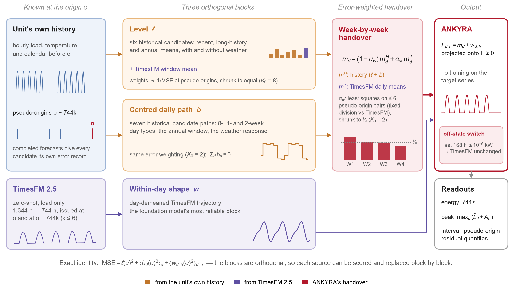
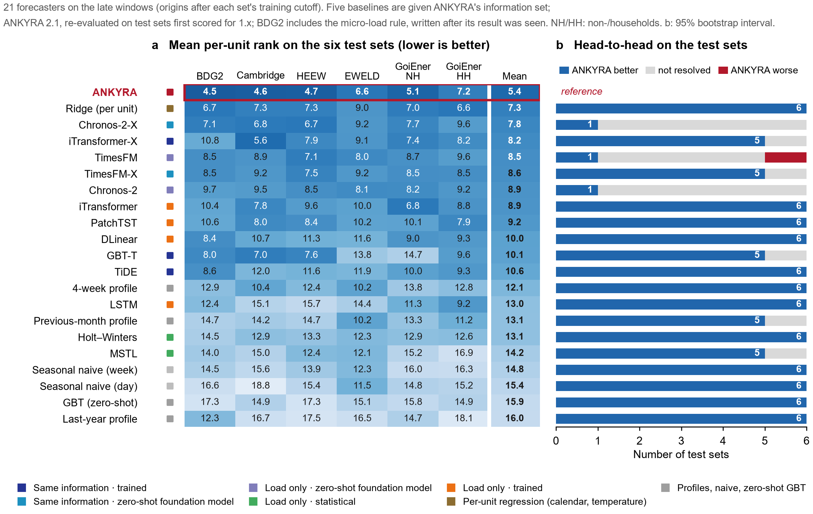
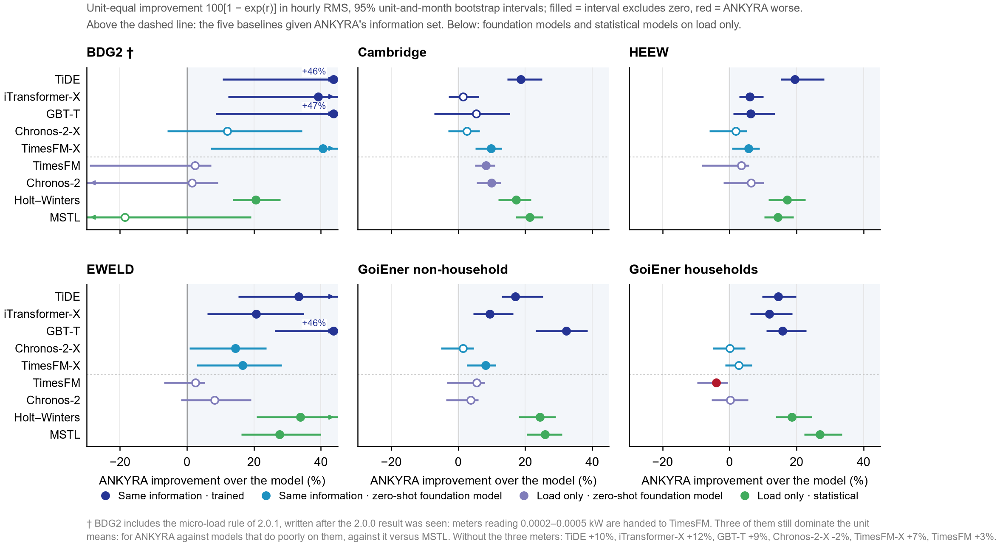
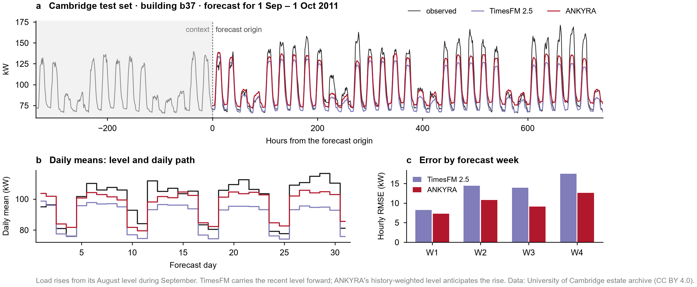
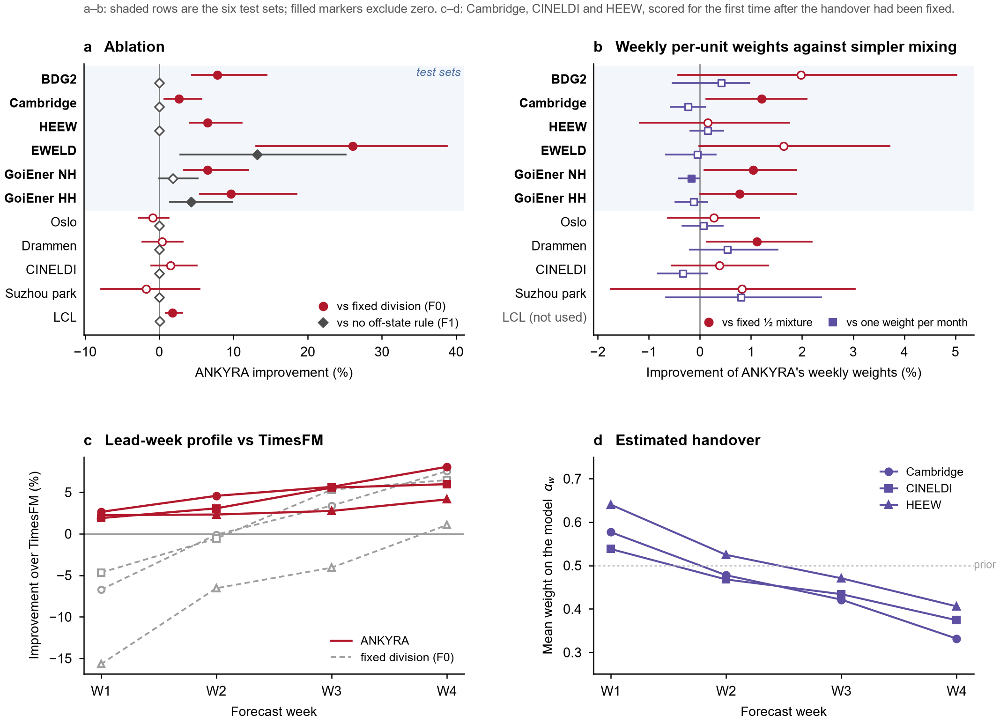
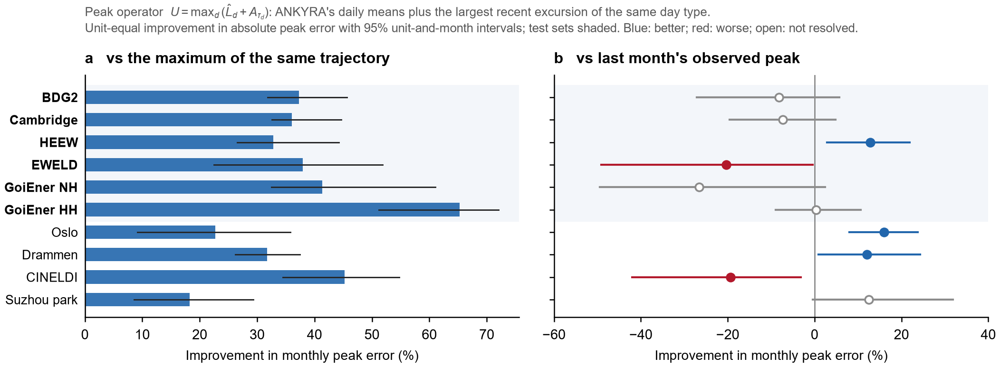
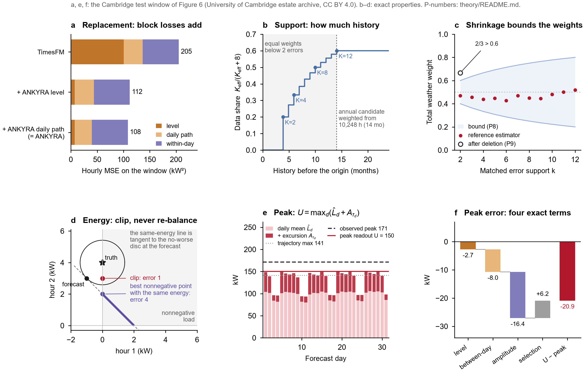

# ANKYRA

**用每个单位自己的历史，给时间序列基础模型“下锚”：月前负荷预测**

[English](README.md) · [方法](docs/METHOD.md) · [精确性质](docs/THEORY.md) · [评估](docs/EVALUATION.md) · [结果数据](results/)



预训练的时间序列基础模型能很好地给出“一天之内怎么分布”，但在 31 天的预测期里，它的月水平跟着最近几天走，会逐渐漂移。供电单位自己的历史能锚住整个月，但反应慢，也表示不了“已经关停”。**ANKYRA**（希腊语 *ἄγκυρα*，锚）让两者各管自己可靠的部分，并由这个单位自己的历史预测误差决定分工。

- **三块分解**：744 小时的预测精确地拆成三块，即**月水平**、**居中的逐日路径**和**日内形状**。三块互相正交，平方误差可以直接相加。
- **日内形状**：来自零样本的 **TimesFM 2.5**。
- **水平与逐日路径**：来自六个历史候选，外加基础模型自己的月水平。每个候选的权重由这个单位在过去伪起报点上的误差决定；**同一套误差还决定这个月交给基础模型多少**。
- **关停规则**：单位已经**关停一周**时，整段交给基础模型。
- **不训练**：不在目标序列上训练任何参数，所有权重都是这个单位已完成伪预测的函数。
- **三个读出算子**，复用同一套计算：
  - 电量取自水平；
  - 月峰值取自历史偏移包络；
  - 预测区间取自伪起报残差。
- **精确性质**：设计选择及其边界由精确性质解释，包括恒等式、界，以及标出适用边界的反例；每条都已实现并测试（[docs/THEORY.md](docs/THEORY.md)）。

## 起报点之后无信息

在起报点，ANKYRA 只使用那一刻已经知道的信息。

- **输入**：
  - 截至起报点的负荷与温度；
  - 预测月份的日历（星期或法定节假日类型）；
  - 单位类别。

  接口里没有未来负荷或未来天气的参数。
- **天气**：未来温度只以起报前形成的期望进入，由过去温度的年周期谐波加上固定的异常尺度给出。从不使用实测的未来天气。
- **权重**：所有权重都在记录内部的伪起报点上估计，这些伪起报点的目标窗口都在起报点之前结束。每个水平伪预测只使用它自己伪起报点之前的数据。
- **基础模型**：TimesFM 只接收每个起报点或伪起报点之前的 1,344 小时。
- **由测试检验**：[`tests/test_no_future_information.py`](tests/test_no_future_information.py) 改动起报点之后（或每个伪起报点之后）的全部数值，检验预测、模型输入、伪起报误差和区间都逐位不变。
- **评估**：
  - 基线拿到同一信息集，并对特征与滞后的时间索引、标准化统计量、训练目标终点做泄漏断言；
  - 训练型基线只在训练截点之后的窗口上评分；
  - 六个测试集在模型定型后只评一次，没有在其上调任何参数。

**测试说明了什么、没有说明什么**：测试证明的是实现层面的输入隔离，即起报点之后记录的任何数据都进不了计算。它不能单独证明输入本身不含更晚的信息。有三类来源在实现之外：

- 数据提供方的预处理，例如缺测填补（有记录的插补或补零小时已屏蔽）；
- 天气档案，其过去的数值可能经过事后质控；
- TimesFM 2.5 与 Chronos-2 的预训练语料，可能包含部分评估序列（其中列出了 7 个 BDG2 站点）。这可能让所有基于这些模型的预测器受益，ANKYRA 也在内（[局限](docs/EVALUATION.md#limitations)）。

信息集的完整说明见 [docs/METHOD.md](docs/METHOD.md#information-at-the-origin)。

## 六个测试集上的结果

20 个基线中，有 5 个拿到与 ANKYRA **相同的信息集**：过去负荷与温度、未来气候态温度、一年前同时刻负荷、日历特征和单位类别。它们是每个数据集单独训练的 TiDE、iTransformer-X、GBT-T，以及带协变量的 Chronos-2、TimesFM。

各模型按自身结构接收这套信息：

- iTransformer-X 不接收未来协变量；
- Chronos-2-X 不接收静态量；
- TimesFM-X 以线性回归方式使用协变量；
- GBT-T 使用由这些信息派生的 21 个特征。

PatchTST 是通道独立结构，加不加这些输入，预测都相同。六个测试集在模型定型之后**只评了一次**。

**主指标**：单位等权 log RMS 比，区间由对单位与月份重抽样得到（95%）；区间不含零称为“显著”。平均单位排名是次要汇总：在部分单位误差为零时它仍有定义，但不能替代主指标。

| 测试集 | 国家 | 单位 / 窗口 | 显著优于（共 20 个） | 其中同信息基线（共 5 个） | 显著劣于 | 21 个模型中的名次 |
|---|---|---:|:---:|:---:|:---:|:---:|
| BDG2 2017 建筑电表 | 美国 / 欧洲 | 142 / 474 | 10 | 2 | — | 1 |
| 剑桥大学校园建筑 | 英国 | 108 / 730 | 16 | 2 | — | 2 |
| HEEW 亚利桑那州立大学校园 | 美国 | 138 / 658 | 15 | 2 | — | 1 |
| EWELD 工商业电表 | 中国 | 197 / 523 | 18 | 5 | — | 1 |
| GoiEner 非住户 | 西班牙 | 481 / 890 | 15 | 3 | — | 1 |
| GoiEner 住户 | 西班牙 | 696 / 696 | 16 | 3 | TimesFM（3.8%） | 2 |

表中窗口是各数据集训练截点之后的窗口，21 个模型在这些窗口上都有预测。

- 测试集上，**ANKYRA 没有显著输给任何拿到相同信息集的基线**。
- 对这 5 个同信息基线：
  - 对 TiDE 六个集显著更好；
  - 对 GBT-T 四个；
  - 对 iTransformer-X、TimesFM-X 各三个；
  - 对 Chronos-2-X 一个（EWELD）。
- 对只看负荷的统计模型：Holt–Winters 六个集显著更好，MSTL 五个。
- 测试集上唯一的显著落后，是住户上的零样本 **TimesFM**（3.8%）。
- 六个测试集的平均单位排名：**5.94**；其次是逐单位岭回归 7.21、Chronos-2-X 7.72、iTransformer-X 8.06。





**ANKYRA 在哪里落后**（照实报告）：

- **挪威的学校与市政楼宇**（Oslo、Drammen，预览集）：跨单位训练、带日历特征的模型更好，GBT-T 好 18%，iTransformer-X 好 9%。诊断更支持**逐天的活动水平**（假期、类停工日、调休）而非日内形状是主要来源；类停工日在单位之间共享、逐年重复。诊断依据的是上限与相关分析，缩小了原因的范围，但没有识别真实的停业原因。
- **住户**：零样本 TimesFM 更好（见上）。
- **BDG2**：有 3 个读数约 0.0002 kW 的电表，高于关停阈值，主导了单位均值。完整结果保留，敏感性分析并列：
  - 含这 3 个电表时，ANKYRA 对 TimesFM 的点估计为 −54.8%（训练截点后的窗口）；
  - 去掉它们（11 个窗口）后为 +1.6%；
  - 两种情况下区间都很宽，因为还有其他低负荷单位的比值极端；
  - 按中位数，上图九个模型都不如 ANKYRA（59–92% 的单位 ANKYRA 更好）；
  - 含与不含这 3 个电表，ANKYRA 的平均排名都是第一。
- **常规指标**：按单位中位数 CV(RMSE)，11 个数据集中有 9 个上 Chronos-2-X 或逐单位岭回归略低，差 0.2–2.2 个百分点。ANKYRA 的优势在单位平均与排名上，而不是中位数单位。

## 交接怎样起作用



九月，大学建筑的负荷在暑假后回升。TimesFM 延续最近的水平，ANKYRA 按历史加权的水平预见到了回升。

- **固定分工**（水平用历史、形状用模型）时，第一周模型更好，之后历史更好。
- ANKYRA 按单位估计用多少模型的日均值（每个预测周一个权重）。
- 在交接定型后首次评分的三个数据集上，ANKYRA 的点估计**每一周**都优于 TimesFM。
- 交接相对固定分工在 11 个数据集中 7 个显著改进（1.7–26.1%），从未显著变差。
- **哪一部分起作用**：一个运行前写定的消融把各部分分开。在六个测试集上：
  - 以固定各取一半的权重混入模型的日均值，已经拿到大部分收益（五个集上 63–96%，剑桥 10%）；
  - 按单位估计权重再改进 0.8–1.2%，三个集显著，没有显著更差的；
  - 分周估计权重相比每单位一个整月权重没有额外收益（GoiEner 非住户上还差 0.2%）。

  起作用的是按单位、用误差定权的混合；周权只描述提前期上的变化（[详情](docs/EVALUATION.md#what-the-handover-contributes)）。
- **为什么用误差定权，为什么要有关停规则**：偏离正常运行的状态持续得越久，越可能继续持续。这一点在七个数据集上按单位内比较都成立。起报时偏离已经持续得越久，模型所含的近期信息在整个月里就越有价值（[证据](docs/EVALUATION.md#departures-from-normal-operation-persist)）。



## 峰值算子

月峰值单独读出：ANKYRA 的日均值，加上最近同类型日“高出当日均值最多多少”：$U=\max_d(\hat L_d+A_{\tau_d})$。

- 最大值可交换，所以它等价于逐小时的包络。
- 满足 $U\ge\max_d\hat L_d\ge\bar F$。
- 在写明的工作分布下，它恰好是未来峰值的中位数。
- 它的误差可分解为水平、日路径、振幅与选日四项。

结果：

- 相对同一条轨迹的最大值，**11 个数据集上峰值误差全部降低 22–77%**。
- 相对上月实测峰值，在规律运行的建筑上更好（Drammen、Oslo、HEEW 好 12–16%），在 CINELDI 的工业客户上更差。



**预测区间**：住户上以 ANKYRA 为中心的伪起报区间，在 80% 名义水平下覆盖 **79.2%** 的小时；TimesFM 自带的 0.1–0.9 区间只覆盖 36.1%。

## 精确性质



整个构造可以逐步核查，因为每一步都有写明的性质。[docs/THEORY.md](docs/THEORY.md) 将它们编号为 P1–P19，给出证明和反例；早期研究在数据上测过的后果，也列在相应性质之后。

- **替换是精确的（P4）**：替换一块，MSE 的变化恰好等于这一块损失的变化。
  - 因此，两个预测器之间的任何分工，都可以直接由分块损失打分。
  - 只替换水平，MSE 的相对降幅最多等于水平所占份额。
  - 早期研究中，替换 DLinear 的水平与日路径使其改进 5.0%；对 PatchTST 效果未分辨。
- **为什么固定分工不够（P5）**：对单个单位，分工的收益有下界 $\tfrac12\log(1-\pi)$，损失却没有上界。因此，合并误差最优的分工，对典型单位仍可能更差。ANKYRA 的逐单位权重与分周交接正是对此的回应。
- **权重需要多少历史（P7–P9）**：
  - $m$ 小时的完整记录给出 $\min\lbrace12,\lfloor(m-1344)/744\rfloor\rbrace_+$ 个已完成误差；
  - 不足两个误差时权重相等，年度候选需要 10,248 小时才能被加权；
  - 收缩限定权重离等权最多能移动多远，起报时删除候选可能打破这一界；
  - 早期研究中，把历史限制在 12、9、6 个月，水平分别变差 6.2%、14.2%、20.6%。
- **电量（P11–P12）**：零点截断不会增大任何一小时的误差。任何映射都不能同时保持电量、输出非负负荷、保证误差不增。所以电量取自水平。
- **峰值（P15–P17）**：峰值读出有标量形式，满足 $U\ge\max_d\hat L_d\ge\bar F$，并有四项误差分解和有限样本中位数性质；每条性质都配有标出适用边界的反例。
- **估计量（P19）**：合并与单位等权两种汇总可能因代数原因符号相反，所以评估同时报告两者，以及平均排名与常规指标。

19 条性质全部实现于 `ankyra/operators.py`，由 `tests/test_operators.py` 检验。

## 成本

在一台笔记本上计时（RTX 5060 笔记本 GPU，Ryzen 9 8940HX，历史侧用单个 CPU 线程），每个 744 小时窗口：

| 预测器 | 首次运行 | 复用伪起报结果 |
|---|---:|---:|
| TimesFM 单独 | 15 ms | — |
| ANKYRA | 0.50 s | 0.11 s |
| Chronos-2-X | 55 ms | — |
| 逐单位岭回归（CPU） | 97 ms | — |

- **时间花在哪里**：ANKYRA 的时间主要花在六个伪起报点上的历史估计（0.30 秒），而不是基础模型（七次调用 0.10 秒）。
- **复用**：按 744 小时间隔滚动预测时，这些伪起报结果来自之前的运行。
- **TimesFM 配置**：研究中 TimesFM 用的是默认的每核批大小 1，每次调用 0.50 秒；改为 64 时，预测结果相差不超过 3×10⁻⁵ kW。

完整计时见 [`results/cost_per_window.csv`](results/cost_per_window.csv)。

## 安装与运行

```bash
pip install -e .
python examples/quickstart.py                 # 人工建筑 + 替身预测器，无需数据与下载
pip install -e ".[timesfm]"
python examples/quickstart.py --timesfm       # 使用 TimesFM 2.5（会从 Hugging Face 下载权重）
```

用法见英文 README 的代码示例，公式与全部常数见 [docs/METHOD.md](docs/METHOD.md)。

## 可复现性

- **参考实现逐窗复现了评估中的预测**：613 个测试窗口，最大绝对差 0.0 kW，包括全部关停窗口。TimesFM 适配器、峰值算子与区间函数同样逐位一致。见 [results/REPRODUCTION_CHECK.json](results/REPRODUCTION_CHECK.json)。
- `results/` 保存全部评分统计量，`python figures/make_figures.py` 可由它重新生成所有图。
- `python -m unittest discover -s tests -t .` 运行 53 个测试，检验：
  - 起报点之后的任何信息都不会进入预测、权重或区间；
  - [docs/THEORY.md](docs/THEORY.md) 的 19 条精确性质及其反例；
  - 交接的端点与关停规则；
  - 参考估计器的已发表数值。
- 原始数据不在此重新分发，来源见 [docs/EVALUATION.md](docs/EVALUATION.md)。

## 引用与许可

论文在准备中，暂请引用软件（[CITATION.cff](CITATION.cff)）。代码以 MIT 许可发布。TimesFM 2.5 版权归 Google（Apache-2.0），本仓不重新分发。示例窗口数据来自剑桥大学校园能耗档案（CC BY 4.0）。
