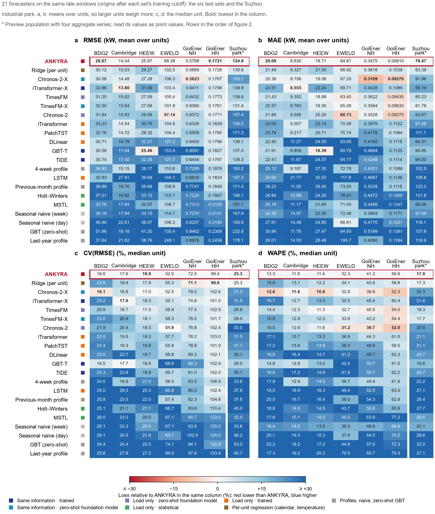
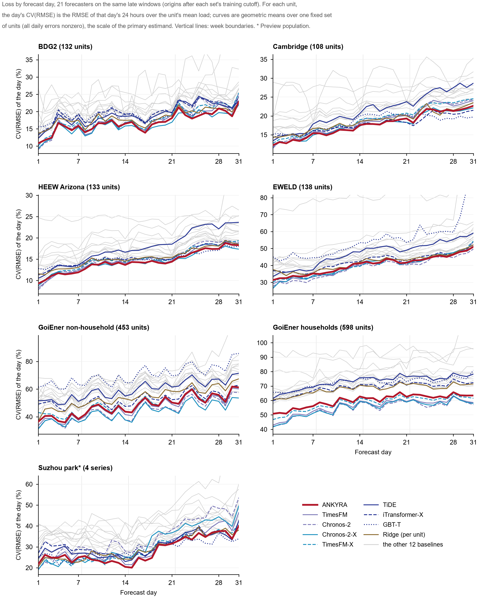
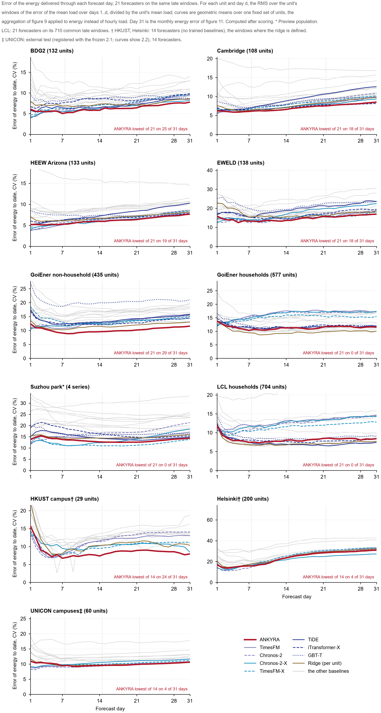
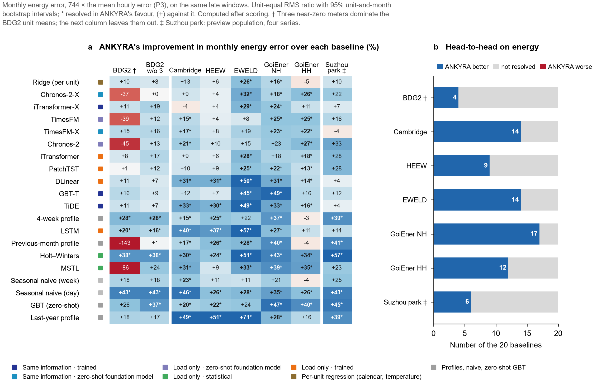
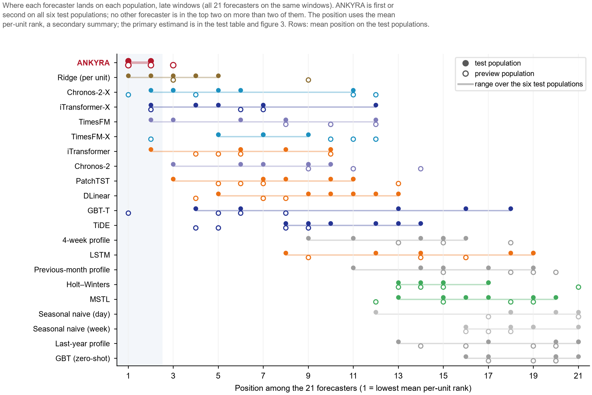
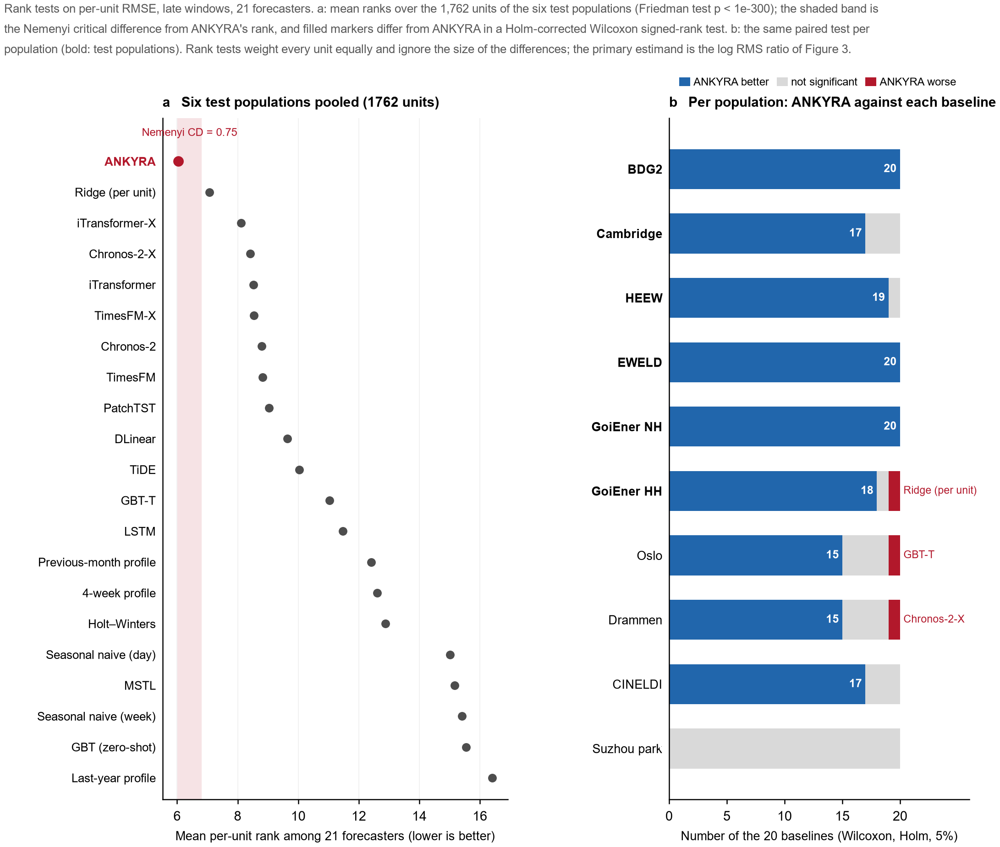
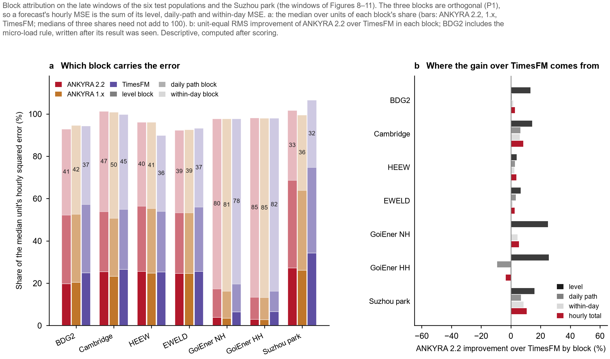
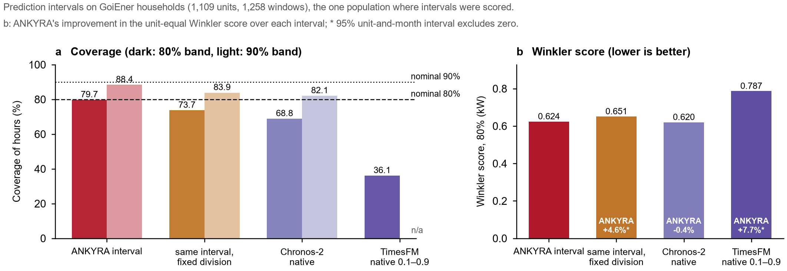
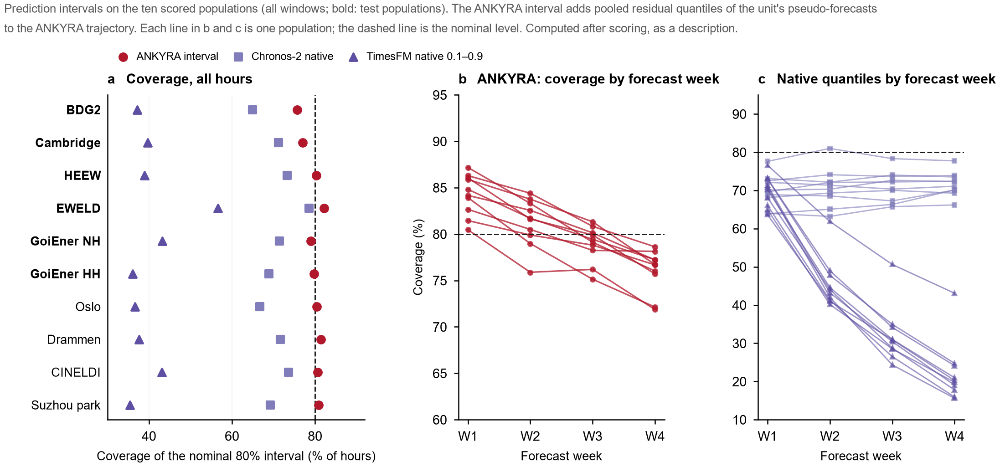

# ANKYRA

**月前逐时负荷预测：把时间序列基础模型锚定到每个单位自己的历史上**

[English](README.md) · [安装与运行](#安装与运行) · [用自己的数据](#预测你自己的单位) · [方法](docs/METHOD.md) · [理论](theory/README.zh-CN.md) · [评估](docs/EVALUATION.md) · [数据](docs/DATA.md) · [评分代码](evaluation/) · [结果数据](results/)

中文页面只有本页和 [theory/README.zh-CN.md](theory/README.zh-CN.md)；其余文档（`docs/`、`results/README.md`、`evaluation/README.md`、`theory/PROOFS.md`）为英文。

ANKYRA 预测一个单位（一栋楼、一块电表或一个用电点）未来 31 天（744 小时）的逐时用电负荷。它面向需要为许多单位做月前负荷或电量预测、又不想给每个单位单独训练模型的研究者和从业者。它把预训练基础模型 TimesFM 2.5 的零样本预测，与由该单位自己过去的负荷、室外温度和日历得到的估计结合起来；两者的权重，取决于各自对这个单位此前各月预测得有多准。

当前版本：**2.0.1**（[改了什么](#20-与-201-改了什么) · [版本历史](#版本历史)）。


*图 1. 架构。*

预训练的时间序列基础模型能很好地再现一天之内的形状，但在 31 天的预测期里，它的月水平跟着最近几天走，会逐渐漂移。单位自己的历史能锚住整个月，但反应慢，也表示不了已经关停的负荷。**ANKYRA**（希腊语 *ἄγκυρα*，锚）让两个来源各管自己可靠的部分，并由这个单位自己的预测记录决定哪一部分可靠。下文用到的术语（伪起报点 pseudo-origin、块 block、交接 handover 等）在[本页用到的术语](#本页用到的术语)里定义。

- 744 小时的预测可以精确地拆成**水平**、**居中的日路径**和**日内形状**三块。三块互相正交，平方误差可以直接相加。
- 水平与日路径来自六个历史候选，外加基础模型自己的水平。各候选的权重由该单位在此前伪起报点上的误差决定，**同一套误差还决定这个月交给基础模型多少**。
- 日内形状以零样本的 **TimesFM 2.5** 为起点。自 **2.0** 起这一块也被锚定：单位自己的相似日形状与模型的形状竞争，权重由该单位在三个已完成伪起报点上的误差决定，向模型收缩，上限为二分之一。三块现在用同一种方式锚定。
- 已经**关停一周**的单位，整段交给基础模型。自 **2.0.1** 起，整段 1,344 小时上下文都在零附近 10⁻³ kW 以内的单位也这样处理：连续八周都落在归一化尺度下限以内的记录，按已关停处理。
- **不在目标序列上训练任何参数。** 每个权重都是该单位已完成伪预测的函数。
- 三个**读出算子**复用同一套计算：
  - 电量取自水平；
  - 月峰值取自历史偏移包络；
  - 预测区间取自伪预测残差。
- 设计选择及其界限由**精确性质**解释：恒等式、界，以及标出适用边界的反例。它们单独放在 [theory/](theory/README.zh-CN.md) 文件夹，与 [ankyra/](ankyra/) 里的预测器分开；每条都有证明、算子和数值检验。

## 目录

- **使用：** [仓库里有什么](#仓库里有什么) · [安装与运行](#安装与运行) · [预测你自己的单位](#预测你自己的单位)（[输入](#输入) · [输出](#输出) · [耗时](#耗时) · [什么时候不该用](#什么时候不该用)）
- **读结果：** [本页用到的术语](#本页用到的术语) · [起报点之后无信息](#起报点之后无信息) · [信息集](#输入与特征所有预测器用同一套信息) · [六个测试人群上的结果](#六个测试人群上的结果) · [LCL 住户与两项未采纳的改动](#lcl-住户与两项未采纳的改动)
- **工作原理：** [交接](#交接怎样起作用) · [日内锚定](#日内锚定20) · [读出](#读出峰值与预测区间) · [理论](#理论精确性质)
- **核对：** [可复现性](#可复现性) · [2.0 与 2.0.1 改了什么](#20-与-201-改了什么) · [版本历史](#版本历史) · [许可与致谢](#许可与致谢)

## 仓库里有什么

```
ankyra/              预测器
  core.py            forecast()：模型水平候选、分周交接、日内锚定、关停规则与微负荷规则
  analog.py          相似日形状与按误差定权的日内信任（2.0）
  history/           历史水平与日路径的冻结参考估计器
  readouts.py        电量、峰值包络算子、伪起报点区间
  blocks.py          正交块分解
  metrics.py         单位等权 log RMS 比、单位与月份自助法、平均单位排名、合并分解
  synthetic.py       人工建筑历史与替身预测器，供快速示例和测试使用
  timesfm_adapter.py 研究所用配置的 TimesFM 2.5
examples/            人工建筑上的快速示例
tests/               预测器的测试（含起报点之后无信息的测试）与评估模块的测试
theory/              精确性质 P1–P19，与预测器分开
  README.zh-CN.md    索引：每条性质的成立条件、用途、代码与检验
  PROOFS.md          陈述、证明、反例与在数据上测得的后果
  operators.py       把性质写成算子（替换、支撑、收缩、投影、峰值）
  test_operators.py  数值检验，含反例
evaluation/          由预测和实际负荷给一个人群评分；附可运行示例
results/             评分统计量（CSV / JSON）与复现记录；2.0.0 和 1.x 的在子文件夹里
figures/             make_figures.py 与全部图（PDF 和 PNG）
docs/                METHOD.md（公式与常数）、EVALUATION.md（协议与完整表格）、
                     DATA.md（来源与整理）、LCL_AND_CLOSEOUT.md（LCL 住户；两项未采纳的改动）
```

有意不包含的内容：

- **原始数据和整理后的数据。** 评估所用的人群都是公开数据。[docs/DATA.md](docs/DATA.md) 列出每个来源以及研究中的整理方式。
- **保存的预测。** `results/` 保存的是评分统计量，不是算出这些统计量的预测，所以仅凭本仓库不能重新生成这些表。
- **模型权重。** TimesFM 2.5 在首次使用时从 Hugging Face 下载，也可以从本地副本加载。
- **训练型基线的代码。** 对比模型里，仓库只包含三个简单的参考预测器（`evaluation/baselines.py`）。

## 安装与运行

需要 Python ≥ 3.10、NumPy、SciPy 和 PyTorch。快速示例和测试用 CPU 就够。

```bash
git clone https://github.com/XinanQ/Building_load_ANKYRA.git
cd Building_load_ANKYRA
pip install -e .
python examples/quickstart.py
```

`pip install -e .` 会在缺少 PyTorch 时安装它。如果只要 CPU 版，先单独安装：`pip install torch --index-url https://download.pytorch.org/whl/cpu`。

快速示例预测一栋人工建筑，基础模型用替身代替（重复最近一周）。它不需要数据，也不需要下载，几秒钟跑完。它输出的各行在[输出](#输出)一节解释。这栋人工建筑几乎严格周期，所以替身近乎完美：分周权重达到上限 0.875，日内信任为 0。这份输出只展示格式，不代表典型数值。

用 TimesFM 2.5（Apache-2.0）作基础模型：

```bash
pip install -e ".[timesfm]"
python examples/quickstart.py --timesfm
```

- 第一次调用会从 Hugging Face 把检查点 `google/timesfm-2.5-200m-pytorch`（约 0.9 GB；版本号固定在 `ankyra/timesfm_adapter.py` 里）下载到它的缓存。
- 离线运行时，传入一个含 `model.safetensors` 的本地目录：`python examples/quickstart.py --timesfm --checkpoint DIR`，或在代码里用 `load_timesfm("DIR")`。
- 建议使用 GPU（见[耗时](#耗时)）。
- 这个可选依赖安装 `timesfm` 包（`timesfm>=2.0`）。适配器需要一个提供 `TimesFM_2p5_200M_torch` 和 `ForecastConfig` 的版本。CI 不安装这个可选依赖，所以这条安装路径没有在 CI 里测试。

**软件环境。** 仓库只记录了下面这些：

- `pyproject.toml` 只给出下限：Python ≥ 3.10、NumPy ≥ 1.26、SciPy ≥ 1.11、PyTorch ≥ 2.4；可选的 `timesfm` ≥ 2.0，以及画图用的 Matplotlib ≥ 3.8。
- CI（`.github/workflows/tests.yml`）在 Python 3.10、3.11、3.12 和 3.13 上（Ubuntu，CPU 版 PyTorch）运行两组测试、快速示例和评估示例，并在 Python 3.11 上重新生成全部图。
- 检查点按版本号固定：TimesFM 2.5 在 `ankyra/timesfm_adapter.py` 里，Chronos-2（基线之一）在 [docs/DATA.md](docs/DATA.md) 里。
- 研究中各次运行的确切包版本没有记录在这里。计时所用的硬件见[耗时](#耗时)。

## 预测你自己的单位

`ankyra.forecast` 预测 `load_kw` 最后一个值之后的 744 小时。请先把这个单位的数据放到一张规则的逐时网格上：预测器不做重采样，不补缺测，也不做时区或夏令时换算（[细节](docs/DATA.md#the-input-format-the-forecaster-expects)）。输入不符合下面的约定时会报错，不会悄悄修补。

### 输入

记录用 `ankyra.History` 表示：

| 输入 | 需要提供什么 |
|---|---|
| `load_kw` | 逐时平均负荷，单位 kW（关停阈值和微负荷阈值都是 kW 的绝对值）。下标 0 是记录起始那一年的 1 月 1 日 00:00；最后一个值是预测开始前的那个小时。最后 1,344 小时必须完整；更早的缺测记为 NaN。记录如果从年中开始，用 NaN 向前补到 1 月 1 日。亚小时读数要先聚合（四个 15 分钟的 kWh 读数相加，就是该小时的平均 kW）。 |
| `temperature_c` | 同一批小时的逐时室外气温，单位 °C，处处为有限值，补出的小时也不例外。年温度谐波在全部小时上拟合，所以补出的小时最好用气象档案里的温度；填一个固定值也能运行（研究中整理 LCL 时用的是 15 °C）。在有负荷观测的时段，温度序列必须有变化：如果某一年里日平均温度恒定，温度响应特征无法拟合，`forecast` 会报错。用附近气象站的序列或再分析序列即可。不需要未来温度。 |
| `day_types` | 历史加上 744 个预测小时，每小时一个整数（长度 `len(load_kw) + 744`，整数 dtype）：按日期，周一 = 0 … 周日 = 6，法定节假日为 7；同一天内取值不变。 |
| `start_timestamp` | 下标 0 对应的时刻。必须是 1 月 1 日 00:00，并写明 `+00:00` 偏移（或 `Z`），例如 `"2019-01-01T00:00:00+00:00"`。偏移只是标签，不做任何换算：请使用固定偏移的时间网格（UTC 或当地标准时间，不含夏令时跳变）。 |
| `observed`（可选） | 负荷的布尔掩码。默认取有限值所在的小时。 |

只支持逐时数据，预测长度固定为 744 小时。1 月 1 日这个锚点决定年温度谐波的相位；其他锚点一律拒绝。

下面是记录从年中开始时的完整例子（已在人工数据上用替身模型从头到尾跑通）：

```python
from datetime import datetime, timedelta
import numpy as np
import ankyra
from ankyra.timesfm_adapter import load_timesfm, timesfm_forecaster

# first：第一个逐时读数的 datetime；load_meter、temp_meter：从那个小时起的逐时数组；
# temp_before_first：从 1 月 1 日 00:00 到 `first` 的逐时温度；holidays：节假日日期的集合
anchor = datetime(first.year, 1, 1)
pad = int((first - anchor).total_seconds() // 3600)
load_kw = np.concatenate([np.full(pad, np.nan), load_meter])
temperature_c = np.concatenate([temp_before_first, temp_meter])      # 有限值，长度与 load_kw 相同
days = [(anchor + timedelta(hours=h)).date() for h in range(len(load_kw) + 744)]
day_types = np.array([7 if d in holidays else d.weekday() for d in days], dtype=np.int64)
history = ankyra.History(load_kw, temperature_c, day_types, f"{first.year}-01-01T00:00:00+00:00")

f = ankyra.forecast(history, group="Office", temp_sigma_std=0.25, dst_region="EU",
                    foundation=timesfm_forecaster(load_timesfm()))
print(f.trajectory_kw.shape, f.energy_kwh)        # (744,) 逐时预测，单位 kW；整月电量，单位 kWh
```

**需要多少历史。** 下面的小时数指截至起报点的完整小时，补出的小时不算。

- 1,344 个完整小时：预测能运行；所有权重都取默认值。
- 2,088 小时：交接权重离开 ½（有一个已完成的伪起报点）。
- 2,832 小时：水平权重离开等权（有两个已完成的伪起报点）。
- 10,248 小时（约 14 个月）：用到一年前同一窗口的候选可以被加权。
- 研究中的窗口在起报点之前至少有 10,248 小时（例外见 [docs/DATA.md](docs/DATA.md#common-window-rules)），而且相对单独的 TimesFM 的收益，只有在历史达到两年时才显著。

`ankyra.forecast` 的其他参数：

- `group`：`"Industrial"`、`"Office"`、`"Public"`、`"Residential"` 或 `"Commercial"`（拼写须完全一致）。它为单位对温度的响应（即*温度响应特征*，temperature signature）选一条固定的先验曲线；请选最接近的类别。研究中各人群的归类见 [docs/DATA.md](docs/DATA.md)。
  **`"Commercial"` 没有先验曲线。** 在冻结的配置里，它的曲线存在键 `group_4` 下，而这个键不会被读取，所以 Commercial 单位的温度响应特征为零，它的天气调整候选与未调整的候选相同。评估时就是这个行为（BDG2 的 13 个单位和苏州的一条序列属于 Commercial）。它作为已知性质保留。
- `temp_sigma_std`：日温度偏离季节常态的程度，以标准差表示，单位为 10 °C（0.25 即 2.5 °C）。预测器用它把温度响应在预测月可能出现的温度上取平均。每个人群一个数，在第一个起报点之前拟合一次，之后固定不变。研究中的做法：
  1. 把温度标准化为 (T − 15 °C) / 10 °C，取日均值；
  2. 减去居中的 31 天滑动均值；
  3. 取这个异常的标准差，在该人群的各单位上合并，用记录的前 244 天（两端各去掉 15 天）。

  研究中各人群所用的数值没有列在仓库里。快速示例和测试用的是 0.25。在快速示例的人工建筑上，这个值从 0.05 变到 1.0，水平只从 23.014 kW 变到 23.019 kW；这只是一个人工例子，不是关于真实数据的证据。输入检查只核实这个值有限且为正。它是否由第一个起报点之前的数据拟合，由调用者负责。
- `dst_region`：`"EU"`（3 月和 10 月的最后一个星期日换时）、`"US"`（3 月第二个星期日到 11 月第一个星期日）或 `"none"`（默认：没有夏令时，或用的是别的规则）。负荷始终留在固定偏移的网格上。这条规则只用来保证相似日取自同一夏令时状态。
- `foundation`：三种形式之一。
  - 一个可调用对象，把 (N, 1344) 的上下文数组映射为 (N, 744) 的点预测：`timesfm_forecaster(load_timesfm())`，或任何其他模型。
  - 一个字典 `{k: forecast}`，存放在起报点（k = 0，必需）和早 744·k 小时的伪起报点（k = 1 … 6）发出的 744 小时预测。这样可以复用前几个月存下的预测；`ankyra.pseudo_origin_contexts(load_kw)` 返回对应的上下文。
  - `None`：不含基础模型的纯历史配置，关停规则和微负荷规则在这个配置下不适用。
- `micro_load_rule`（默认 `True`）：2.0.1 的微负荷规则（[定义](docs/METHOD.md#off-state-and-micro-load-rules)）。设为 `False` 复现 2.0.0 的预测。
- `within_anchor`（默认 `True`）：2.0 的日内锚定。`within_anchor=False` 加上 `micro_load_rule=False` 复现 1.x 的预测。

公式和全部常数见 [docs/METHOD.md](docs/METHOD.md)。

### 输出

`ankyra.forecast` 返回一个 `AnkyraForecast`。快速示例输出下面这些行：

| 快速示例输出的行 | 字段 | 含义 |
|---|---|---|
| `foundation_model` | — | 基础模型这个位置用的是哪个模型。 |
| `trajectory_first_day_kw` | `trajectory_kw[:24]` | `trajectory_kw` 是逐时预测，单位 kW，共 744 个值；第 0 个元素是最后一个负荷值之后的那个小时。它非负，除非最后一行的两条规则之一原样返回了模型的预测。 |
| `level_kw`、`energy_kwh` | 同名 | 水平是 744 个预测小时的均值，整月电量是 744 × 水平。两者都在把负值小时置零之前读出。 |
| `peak_kw` | 由 `readouts.peak_readout` 计算 | 月峰值：“预测的日均值加上该日类型近期的最大偏移”在 31 天里的最大值。 |
| `interval_80pct_first_hour_kw` | 由 `readouts.interval_bands` 计算 | 第一个预测小时的 80% 预测区间：下界和上界，单位 kW。区间是在预测上加上该单位自己伪预测残差的分位数。 |
| `interval_pseudo_windows` | 由 `readouts.residual_quantiles` 返回 | 区间所用残差来自多少个已完成的伪起报点（至多 12 个）。 |
| `lead_week_weights_on_model` | `lead_week_weights` | 交接：第 1–7、8–14、15–21、22–31 天里，基础模型日均值的权重。½ 表示没有证据。 |
| `level_weights` | 同名 | 各水平候选的权重。`s`、`l`、`a` 分别是最近 7 天的均值、长期历史的均值和一年前同一窗口的均值；`_u` 表示不做天气调整，`_w` 表示做天气调整；`fm` 是基础模型自己的窗口均值。 |
| `pseudo_origin_pairs` | `pseudo_pairs` | 交接权重所依据的已完成伪起报点个数（至多 6 个）。 |
| `within_day_trust_on_analog_shape` | `within_trust` | 在月内同样四段里，单位自己相似日形状的权重，介于 0 和 ½ 之间。0 表示沿用基础模型的形状。 |
| `within_day_pseudo_origin_triples` | `within_pseudo_pairs` | 信任所依据的已完成伪起报点个数（至多 3 个）。 |
| `analog_shape_kept` | `analog_kept` | 相似日形状大得不合理（超过上下文最大值的三倍）、整个窗口改用模型形状时为 `False`。 |
| `off_state`、`micro_load` | 同名 | 关停规则或微负荷规则触发时为 `True`。此时原样返回基础模型的预测，不把负值小时置零。 |

其余字段：`daily_means_kw`（交接之后的 31 个日均值）、`within_day_kw`（交付的日内块）、`foundation_within_day_kw` 与 `analog_shape_kw`（混合成日内块的两种形状），以及 `fixed_division_daily_means_kw`（没有交接时的日均值，留作消融用）。

峰值和预测区间是 `ankyra.readouts` 里单独的调用；[`examples/quickstart.py`](examples/quickstart.py) 里两者都有示范。`readouts.interval_bands` 返回五条分位数轨迹（5%、10%、50%、90% 和 95%）；第二条和第四条是 80% 区间的两个界。

### 耗时

在一台笔记本上按每个 744 小时窗口计时：RTX 5060 笔记本 GPU 和 Ryzen 9 8940HX，历史侧用一个 CPU 线程。

| 预测器 | 首次运行 | 复用伪起报点结果 |
|---|---:|---:|
| 单独的 TimesFM，每核批大小 64 | 18 ms | — |
| 单独的 TimesFM，研究配置（每核批大小 1） | 0.72 s | — |
| ANKYRA 2.0，每核批大小 64 | 0.56 s | 0.13 s |
| ANKYRA 2.0，研究配置 | 5.5 s | 0.83 s |
| Chronos-2-X | 80 ms | — |
| 逐单位岭回归（CPU） | 108 ms | — |

- **你会得到哪几行。** `load_timesfm()` 编译的是研究配置（每核批大小 1；占用 0.9 GiB GPU 内存）。每个窗口预计几秒钟，大部分花在七次 TimesFM 调用上（起报点一次，伪起报点六次，每次 0.72 秒）。`load_timesfm(per_core_batch_size=64)`（3.0 GiB）给出批大小 64 的那两行，预测与研究配置相差不超过 3×10⁻⁵ kW。这时大部分时间花在六个伪起报点上的历史估计器（0.32 秒），而不是基础模型（七个上下文，0.13 秒）。
- **复用。** “复用伪起报点结果”一列假定六个伪起报点上的结果是此前运行留下的；每 744 小时发布一次预测时可以做到这一点。已发布的 `forecast()` 在以字典形式传入时会复用存下的 TimesFM 预测（见上文 `foundation`）。历史侧的伪预测（0.32 秒）则每次调用都重新计算。
- **版本。** 计时是在 2.0.0 上做的。2.0.1 的微负荷规则只多一次对 1,344 小时上下文取最大值。日内锚定多出四个起报点上的相似日形状，不增加模型调用；1.x 在同一台机器上测得 0.50 秒和 0.11 秒，差别在这个基准各次运行的波动之内。
- **每次会话一次。** 加载 TimesFM 需要 2.3 秒。需要区间读出时，每个窗口再加 0.56 秒。

完整计时见 [`results/cost_per_window.csv`](results/cost_per_window.csv) 和 [docs/EVALUATION.md](docs/EVALUATION.md#cost)。

### 什么时候不该用

ANKYRA 适合为有两年及以上历史的楼宇和非住户用电点做逐时的月前预测，尤其是看重月电量或月内后几周的场合。按本页的证据，下列情况下它不是更好的选择：

- **住户。** GoiEner 住户上，零样本 TimesFM 的逐时误差更低（3.9%，显著）；LCL 住户上两者分不出高下。ANKYRA 的月电量误差仍然更低。
- **月初几天。** 第 1 天，零样本基础模型在每个人群上都更低。
- **历史不足两年。** ANKYRA 与单独的 TimesFM 分不出高下。
- **由关闭日（如停课日）主导的建筑。** 在挪威的学校上，一个带日历特征、跨单位训练的模型好 12.8%。
- **上下文里有单个大尖峰。** 逐时误差上升；峰值读出取近期最大偏移，会因此失效。
- **会关停的单位。** 不应对它们使用预测区间；区间宽度会失控。
- **不是逐时的数据，或单位不是 kW 的数据。** 关停阈值和微负荷阈值都是 kW 的绝对值。
- **南半球的站点。** 年温度谐波的相位是固定的，最冷的一天在 1 月，幅度非负。评估过的人群都在北半球。

前六条的证据在下面的结果各节；后两条由代码可知。

## 本页用到的术语

- **单位（unit）**：一条计量序列：一栋楼、一块电表、一个用电点或一户住户。
- **起报点（origin）**：发出预测的那个小时。预测覆盖其后的 744 小时（31 天）。
- **上下文（context）**：起报点之前的 1,344 小时（八周）负荷；它是基础模型唯一的输入。
- **窗口（window）**：一个单位的一个起报点，连同它的上下文和 744 小时的目标。
- **伪起报点（pseudo-origin）**：单位自己记录内部更早的起报点，在起报点之前 744、1,488、… 小时，它的 744 小时目标已经观测到。ANKYRA 把它当作起报点做一次预测（*伪预测*，pseudo-forecast），并用误差来确定权重。
- **块（blocks）**：744 小时预测的三个部分。*水平*是 744 小时的均值；*居中的日路径*是 31 个日均值减去水平；*日内形状*是每个小时减去当天的均值。
- **交接（handover）**：日均值里取自基础模型而不是历史侧的份额，每个预测周一个权重（第 1–7、8–14、15–21、22–31 天）。*把一个窗口交给基础模型*，指原样返回基础模型的预测。
- **固定分工（fixed division，F0）**：历史侧的水平和日路径，加上模型的日内形状，没有交接。
- **信任（trust）**：日内块里单位自己相似日形状的权重，介于 0 和 ½ 之间。
- **训练截点、截点后窗口（training cutoff, late windows）**：训练型基线只在截点日期之前结束的目标上拟合，每个人群一个截点。*截点后*窗口（结果文件里记作 late）是截点之后的窗口，只有在这些窗口上 21 个预测器才都有预测。
- **同信息基线（same-information baseline）**：拿到 ANKYRA 全部输入的五个基线之一（TiDE、iTransformer-X、GBT-T、Chronos-2-X、TimesFM-X）。
- **显著（resolved）**：一个对比的 95% 区间不含零。
- **层级（tier）**：一个人群在评估中的角色：*测试*（预测器定型之后只评一次）、*预览*（开发期间用于诊断）或*保留*（留出不用）。
- **已见 / 首次读取（seen / first read）**：如果 ANKYRA 的某个组成部分写定时已经知道一个人群的结果，这个人群就是*已见*的。如果它是在交接定型之后才第一次评分，就是*首次读取*。*复用评估*（re-evaluation）是给此前评过分的窗口再评分。
- **冻结协议（frozen protocol）**：规则、窗口和通过标准都在评分之前写定。
- **设计集（design sets）**：用来选定规则的数据：三个开发人群，以及六个测试人群的截点前窗口。

**人群（population）。** 主要比较包含十个人群，本页称为*十个人群*：

- 六个*测试*人群：BDG2 2017、剑桥、HEEW、EWELD、GoiEner 非住户和 GoiEner 住户；
- 四个*预览*人群：Oslo 的学校、Drammen 的市政建筑、CINELDI 的工业客户，以及苏州一个工业园区的四条分类汇总序列。

第十一个人群是 Low Carbon London 住户（LCL）。它没有进入这项比较，最后单独评分（[见下文](#lcl-住户与两项未采纳的改动)）。选定规则所用的三个*开发人群*是：一个西班牙非住户开发数据集（与 GoiEner 的测试单位不重叠）、Oslo 和 Drammen。各人群的单位数、窗口数、来源和状态见 [docs/EVALUATION.md](docs/EVALUATION.md#populations-and-tiers)。

## 起报点之后无信息

在起报点，ANKYRA 只使用那一刻已经知道的信息。

- **输入。** 它接收：
  - 截至起报点的负荷与温度；
  - 预测月份的日历（星期或法定节假日类型）；
  - 单位的类别。

  接口里没有未来负荷或未来天气的参数。
- **天气。** 未来温度只以起报点之前形成的期望进入：过去温度的年谐波，加上一个固定的异常尺度。从不使用实测的未来天气。
- **权重。** 每个权重都在记录内部的伪起报点上估计，这些伪起报点的目标在起报点之前结束。每个水平伪预测只使用它自己伪起报点之前的数据。
- **基础模型。** TimesFM 只接收每个起报点或伪起报点之前的 1,344 小时。
- **由测试检验。** [`tests/test_no_future_information.py`](tests/test_no_future_information.py) 改动起报点之后（或每个伪起报点之后）的每一个数值，检验预测、模型的输入、伪起报点误差和区间都逐位不变。
- **评估。**
  - 基线拿到同一信息集，并对特征与滞后的时间索引、标准化统计量、训练目标的终点做泄漏断言。
  - 训练型基线只在各自的训练截点之后评分。
  - 六个测试人群在 1.x 定型之后只评了一次，没有在它们上面调过任何参数。2.0 的日内规则随后在同一批人群的截点前窗口上设计，再在截点后窗口上按冻结协议做复用评估（[细节](docs/EVALUATION.md#within-day-anchoring-20)）。
  - 2.0.1 的微负荷规则是例外。它是看到 BDG2 截点后的 2.0.0 结果之后写的，所以 2.0.1 下的 BDG2 不是“模型定型后只评一次”的测试集。其余五个测试人群不受这条规则影响。规则本身只读起报点之前的负荷。

**测试说明了什么，没有说明什么。** 测试证明的是实现层面的输入隔离：起报点之后记录的任何数据都进不了计算。它们本身并不能说明输入不含更晚的信息。有三类来源在实现之外：

- 数据提供方的整理，例如补缺测（凡有记录的插补小时或补零小时都已屏蔽）；
- 天气档案，其过去的数值可能在事后做过质量控制；
- TimesFM 2.5 和 Chronos-2 的预训练语料，其中可能包含部分评估序列（语料清单里有七个 BDG2 站点）。这可能让所有建立在这些模型之上的预测器受益，ANKYRA 也在内（[局限](docs/EVALUATION.md#limitations)）。

信息集的详细说明见 [docs/METHOD.md](docs/METHOD.md#information-at-the-origin)。

## 输入与特征：所有预测器用同一套信息

只有各预测器拿到相同的信息，比较才有意义。这套共用的信息集在基线运行之前就写定了。ANKYRA 以原始记录（负荷、温度、日类型、类别）接收它，并从中构造自己的量；同信息基线以工程化特征接收它。**信息集里没有任何在起报点之后才观测到的量。**

**逐时特征**（过去 = 1,344 小时的上下文，未来 = 744 小时的预测期）：

| # | 特征 | 过去 | 未来 | 构造方式 | ANKYRA 用它做什么 |
|---|---|:---:|:---:|---|---|
| 1 | 负荷 | 观测值 | — | 逐单位 z 标准化；统计量取自上下文或训练截点之前 | 水平与日路径候选、相似日形状、伪起报点误差、基础模型的上下文 |
| 2 | 温度 | 观测值 | 气候态 | 预测期的值是用起报点之前的温度拟合的年谐波；**从不使用实测的未来温度** | 天气调整的水平与路径候选、相似日的选择 |
| 3 | 一年前的负荷 | ✓ | ✓ | $t-8{,}736$ 小时（52 周，星期对齐；始终早于起报点），缺测处为 0 | 年度水平与路径候选 |
| 4 | 特征 3 的可用标记 | ✓ | ✓ | 特征 3 有观测时为 1 | 没有支撑时关闭年度候选 |
| 5–6 | 一天中的小时 | sin、cos | sin、cos | 周期 24 | 每一块的小时网格 |
| 7–8 | 星期 | sin、cos | sin、cos | 周期 7 | 周一至周日的日类型 |
| 9–10 | 一年中的日 | sin、cos | sin、cos | 周期 365.25 | 气候态的相位、相似日的窗口（±14 天） |
| 11 | 节假日 / 非工作日 | ✓ | ✓ | 法定节假日或周六、周日 | 所有按日类型计算的量里的日类型 7 |

这样共有过去 11 维、未来 10 维（特征 2–11）。**静态特征**（6 维）：单位的类别（工业、办公、公共、居民、商业；独热编码），以及长期历史均值与上下文均值之比的对数。ANKYRA 2.0 另有一个输入：所在地区的夏令时规则（EU、US 或无）。它是日历事实，只用来让相似日处于同一夏令时状态。

**各预测器怎样接收这套信息**

| 预测器 | 接收 | 结构上不接收 |
|---|---|---|
| ANKYRA | 全部 11 + 10 + 6 个特征背后的原始记录，加上基础模型在起报点和伪起报点的预测 | — |
| TiDE | 过去 11 维、未来 10 维、静态 6 维 | — |
| iTransformer-X | 过去 11 维作为变量通道，静态 6 维作为常数通道 | 未来协变量 |
| GBT-T | 每个预测小时 21 个由这套信息派生的特征（负荷聚合量、特征 3–4、温度、日历、提前期、静态量） | 原始序列 |
| Chronos-2-X | 特征 2–11，作为过去协变量和已知的未来协变量 | 静态特征 |
| TimesFM-X | 特征 2–11，经它的线性协变量回归；类别作为类别型协变量 | 协变量的非线性作用 |
| PatchTST | 同样的通道，但它是通道独立的：它的负荷预测与只看负荷时相同 | 通道之间的信息 |
| 只看负荷的模型（TimesFM、Chronos-2、DLinear、iTransformer、LSTM、Holt–Winters、MSTL、朴素预测器和剖面预测器） | 只有特征 1 | — |
| 逐单位岭回归 | 日历与气候态温度，每个起报点重新拟合 | — |

**所有预测器都有意不用的：** 实测的未来天气；湿度等其他气象变量（只有一个人群有）；人工的信号变换（平滑、小波、傅里叶或 EMD 分解），它们不增加信息，还是前视泄漏的常见来源。每个特征的时间索引都由断言检查（滞后、标准化统计量和训练目标的终点都在起报点或截点之前）。完整规格见 [docs/METHOD.md](docs/METHOD.md#inputs-and-features-the-shared-information-set)。

## 六个测试人群上的结果

本页所说的“研究”，指 [docs/EVALUATION.md](docs/EVALUATION.md) 记录的对 ANKYRA 的评估。

20 个基线中有 5 个拿到 **ANKYRA 的信息集**：过去的负荷与温度、气候态的未来温度、一年前的负荷、日历特征和单位类别。它们是每个人群单独训练的 TiDE、iTransformer-X 和一个梯度提升模型（GBT-T），以及带协变量的 Chronos-2 和 TimesFM。

每个基线使用其结构能接收的部分：

- iTransformer-X 不接收未来协变量；
- Chronos-2-X 不接收静态特征；
- TimesFM-X 通过线性回归使用协变量；
- GBT-T 接收由这套信息派生的 21 个特征。它的第一版实现对平直或全零的上下文定错了尺度；这里报告的是修正后的版本（[细节](docs/EVALUATION.md#correction-of-the-gbt-t-baseline)）。

PatchTST 是通道独立的，所以有没有这些输入，它的预测都相同。六个测试人群是为 1.x 评的分，**在模型定型之后只评了一次**；下面是 2.0.1 的数字。其中五个人群的数字与 2.0.0 的数字相同，也就是上文所说的复用评估。BDG2 一行（†）还包含微负荷规则，这条规则是看到该人群的 2.0.0 结果之后写的。

**主要估计目标（下称主指标）。** 对每个单位，取它各窗口逐时误差的 RMS。单位等权 log RMS 比 r，是 log(ANKYRA 的 RMS / 基线的 RMS) 在各单位上的均值。

- 表里把它报告为改进量 100·[1 − exp(r)]，所以正的百分数表示 ANKYRA 更好。
- 凡注明“对数单位”的区间，都是 r 本身的区间，此时负值表示 ANKYRA 更好。
- 95% 区间来自 2,000 次自助重复，每次对单位和月份重抽样。区间不含零的对比称为*显著*。
- 平均单位排名是次要汇总：部分单位误差为零时它仍有定义，但它不能替代上面的比值。

| 测试人群 | 国家 | 单位 / 窗口 | 显著优于（共 20 个） | 其中同信息基线（共 5 个） | 显著劣于 | 21 个预测器中的名次 |
|---|---|---:|:---:|:---:|:---:|:---:|
| BDG2 2017（商业与机构建筑的电表）† | 美国 / 欧洲 | 142 / 474 | 15 | 4 | — | 1 |
| 剑桥大学校园建筑 | 英国 | 108 / 730 | 17 | 2 | — | 1 |
| HEEW，亚利桑那州立大学校园 | 美国 | 138 / 658 | 17 | 4 | — | 1 |
| EWELD 工商业电表 | 中国 | 197 / 523 | 18 | 5 | — | 1 |
| GoiEner 非住户用电点 | 西班牙 | 481 / 890 | 17 | 4 | — | 1 |
| GoiEner 住户 | 西班牙 | 696 / 696 | 16 | 3 | TimesFM（3.9%） | 2 |

表中的窗口是各人群训练截点之后的窗口，21 个预测器在这些窗口上都有预测。（ANKYRA 1.x：显著优于 10、16、16、18、15、16 个；名次 1、2、1、1、1、2。）

† BDG2 一行包含微负荷规则，这条规则是看到 BDG2 的 2.0.0 结果之后写的。这一行说明规则改变了什么，不是对规则的检验。ANKYRA 2.0.0 显著优于 20 个中的 10 个（5 个同信息基线中的 2 个），没有显著劣于的，名次第一。去掉三块近零电表后，2.0.1 显著优于 14 个，2.0.0 显著优于 11 个。这 14 个里有 3 个只在含规则时显著，所以不涉及规则的读数是 20 个中的 11 个。对比见下文“ANKYRA 在哪里落后”里 BDG2 那一条。

- 在测试人群上，**ANKYRA 从未显著劣于任何拿到它的信息集的基线**。
- 在这五个基线里，它显著优于：
  - TiDE：全部六个人群；
  - GBT-T：五个；
  - iTransformer-X 和 TimesFM-X：五个（2.0.0 下四个；第五个是含微负荷规则的 BDG2）；
  - Chronos-2-X：一个（EWELD）。
- 在只看负荷的统计模型里，它显著优于 Holt–Winters（全部六个人群）和 MSTL（五个）。
- 它在测试人群上唯一的显著落后，是**住户上的零样本 TimesFM**（3.9%），日内锚定在那里不起作用。
- 六个人群上的平均单位排名：**5.49**（2.0.0：5.51；1.x：6.00）。其后是逐单位岭回归（7.30）、Chronos-2-X（7.84）和 iTransformer-X（8.17）。


*图 2. 测试集排名与两两比较。*


*图 3. 两两改进与区间。*

**对每个基线的损失指标。** 下图给出全部 21 个预测器在同一批截点后窗口上的常规损失，覆盖六个测试人群和苏州工业园区（预览人群，四条汇总序列）。名次取决于指标：

- **RMSE**（单位均值）：ANKYRA 在 BDG2 和苏州园区最低，在其余五个人群上第二。比它低的是 iTransformer-X（剑桥）、GBT-T（HEEW）、Chronos-2（EWELD）、Chronos-2-X（GoiEner 非住户）和逐单位岭回归（住户，低 0.1%）。
- **MAE 与 WAPE** 由预测分布的中位数最小化，平方误差类指标由它的均值最小化。在这两个指标上，零样本的 Chronos-2 或 TimesFM 的变体在 EWELD 和两个 GoiEner 人群上低于 ANKYRA，ANKYRA 在那里排第二到第五。
- **中位数单位的 CV(RMSE)**：ANKYRA 在 EWELD 最低，在其余六个人群上第二。
- 在四个指标、七个人群上，ANKYRA 在 21 个预测器中排第一到第五，没有哪个基线在所有指标和人群上都更低。这些指标对单位的加权方式与主指标不同（[细节](docs/EVALUATION.md#loss-metrics-of-every-forecaster)）。



*图 8. 21 个预测器的损失指标。*

**按预测日的损失。** 下面的图 9 给出的是逐时负荷预测的误差。它把全部 21 个预测器在同一批截点后窗口上的预测，按预测日（第 1 到 31 天）拆开。损失是每天 24 小时的 CV(RMSE)，在一个固定的单位集上取几何平均，也就是主指标的尺度。拆分是在评分之后做的，属于描述。

- 在图中每个人群的每个预测日，ANKYRA 都在 21 个预测器里损失最低的六个之内。31 天里，它在 BDG2 有 9 天最低，剑桥 16 天，HEEW 12 天，苏州园区 13 天；但在 EWELD 只有 2 天，在两个 GoiEner 人群上一天也没有。
- **最初几天，零样本基础模型更低。** 第 1 天，TimesFM 和 Chronos-2 在每个人群上都低于 ANKYRA，ANKYRA 在 21 个里排第三到第五。在 BDG2、HEEW 和苏州园区，四个零样本变体里至少有两个直到第 3 天都低于它。
- 从第二周起，在 BDG2、剑桥、HEEW 和苏州园区，ANKYRA 在 24 天里有 17–21 天最低或第二低；在 EWELD 是 8 天。从第一周（第 1–7 天）到第四周（第 22–31 天），它的损失增长到 1.19–1.55 倍；在全部七个人群上，这都小于 TimesFM 的增长（1.24–1.68 倍）和 Chronos-2 的增长（1.25–1.80 倍）。
- 在 GoiEner 住户上，四个零样本变体每一天都更低。在 GoiEner 非住户上，ANKYRA 有 19 天低于 TimesFM，但 Chronos-2-X 每一天都更低，Chronos-2 有 27 天更低。在 EWELD 上，有 29 天至少有一个变体更低。
- 逐时误差主要来自日内形状，而日内形状大部分仍是基础模型的。微负荷规则使 BDG2 的曲线在任何一天的移动都不超过 0.012 个百分点。曲线用的是一个固定的单位集，即全部 21 个预测器的逐日误差都不为零的单位（BDG2 的 142 个里有 132 个）；每个窗口都近零的三块电表不在其中。逐日的对比、相对 ANKYRA 的同一组曲线（[图 10](figures/fig10_loss_by_day_relative.png)）以及它与整月主指标的精确关系，见 [docs/EVALUATION.md](docs/EVALUATION.md#loss-by-forecast-day)。



*图 9. 按预测日的逐时损失。*

**电量随月份累积的误差。** 下面的图 9b 给出的是电量的误差，用的是同一批预测。它跟踪截至每个预测日已交付电量的误差（第 1 到 *d* 天的平均负荷），同样在一个固定的单位集上取几何平均。这正是 ANKYRA 的水平与日路径所作用的量，第 31 天就是整月电量误差。和图 9 一样，它是在评分之后算的，属于描述。

- **ANKYRA 在 21 个预测器中误差最低**的天数：GoiEner 非住户 31 天里有 29 天，BDG2 25 天，EWELD 20 天，剑桥 19 天，HEEW 18 天。到第 31 天，它在六个测试人群中的四个上排第一（GoiEner 非住户 11.5%，下一个预测器 13.1%；以及 BDG2、HEEW、EWELD），在剑桥第二。
- **从第二周起，它低于全部四个零样本基础模型变体**：在剑桥和两个 GoiEner 人群上每天如此，在 BDG2、HEEW 和 EWELD 上 24 天里有 18–22 天如此。
- **在建筑人群上误差仍在增长。** 基础模型的电量误差随它们水平的漂移而增大：从第一周（第 1–7 天）到第四周（第 22–31 天），TimesFM 和 Chronos-2 的误差在 BDG2、剑桥和 HEEW 上增长 51–72%，在 EWELD 和两个 GoiEner 人群上增长 18–38%。ANKYRA 的也在增长：在 BDG2、剑桥和 HEEW 上 33–37%，在 EWELD 上 11%。只有在两个 GoiEner 人群上它保持平稳（+5% 和 0%）。
- 在 GoiEner 住户上，ANKYRA 的电量误差（第 31 天 11.7%）比四个基础模型变体（15.5–17.4%）低四分之一到三分之一，但逐单位岭回归、三个剖面或朴素预测器和 LSTM 还要更低（10.0–11.4%），所以它在那里排第六。在苏州园区（四条序列）上，带协变量的 TimesFM 从第 2 天起更低。
- **两张图回答的是不同的问题，并不冲突。** 图 9 是逐时负荷的误差：基础模型在最初几天领先，在 EWELD 和西班牙的两个人群上则在多数日子领先。图 9b 是累积电量的误差，历史这个锚作用在这里：从第二周起，在全部六个测试人群上，ANKYRA 在多数日子低于零样本变体（[细节](docs/EVALUATION.md#energy-as-the-month-accumulates)）。



*图 9b. 电量随月份累积的误差。*

**ANKYRA 最强的地方：月电量。** 一个月的电量误差是水平误差的 744 倍（[P3](theory/README.zh-CN.md)）。ANKYRA 的设计就作用在这个量上：它的水平和日路径来自单位自己的历史，日内形状则以 TimesFM 的为起点。

- 在全部七个人群上，ANKYRA 的月电量误差从未显著劣于 20 个基线中的任何一个，并显著优于其中 6–17 个：GoiEner 非住户 17 个，剑桥、EWELD 和 BDG2 各 14 个，住户 11 个。BDG2 的个数包含微负荷规则：2.0.0 下是 4 个，去掉三块近零电表后是 6 个（2.0.0 下 5 个）。
- 在 GoiEner 住户上，零样本基础模型的逐时误差每一天都更低；但 ANKYRA 的月电量误差比这四个模型都低 22–27%，全部显著。
- TimesFM 是 ANKYRA 日内形状的来源。相对它，ANKYRA 的电量误差在全部七个人群上低 4–25%，在剑桥和两个 GoiEner 人群上显著。在 BDG2 上低 12%，不显著，去不去掉三块近零电表都是如此；2.0.0 下，这三块电表使它反而高出 38.7%。
- 电量的对比是在评分之后算的，属于描述（[细节](docs/EVALUATION.md#monthly-energy-error)）。



*图 11. 对每个基线的月电量误差。*

**跨人群的一致性。** ANKYRA 2.0.1 在六个测试人群中的五个上是 21 个预测器里的第一，在住户上第二。没有别的预测器在两个以上的测试人群上进入前两名。在四个预览人群上，它排第 1（CINELDI）、第 1（苏州园区）、第 2（Drammen）和第 3（Oslo）；1.x 是第 3、第 1、第 7 和第 5。名次按平均单位排名（次要汇总）计算。



*图 12. 各人群上的名次。*

**排名检验。** 预测文献里的标准检验给出同样的结论。在六个测试人群共 1,762 个单位的逐单位 RMSE 上，Friedman 检验拒绝“名次相同”；ANKYRA 的平均名次（6.04）与其他每个预测器的差都超过 Nemenyi 临界差（0.75；下一个是逐单位岭回归，7.07），Holm 校正的 Wilcoxon 检验显示它领先于全部 20 个基线。分人群看，在测试人群上它在检验中显著优于 20 个基线里的 17–20 个。有三个基线在某个人群上检验显著更好：住户上的逐单位岭回归、Oslo 上的 GBT-T 和 Drammen 上的 Chronos-2-X（[细节](docs/EVALUATION.md#rank-significance-tests)）。



*图 15. 排名检验。*

**误差落在哪一块。** 三块正交，所以每个预测的逐时 MSE 恰好拆成水平、日路径和日内三部分。在截点后窗口上，日内块占中位数单位误差的 33–48%（建筑人群；EWELD 为 38%）和 80–85%（西班牙的两个人群）；ANKYRA 相对 TimesFM 的收益在每个人群上都来自水平，在建筑上还来自日路径，在 2.0 里也来自日内块（`results/block_shares.csv`，图 14）。在 BDG2 上，对 TimesFM 的逐块对比包含微负荷规则（水平 +11.9%、日路径 +0.6%、日内 +1.4%）；2.0.0 下，近零电表使它们成为 −38.7%、−52.4% 和 +9.1%，所以对 BDG2，这句话只有在含规则时才成立。



*图 14. 逐块归因。*

**ANKYRA 在哪里落后。** 这些是作为结果报告的，不是脚注。

- **挪威的学校**（Oslo，预览人群）。GBT-T 是一个带日历特征、跨单位训练的模型，它仍然更好，好 12.8%（1.x：18%）；iTransformer-X 的领先（4.4%）不再显著。在 Drammen 上，没有模型显著优于 2.0。
  - 诊断指向**个别日子的活动水平**（假期、类似停课的日子、夹在节假日与周末之间的搭桥日），而不是一天的形状。
  - 类似停课的日子在单位之间是共有的，并且逐年重复。
  - 诊断依据的是一个理想上界（oracle bound）和相关分析。它缩小了原因的范围，但没有识别运行上的具体原因。
- **住户。** 零样本 TimesFM 更好（见上）。日内锚定在那里找不到可靠的相似日信号（平均信任 0.08），预测与 1.x 相同。
  按逐单位名次，逐单位岭回归在那里领先于 ANKYRA，配对检验显著；按块看，对 TimesFM 的差距在日路径（−9%），不在日内形状。
- **历史短。** 历史不足两年时，ANKYRA 与单独的基础模型分不出高下（十个人群合并，两个最短的分层为 −0.8% 和 +2.0%，都不显著；后一个在 2.0.0 下是 −1.4%，那时 BDG2 的微负荷窗口还没有交给模型）；历史两年及以上时，它好 6–8%，显著（[细节](docs/EVALUATION.md#history-length)）。
- **上下文里的单个大尖峰。** 对损坏上下文的压力测试显示，ANKYRA 对缺测、补零块和时钟错位至少与基础模型一样稳健，并且在测试过的缩放下（Drammen 窗口上的 ×0.5 和 ×2）严格尺度等变。关停阈值和微负荷阈值是 kW 的绝对值，所以只有缩放不把记录移过某个阈值时，等变才成立；负荷必须以 kW 提供。一个 10 倍于上下文最大值的尖峰使逐时误差上升 17%（TimesFM：3%），并使峰值读出失效，因为峰值读出取近期的最大偏移。评估文档里描述了一个能消除这一影响的尖峰保护，但它不在已发布的预测器里（[细节](docs/EVALUATION.md#robustness-to-corrupted-contexts)）。
- **BDG2 与近零电表。** BDG2 一个站点的九块电表连续数月读数为 0.0002–0.0005 kW，其中三块在每个窗口里都是如此。这高于关停阈值，所以 2.0.0 让历史候选留在组合里，预测出的是更早月份的负荷（在电表一直近零的地方平均 0.35 kW）。主指标是比值，所以这三块电表主导了单位均值。它们使对 TimesFM、Chronos-2、Chronos-2-X、MSTL 和上月剖面的点估计都不利于 ANKYRA（都不显著）。2.0.1 用微负荷规则把这类上下文交给 TimesFM（九块电表的 46 个窗口，其中 33 个在训练截点之后）。下表是截点后窗口上 ANKYRA 相对各模型的改进（474 个窗口、142 个单位；最后一列：464 个窗口、139 个单位；正值 = ANKYRA 更好；* = 95% 区间不含零）：

  | 对比模型 | 2.0.0 | 2.0.1 | 2.0.1，去掉三块近零电表 |
  |---|---:|---:|---:|
  | TimesFM | −53.4% | +2.5% | +2.5% |
  | Chronos-2 | −54.9% | +1.5% | +6.8% |
  | Chronos-2-X | −38.3% | +12.0% | −2.1% |
  | MSTL | −86.4% | −18.6% | +18.7% |
  | 上月剖面 | −90.3% | −21.1% | +23.2% |
  | TimesFM-X | +6.5% | +40.5% * | +6.8% * |
  | iTransformer-X | +4.4% | +39.2% * | +11.8% *（只在 2.0.1 下显著） |
  | GBT-T | +15.9% * | +46.5% * | +8.8% |
  | TiDE | +14.4% * | +45.6% * | +10.3% * |
  | 逐单位岭回归 | +9.3% * | +42.3% * | +6.7% * |
  | 显著优于（共 20 个） | 10 | 15 | 14（2.0.0：11） |
  | 显著劣于 | 无 | 无 | 无 |
  | 按平均单位排名的名次 | 1 | 1 | 1 |

  - **逐个窗口看**（[`results/bdg2_micro_load_windows.csv`](results/bdg2_micro_load_windows.csv)）。
    - 46 个窗口里有 41 个，电表在整个预测月里一直近零。在那里，2.0.0 平均预测 0.35 kW，而实际是 0.0003 kW（平均 RMSE 0.38 kW）。2.0.1 返回的 TimesFM 预测再现了这个读数（RMSE 0.00 kW）。
    - 另外 5 个窗口（五块电表，都在截点之后），电表在预测月内恢复了用电，实际峰值 18–48 kW。两个预测都没有预见到恢复用电，2.0.0 在那里略好（平均 RMSE 5.82 对 5.87 kW；四个窗口更低，一个相同），因为它的历史水平不是零。这条规则预见不了恢复用电。
  - **2.0.1 一列怎么读。** 有了规则，ANKYRA 在近零电表上的预测就是 TimesFM 的。每个窗口都近零的三块电表（11 个窗口，其中 10 个在截点之后）仍然主导 BDG2 的单位均值，方式有三种：
    - 对 **TimesFM**，它们现在不起作用：含它们 +2.5%，去掉也是 +2.5%；
    - 对在这些电表上比 TimesFM 做得好的预测器，它们仍然**不利于** ANKYRA：MSTL（含它们 −18.6%，去掉 +18.7%）、上月剖面（−21.1% / +23.2%），Chronos-2 也略受影响（+1.5% / +6.8%）。都不显著；
    - 对在这些电表上比 TimesFM 做得差的预测器，它们现在**有利于** ANKYRA：训练型基线、TimesFM-X 和逐单位岭回归上升 29–36 个百分点（零样本梯度提升上升 25 个，去年同期剖面上升 11 个），Chronos-2-X 含它们是 +12.0%，去掉是 −2.1%。这部分上升不是 ANKYRA 自己预测能力的提高：在这些电表上，它的预测就是 TimesFM 的。
  - **去掉三块电表的一列。** 这一列的点估计不依赖规则：2.0.1 与 2.0.0 在截点后窗口上相差不超过 0.01 个百分点，在全部窗口上不超过 0.03 个百分点。它的区间和显著个数却依赖规则，因为另外六块电表在这一列里还留着 23 个截点后的微负荷窗口。
    - 对 TimesFM、Chronos-2、Chronos-2-X、MSTL 和上月剖面，区间上端下降（TimesFM：对数单位 +1.05 → +0.22）。
    - 对训练型基线、TimesFM-X 和逐单位岭回归，区间下端拉长，从 −0.13 到 −0.35 之间变为 −0.73 到 −1.17 之间（岭回归：[−0.134, −0.031] → [−0.987, −0.035]）。
    - 有三个对比（iTransformer-X、iTransformer、PatchTST）在这一列里只在 2.0.1 下显著：14 个对 11 个。
    - 完全不涉及规则的读数是“2.0.0 去掉三块电表”：显著优于 20 个中的 11 个，没有显著劣于的，按排名第一。
  - **仍然是局限的地方。** 近零电表是 2.0.0 的一处失败。2.0.1 用一条规则处理它，而这条规则是看到 BDG2 的结果之后写的，没有在别处检验过：其他评过分的人群没有一个窗口因它而改变预测。规则是充分条件，不是推导出来的边界：读数略高于阈值的记录不在其内。它在 BDG2 上的效果说明规则改变了什么，不是对规则的检验。2.0.1 相对 2.0.0，在截点后窗口上是 +36.4%，对数单位的区间为 [−1.323, +0.000]（上端在零：不显著）；在全部窗口上是 +30.4% [−1.230, −0.001]。BDG2 的单位均值仍被三块电表主导。
  - 基于排名的汇总几乎不变：ANKYRA 在 BDG2 的每一列里都排第一；排名检验里合并的平均名次在两个版本下都是 6.04；六个人群平均单位排名的均值从 5.51 变为 5.49。
  - 2.0.0 的结果保留在 [`results/ankyra_2_0_0/`](results/ankyra_2_0_0/)；两个版本、含与不含三块电表的数字都在 [`results/bdg2_near_zero_sensitivity.csv`](results/bdg2_near_zero_sensitivity.csv)（[细节](docs/EVALUATION.md#the-near-zero-meters-and-the-micro-load-rule-201)）。
- **常规指标。** 在全部窗口上（14 个预测器），Chronos-2-X 或逐单位岭回归的中位数单位 CV(RMSE) 在十个人群中的四个上（BDG2、EWELD、住户、Oslo）略低（低 0.4–2.0 个百分点）；1.x 则在十一个人群中的九个上落后。全部 21 个预测器在截点后窗口上的损失见上图。

十个人群的完整表格和评估协议见 [docs/EVALUATION.md](docs/EVALUATION.md)。

## LCL 住户与两项未采纳的改动

**Low Carbon London 住户（LCL，英国）。** LCL 没有进入十个人群的比较。它用冻结的 2.0.1 预测器评了一次，没有重新调参：965 户住户的 1,215 个窗口，其中 710 个在截点之后。它的 1.x 结果此前已经看过，所以 LCL 不是一个未曾接触过的人群。它的数字不并入上面的表。

- 相对输入相同的 1.x，2.0.1 在全部窗口上好 0.7%，在截点后窗口上好 0.9%，都显著。
- 相对 TimesFM，它在全部窗口上是 +1.2%，在截点后窗口上是 +1.3%，都不显著。对 Chronos-2、Chronos-2-X 和 TimesFM-X 的对比（+1.0% 到 +1.5%）也不显著。
- 按截点后窗口上的平均单位排名，它是 21 个里的第一（6.25；其后是逐单位岭回归，6.48）。对岭回归的对比在全部窗口上显著（+1.9%），在截点后窗口上不显著（+1.2%）。
- 没有哪个同信息基线在检验中显著优于 ANKYRA，逐单位岭回归也没有（六个单侧检验，Holm 校正）。这并不说明 ANKYRA 优于其中每一个。
- 有两个窗口是关停窗口，没有一个是微负荷窗口，所以 LCL 不是对微负荷规则的检验。2.0.1 的预测区间没有在 LCL 上评分。

**2.0.1 之后考察过的两项改动，都没有采纳。**

- *岭回归的日路径。* 这个候选把 ANKYRA 的居中日路径与逐单位岭回归的居中日路径各取一半混合。事先定下的检查要求：在 562 个住户设计窗口上，岭回归的日路径单独使用时至少与 ANKYRA 的一样准。结果它差 0.09%，所以没有给混合评分。这并不说明混合不可能有帮助。
- *修订的预测区间。* 它需要已完成的 ANKYRA 伪预测的残差。7,676 个设计窗口里至少有 742 个没有这样的残差，它的覆盖率标准是在全部窗口上定义的，因此无法评估，也就没有评分。这是缺少支撑，不是测出来的失败。

预测器没有改动。细节见 [docs/LCL_AND_CLOSEOUT.md](docs/LCL_AND_CLOSEOUT.md#lcl-final-stage)；文件是 `results/lcl_*` 和 `results/closeout_status.json`（[文件清单](results/README.md)）。

## 交接怎样起作用


*图 6. 一个测试窗口。*

九月，一栋大学建筑的负荷在暑假之后回升。TimesFM 延续最近的水平，而 ANKYRA 按历史加权的水平预见到了回升。两个来源之间的平衡随提前期而变：

- 在**固定分工**（水平用历史的，形状用模型的）下，单独的基础模型在第一周更好，之后更差。
- ANKYRA 为每个单位估计该用多少模型的日均值（每个预测周一个权重）。
  - 权重在该单位已完成的伪预测上拟合：固定分工对 TimesFM。
  - 然后把权重用到 ANKYRA 历史侧的日均值上，其水平里也含模型候选（[细节](docs/METHOD.md#week-by-week-handover)）。
- 在交接定型之后才首次评分的三个人群上，ANKYRA 的点估计在**每一个**预测周都优于 TimesFM。
- ANKYRA 2.0.1 在十个人群中的九个上相对固定分工有改进，每个都显著：八个上是 3.3–26.4%，BDG2 上含微负荷规则是 36.5%（2.0.0 下 8.7%）。在苏州园区上没有显著差别。固定分工（F0）是 1.x 时期的预测器，没有日内锚定，所以这份收益里有一部分来自日内锚定。
- **哪一部分起作用。** 一个在运行之前写定的消融把各部分分开。在六个测试人群上：
  - 以固定的一半权重混入模型的日均值，已经拿到大部分收益（五个人群上 63–96%，剑桥 10%）；
  - 按单位估计权重再增加 0.8–1.2%，在六个中的三个上显著，从未显著更差；
  - 每周单独的权重，相比每个单位每月一个权重，没有额外收益（在 GoiEner 非住户上差 0.2%）。

  带来收益的是按单位、按误差定权的混合。分周的权重描述的是平衡如何随提前期移动（[细节](docs/EVALUATION.md#what-the-handover-contributes)）。
- **为什么用误差定权，为什么要有关停规则。** 偏离正常运行的状态持续得越久，就越可能继续下去。这一点在单位内部成立，在七个人群上都如此。起报时偏离已经持续得越久，模型所含的近期信息对整个月就越有价值（[证据](docs/EVALUATION.md#departures-from-normal-operation-persist)）。没有关停规则时，权重的收缩会让历史水平在已关停的电表上继续留在组合里。微负荷规则（2.0.1）把这一点延伸到整段上下文都在零附近 10⁻³ kW 以内的记录。它是看到 BDG2 的 2.0.0 结果之后写的（[定义](docs/METHOD.md#off-state-and-micro-load-rules)；[证据状态](#20-与-201-改了什么)）。


*图 4. 消融、交接粒度与分周曲线。*

## 日内锚定（2.0）

日内形状是基础模型最强的地方，也是 1.x 没有加任何东西的地方。2.0 用其余两块已经在用的规则，让单位自己的历史在这里也有发言权：

- **相似日。** 对预测期的每一天，取单位过去同日历类型、与该日在一年中的日序相差 ±14 天以内、处于同一夏令时状态的完整日子；至多八天，取日平均温度与该日气候态最接近的。它们的形状各自除以其前 744 小时的尺度，取平均，再按起报点的尺度放回。
- **信任。** 对月内每个提前期块，$w=w^T+\omega_k\,(S-w^T)$，其中 $\omega_k$ 是相似日形状对模型形状的最小二乘权重，在该单位三个已完成的伪起报点窗口上拟合，截到 $[0,1]$，按 $n/(n+2)$ 向零收缩，上限为 ½。没有证据就用模型的形状，也就是 1.x 的预测。
- **它不动的部分。** 两种形状的日均值都为零：水平、日路径、电量读出和峰值读出与 1.x 完全相同。三个伪起报点预测本来就在 ANKYRA 已经计算的六个之中。2.0.1 的微负荷窗口是另一回事：在那里整条轨迹是 TimesFM 的。
- **它在哪里起作用。** 在作息固定的建筑上，几乎每个窗口都被锚定（平均信任 0.20–0.33），逐时误差下降 0.8–4.2%（2.0.0 对 1.x），并随提前期增大；在住户上信任接近零（0.08），预测不变。
- **它是怎么选出来的，证据有多强。** 这条规则是相似日思路的第六个版本。前四版在开发数据上没有达到“不造成损害”的标准，第五版在测试人群上没有达到。第六版从事先写定的一族候选里选出，依据是九个设计集（三个开发人群和六个测试人群的截点前窗口），在 CINELDI 和苏州园区上验证，再在截点后的测试窗口上按冻结协议评了一次。此后又有一轮尝试了六个伪起报点、一个相似日的日路径候选和更细的交接块，什么都没有采纳。完整的记录，连同各项标准及其数值，见 [docs/EVALUATION.md](docs/EVALUATION.md#within-day-anchoring-20)。

## 读出：峰值与预测区间

电量从水平读出（744 × 水平）。峰值和区间各有自己的算子；调用方式见 [`examples/quickstart.py`](examples/quickstart.py)。

### 峰值

月峰值与轨迹分开读出。估计值是 ANKYRA 的日均值加上同类型日近期的最大偏移：

$$U=\max_d(\hat L_d+A_{\tau_d}).$$

取最大值的次序可以交换，所以它等于逐小时的包络。它满足 $U\ge\max_d\hat L_d\ge\bar F$，并在写明的工作分布下有精确的中位数性质。它的误差拆成水平、日路径、幅度和选日四项，所以 ANKYRA 在水平上的收益会传到峰值。

- 相对同一条轨迹的最大值，它**在全部十个人群上把峰值误差降低 18–65%**。
- 相对上月的实测峰值，它在规律运行的建筑上更好（Drammen、Oslo、HEEW：12–16%），在 CINELDI 的工业客户和 EWELD 上更差。


*图 5. 峰值算子。*

### 预测区间

在 GoiEner 住户上，以 ANKYRA 为中心的伪起报点区间在 80% 名义水平下覆盖 **79.4%** 的小时，在 90% 下覆盖 88.2%。它是唯一接近名义水平的区间：TimesFM 自带的 0.1–0.9 区间覆盖 36.1%，Chronos-2 自带的 80% 区间覆盖 68.8%。按 Winkler 分数，ANKYRA 的区间比 TimesFM 的区间好 7.5%，比以固定分工为中心的同一区间好 4.4%，都显著。它与 Chronos-2 的区间持平（落后 0.5%，不显著）。区间只在这一个人群上评了分。



*图 13. 住户上的预测区间。*

之后把同一个区间用到全部十个人群：它在 80% 名义水平下覆盖 **75.6–82.2%** 的小时，在 90% 下覆盖 84.5–89.1%；Chronos-2 自带的 80% 区间为 65–79%，TimesFM 的为 35–57%。它并不比 Chronos-2 的分位数更锐利：按 Winkler 分数，ANKYRA 在八个人群上显著优于 TimesFM 的区间（两个版本都是），但与 Chronos-2 的区间在六个人群上分不出高下，在四个人群上显著更差（HEEW、EWELD、GoiEner 非住户和 CINELDI）。2.0.0 下显著更差的是五个：BDG2 当时刚好在边界之外，现在刚好在边界之内（[`results/intervals_winkler_contrasts.csv`](results/intervals_winkler_contrasts.csv)）。它的覆盖率还随提前期下降（第一周 80–87%，第四周 72–79%），因为残差是在整个窗口上合并的；对会关停的单位不应使用它，在那里它的宽度会失控（[细节](docs/EVALUATION.md#readouts)）。



*图 16. 十个人群上的区间覆盖率。*

## 理论：精确性质


*图 7. 一个测试窗口上的精确性质。*

整个构造可以逐步核查，因为每一步都有写明的性质。这些数学贡献放在预测器旁边单独的文件夹 [theory/](theory/README.zh-CN.md) 里，预测器不引用它：

- [theory/README.zh-CN.md](theory/README.zh-CN.md) 列出 P1–P19，写明每条的成立条件、ANKYRA 用它做什么、它的代码和检验；
- [theory/PROOFS.md](theory/PROOFS.md) 给出证明、反例，以及早期研究在数据上测过的后果。*早期研究*指这个模型的第一个版本，它在西班牙的用电点和 BDG2 上评估；
- [theory/operators.py](theory/operators.py) 把每条性质写成函数，[theory/test_operators.py](theory/test_operators.py) 逐条做数值检验。

- **替换是精确的（P4）。** 替换一块，MSE 的变化恰好等于这一块的变化。因此，两个预测器之间的任何分工都可以由各块的损失打分。只修正水平，MSE 的降幅最多等于水平所占的份额。
  - 在早期研究里，替换 DLinear 的水平和日路径使它改进 5.0%；对 PatchTST，效果不显著。
- **为什么固定分工不够（P5）。** 对单个单位，分工的收益有限（对数比不低于 $\tfrac12\log(1-\pi)$），损失却没有上界。因此，在合并误差上最优的分工，对典型单位可能是亏的。ANKYRA 的逐单位权重和分周交接就是对此的回应。
- **权重需要多少历史（P7–P9）。** $m$ 小时的记录给出 $\min\lbrace12,\lfloor(m-1344)/744\rfloor\rbrace_+$ 个已完成误差。不足两个误差时权重相等，年度候选需要 10,248 小时。
  - 收缩限定权重离等权最多能移动多远。起报时候选缺失可能打破这一界。
  - 在早期研究里，把历史限制在 12、9 和 6 个月，水平分别变差 6.2%、14.2% 和 20.6%。
- **电量（P11–P12）。** 截断到零不会增大任何一个小时的误差。没有映射能同时保持电量、返回非负负荷并保证误差不增。所以电量从水平读出。
- **峰值（P15–P17）。** 峰值读出有标量形式，满足 $U\ge\max_d\hat L_d\ge\bar F$，并有四项误差分解和有限支撑中位数性质。反例标出每条性质在哪里失效。
- **估计目标（P19）。** 合并汇总和单位等权汇总可能因代数原因符号相反，所以评估同时报告两者，以及平均排名和常规指标。

每条性质或写成 `theory/operators.py` 里的函数，或由预测器自身的函数承载（P1、P3、P15、P19），并由 `python -m unittest discover -s theory -t .` 检验。

## 可复现性

- **参考实现复现了评估中的预测**：在七个人群的 484 个窗口上（其中包括 BDG2 的全部微负荷窗口和 EWELD 截点后窗口里的全部微负荷窗口，共 263 个），2.0.1 的预测与评分所用的预测一致到其 float32 存储的精度（最大相对差 6.6×10⁻⁸）。2.0.0 模式（`micro_load_rule=False`）与 2.0.0 评估存下的预测一致（5.7×10⁻⁸），与评分面板里的 2.0.0 一臂直接比较也一致（6.6×10⁻⁸）。1.x 模式与评估中的 1.x 预测精确一致（最大差 3.4×10⁻¹³ kW）。在微负荷窗口上，预测与 TimesFM 的预测逐位相同；在其余窗口上，与 2.0.0 模式逐位相同。TimesFM 适配器、峰值算子和区间函数没有改动，在 1.x 的记录里是精确一致的。
  见 [results/REPRODUCTION_CHECK.json](results/REPRODUCTION_CHECK.json)；2.0.0 和 1.x 的记录是 [results/ankyra_2_0_0/REPRODUCTION_CHECK.json](results/ankyra_2_0_0/REPRODUCTION_CHECK.json) 和 [results/ankyra_1x/REPRODUCTION_CHECK.json](results/ankyra_1x/REPRODUCTION_CHECK.json)。
- `results/` 保存图和表背后的每一个评分统计量，对应 2.0.1。先 `pip install -e ".[figures]"`，再 `python figures/make_figures.py`，可由它重新生成全部图。2.0.0 的结果文件保留在 `results/ankyra_2_0_0/`，1.x 的在 `results/ankyra_1x/`。2.0.1 新增两个文件：[`bdg2_micro_load_windows.csv`](results/bdg2_micro_load_windows.csv) 逐个列出微负荷规则改变的 46 个窗口；[`intervals_winkler_contrasts.csv`](results/intervals_winkler_contrasts.csv) 给出 2.0.1 和 2.0.0 的 Winkler 对比及其区间（[文件清单](results/README.md)）。
- **核对一个数。** 表里的每个数都是 `results/` 里某个文件的一行。以测试表里剑桥那一行为例：

  ```python
  import csv
  rows = [r for r in csv.DictReader(open("results/benchmark_pairwise.csv", encoding="utf-8"))
          if r["set"] == "Cambridge" and r["subset"] == "late"]
  print(sum(float(r["um_high"]) < 0 for r in rows), "of", len(rows))      # 17 of 20：显著优于 20 个中的 17 个
  ```
- 两组测试：
  - `python -m unittest discover -s tests -t .` 运行预测器的测试和评估模块的测试。预测器的测试检查：起报点之后的任何信息都进不了预测、权重、相似日形状或区间；交接的界限、关停规则和微负荷规则；日内锚定的界与不变性；各个读出；参考估计器在文档中记载的数值；
  - `python -m unittest discover -s theory -t .` 运行精确性质的 29 项检验（[theory/](theory/README.zh-CN.md)），含反例。
- **完整性哈希。** `ankyra/history/provenance.json` 和 `results/ankyra_1x/REPRODUCTION_CHECK.json` 里的哈希，是在行尾为 CRLF 的 Windows 工作副本上取的。仓库存的是 LF，所以要先把检出文件的行尾转成 CRLF，哈希才对得上。
- [`evaluation/`](evaluation/) 是结果表背后的评分代码（带自助区间的两两对比、名次、常规指标、排名检验、标度误差）。用研究中保存的预测运行，它能复现已发布的 BDG2、剑桥、GoiEner 住户和苏州园区的表。这些预测和训练型基线的代码不在仓库里，所以仅凭本仓库不能重新生成这些表。`python -m evaluation.run_example` 在十二栋人工建筑上用替身模型演示数据流程（不到一分钟）；它输出的数字没有意义。

## 2.0 与 2.0.1 改了什么

- **日内锚定。** 1.x 原样采用基础模型的日内形状，而这一块在建筑上占逐时平方误差的 36–50%。2.0 让单位自己的相似日（同日历类型、与该日在一年中的日序相差 ±14 天以内、同一夏令时状态；至多八天，按温度选取）来修正它，用的是其余两块已经在用的按误差定权的规则。水平、日路径、电量读出和峰值读出不变。
- **效果**（截点后的测试窗口，2.0.0 对 1.x，这个对比单独反映日内锚定）：剑桥 +2.9%、GoiEner 非住户 +3.8%、BDG2 +0.9%、HEEW +0.8%（都显著），EWELD +0.4%、住户 −0.1%（不显著）；在全部窗口上，Oslo +4.2%、Drammen +3.3%、CINELDI +2.0%、苏州园区 +2.9%（都显著）。不增加基础模型调用。（截点后窗口的数值列在 [docs/EVALUATION.md](docs/EVALUATION.md#within-day-anchoring-20) 的表中；`results/ablation.csv` 给出的是全部窗口上的对比。）
- **2.0.1：微负荷规则。** 如果上下文的 1,344 小时全都在零附近 10⁻³ kW 以内（max |负荷| ≤ 10⁻³ kW），就原样返回 TimesFM 的预测。这与关停规则的动作相同；关停规则在最后 168 小时都不超过 10⁻⁶ kW 时触发（[定义](docs/METHOD.md#off-state-and-micro-load-rules)）。
  - **为什么是这个阈值。** 它沿用归一化尺度下限的数值，不是新常数。连续八周都落在这个下限以内的记录，按已关停处理，和读数为零的记录一样。关停规则接不住它，因为它的读数很小，但不是零。
  - **它纠正什么。** 在促成这条规则的那些电表上，上下文的读数是 0.0002–0.0005 kW，2.0.0 却平均预测出 0.35 kW。历史候选仍带着更早月份的负荷，权重的收缩又让它们留在组合里，和对已关停的电表一样。
  - **它做不到什么。** 它是看到那次失败之后选定的充分条件，不是推导出来的边界：读数略高于阈值的记录不在其内。它预见不了恢复用电：在它改变的 46 个窗口里有 5 个，电表在预测月内恢复了用电，在那里 2.0.0 略好。
  - **它在哪里起作用。** 在十个人群上，这条规则改变的是 BDG2 一个站点九块电表的 46 个窗口（训练型基线的训练截点之前 13 个，之后 33 个）。在 EWELD 上，全部 339 个微负荷窗口本来就是关停窗口；其余八个人群没有符合条件的窗口。九个人群在 2.0.0 和 2.0.1 之间逐位相同；只有 BDG2 变了。
  - **状态。** 它是看到 BDG2 的 2.0.0 测试结果之后写的，没有在任何别的数据上评估过（见下面的证据状态，以及“ANKYRA 在哪里落后”里 BDG2 那一条）。
- **证据状态。** 2.0 的规则是在测试人群已经为 1.x 评过分之后设计的，在三个开发人群和测试人群的截点前窗口上选出，再在截点后窗口上按冻结协议评了一次。这些窗口此前已经读过；2.0 的测试数字是复用评估，不是首次读取（[细节](docs/EVALUATION.md#within-day-anchoring-20)）。微负荷规则是看到 BDG2 的 2.0.0 测试结果之后、针对它写的。它在 BDG2 上的效果说明规则改变了什么；这不是对规则的检验。其他评过分的人群没有一个窗口因这条规则而改变预测，所以它还没有在不是为之而写的数据上评估过。它出自 2.0.0 评估之后写定的一轮四个候选。只有它在 BDG2 以外的设计集上不改变任何预测；另外三个（按块交接、峰值估计的竞争和尖峰保护）没有采纳。2.0.0 的结果与 2.0.1 的结果并列保留（[`results/ankyra_2_0_0/`](results/ankyra_2_0_0/)）。那几轮里没有读过 LCL。它是之后用冻结的 2.0.1 评了一次（[结果](#lcl-住户与两项未采纳的改动)）；它没有微负荷窗口。
- `forecast(..., micro_load_rule=False)` 精确复现 2.0.0，`forecast(..., within_anchor=False, micro_load_rule=False)` 精确复现 1.x；`foundation=None` 给出纯历史配置。2.0.0 和 1.x 的结果文件保留在 [`results/ankyra_2_0_0/`](results/ankyra_2_0_0/) 和 [`results/ankyra_1x/`](results/ankyra_1x/)。

## 版本历史

- **预测器冻结后的两项核查（2026-10-04；预测器未改）**：把 TimesFM 换成 Chronos-2，锚定在十个人群中的七个上明确改进了基础模型，没有一个明确变差；在一个从未用过的校园数据集（香港科技大学，33 个单位、134 个窗口）上，月电量误差比 TimesFM 低 38%，逐时误差低 8% 但只是边缘（[docs/FROZEN_MODEL_CHECKS.md](docs/FROZEN_MODEL_CHECKS.md)、`results/carrier_swap.csv`、`results/hkust_first_read.csv`）。
- **`v2.0.1` 标签之后（2026-10-04；预测器未改）**：LCL 住户用冻结的 2.0.1 预测器评了一次（`results/lcl_*`），另有两项改动经过考察但没有采纳（[docs/LCL_AND_CLOSEOUT.md](docs/LCL_AND_CLOSEOUT.md)、`results/closeout_status.json`）；数据的来源与整理（[docs/DATA.md](docs/DATA.md)）；评分模块 [`evaluation/`](evaluation/)，附可运行示例和它的测试。`v2.0.1` 标签标记的是预测器；这些文件是在它之后加入的。
- **2.0.1（2026-10-03）**：微负荷规则（`ankyra/core.py`，`MICRO_KW = 1e-3`）：上下文的 1,344 小时全都在零附近 10⁻³ kW 以内时，交给基础模型，和关停规则对已关停单位的做法一样；参数 `micro_load_rule`（`False` 复现 2.0.0；再加 `within_anchor=False` 复现 1.x）和输出字段 `micro_load`。在十个评过分的人群上，这条规则改变 BDG2 九块电表的 46 个窗口；其余九个人群逐位相同。规则是看到 BDG2 的 2.0.0 测试结果之后写的：它在那里的效果说明它改变了什么，不是对它的检验。它是 2.0.0 评估之后写定的一轮四个候选之一；另外三个没有采纳。结果、图和文档按 2.0.1 重新导出；2.0.0 的文件保留在 `results/ankyra_2_0_0/`；新增结果文件 `bdg2_micro_load_windows.csv` 和 `intervals_winkler_contrasts.csv`；新增 10 个针对这条规则的测试。图号换回：图 9 重新是按预测日的逐时损失；电量图在 2.0.0 的结果补充里曾编为图 9，现在是图 9b；两张图都放在本 README 里。
- **2.0.0 结果补充（2026-10-03；预测器未改）**：按预测日的电量误差（图 9；按日的逐时损失改为图 9b）、逐块归因（图 14）、排名检验（图 15）、十个人群上的区间（图 16）、标度误差、历史长度、对损坏上下文的稳健性、对常数的敏感性；分周文件按 2.0 重算；共用的信息集在本 README 里列成表。
- **2.0.0（2026-10-02）**：日内锚定（`ankyra/analog.py`）：单位的相似日形状与基础模型的形状竞争，按该单位的伪起报点误差定权；`dst_region` 输入；纯历史配置（`foundation=None`）；`within_anchor=False` 对应 1.x。结果、图和文档按 2.0 重新导出；1.x 的文件保留在 `results/ankyra_1x/`。新块的测试证据：截点后测试窗口上按冻结协议的复用评估，不是首次读取。
- **1.2.1（2026-09-29）**：修正 GBT-T 基线，重新导出结果和图，图的输出改为确定性的。
- **1.2.0（2026-09-29）**：精确性质放入 `theory/`，损失指标、按预测日的损失、月电量误差、一致性和区间（图 8–13）。
- **1.1.1（2026-09-29）**：交接粒度消融、每个窗口的耗时、BDG2 敏感性。
- **1.1.0（2026-09-29）**：把精确性质 P1–P19 写成经过测试的算子，无未来信息测试，图 7。
- **1.0.0（2026-09-29）**：参考实现、测试集基准、图和文档。

## 许可与致谢

代码以 MIT 许可发布。TimesFM 2.5 版权归 Google（Apache-2.0），本仓库不重新分发。评估使用的公开数据集来自 GoiEner、COFACTOR 项目（Drammen、Oslo）、EWELD、剑桥大学校园能耗档案、CINELDI、HEEW、Building Data Genome Project 2、苏州工业园区数据集和伦敦的 Low Carbon London 项目；参考文献见 [docs/EVALUATION.md](docs/EVALUATION.md)。`results/` 里的示例窗口来自剑桥大学校园能耗档案（CC BY 4.0）。

提问和报告缺陷：请用[问题跟踪页](https://github.com/XinanQ/Building_load_ANKYRA/issues)。
