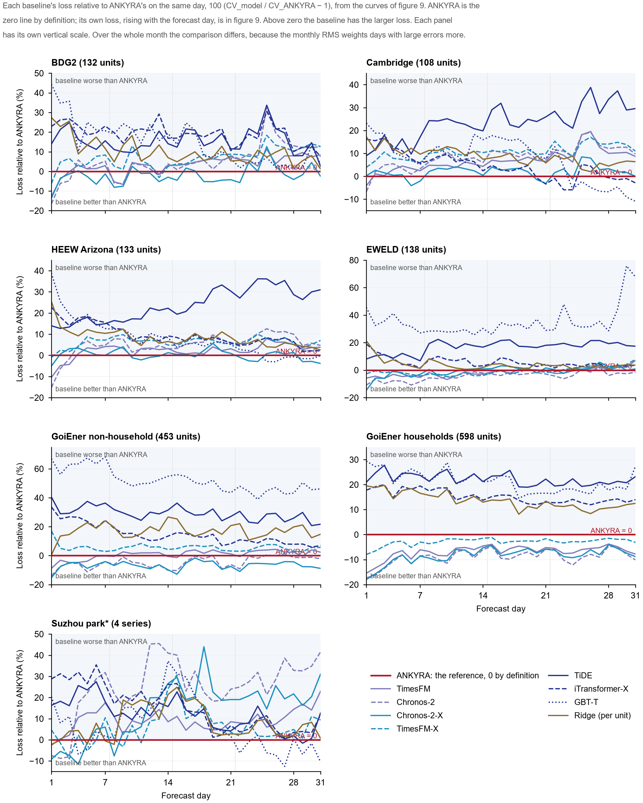

# Evaluation

The scored statistics below are in [`results/`](../results) ([file list](../results/README.md)), and the figures are
regenerated from those files by `figures/make_figures.py`. Four diagnostic passages report numbers that were not
exported: the [GBT-T correction](#correction-of-the-gbt-t-baseline), the
[Norwegian-school diagnosis](#why-ankyra-loses-on-norwegian-schools), the
[condition-matched extension](#a-condition-matched-extension-that-was-not-adopted) and the
[persistence of departures](#departures-from-normal-operation-persist); so does the evaluation of the spike guard
under [Robustness](#robustness-to-corrupted-contexts). Data sources and preparation are in [DATA.md](DATA.md); the
scoring code is in [`evaluation/`](../evaluation/README.md).

The study's working protocols, scripts and saved forecasts are not part of this repository. Where this page says
that a rule or an analysis was *fixed in advance*, it was written down in those working files before it was run.

**Contents**

- [Populations and tiers](#populations-and-tiers)
- [Baselines](#baselines)
- [Estimands](#estimands)
- [Results](#results): [test populations](#test-populations-late-windows-21-forecasters) ·
  [rank tests](#rank-significance-tests) · [scaled errors](#scaled-errors) ·
  [preview populations](#preview-and-reserved-populations) ·
  [LCL households](#lcl-households-and-two-changes-not-adopted) ·
  [loss metrics](#loss-metrics-of-every-forecaster) · [loss by forecast day](#loss-by-forecast-day) ·
  [energy through the month](#energy-as-the-month-accumulates) · [monthly energy](#monthly-energy-error) ·
  [readouts](#readouts)
- [Where the error comes from](#where-the-error-comes-from):
  [block attribution](#where-the-error-sits-block-attribution) · [history length](#history-length) ·
  [Norwegian schools](#why-ankyra-loses-on-norwegian-schools) ·
  [persistence of departures](#departures-from-normal-operation-persist)
- [Evidence for each design choice](#evidence-for-each-design-choice): [handover](#what-the-handover-contributes) ·
  [a rejected extension](#a-condition-matched-extension-that-was-not-adopted) ·
  [within-day anchoring](#within-day-anchoring-20) ·
  [one within-day trust per window](#one-within-day-trust-per-window-21) ·
  [micro-load rule](#the-near-zero-meters-and-the-micro-load-rule-201) ·
  [shrinkage constants](#sensitivity-to-the-shrinkage-constants)
- [Robustness to corrupted contexts](#robustness-to-corrupted-contexts)
- [Cost](#cost)
- [Limitations](#limitations)
- [Reproduction record](#reproduction-record)

## Populations and tiers

| Population | Country | Units / windows (all / late) | Tier | ANKYRA design status | Source |
|---|---|---|---|---|---|
| BDG2 2017, building meters | USA / Europe | 178 / 934 · 142 / 474 | test ¹ | seen | Miller et al., *Sci. Data* 2020, [doi:10.1038/s41597-020-00712-x](https://doi.org/10.1038/s41597-020-00712-x) |
| University of Cambridge estate | UK | 119 / 1,456 · 108 / 730 | test | first read | Langtry & Choudhary 2024, [doi:10.5281/zenodo.10955332](https://doi.org/10.5281/zenodo.10955332) (CC BY 4.0) |
| HEEW, Arizona State University | USA | 142 / 1,282 · 138 / 658 | test | first read | Dong et al., *Sci. Data* 2025, [doi:10.1038/s41597-025-06010-8](https://doi.org/10.1038/s41597-025-06010-8) |
| EWELD industrial and commercial meters | China | 274 / 1,023 · 197 / 523 | test | seen | Liu et al., *Sci. Data* 2023, [doi:10.1038/s41597-023-02503-6](https://doi.org/10.1038/s41597-023-02503-6) |
| GoiEner non-household supply points | Spain | 486 / 1,237 · 481 / 890 | test | seen | Quesada et al., *Sci. Data* 2024, [doi:10.1038/s41597-023-02846-0](https://doi.org/10.1038/s41597-023-02846-0) |
| GoiEner households | Spain | 1,109 / 1,258 · 696 / 696 | test | seen | as above |
| COFACTOR-SBHUB Oslo schools | Norway | 45 / 1,147 · 41 / 581 | preview | seen | Lien et al., *Data in Brief* 2025, [doi:10.1016/j.dib.2025.112288](https://doi.org/10.1016/j.dib.2025.112288) |
| COFACTOR Drammen municipal buildings | Norway | 45 / 1,375 · 43 / 689 | preview | seen | Lien et al., *Sci. Data* 2025, [doi:10.1038/s41597-025-04708-3](https://doi.org/10.1038/s41597-025-04708-3) |
| CINELDI industrial customers | Norway | 45 / 929 · 45 / 475 | preview | first read | Sandell et al., *Data in Brief* 2023, [doi:10.1016/j.dib.2023.109121](https://doi.org/10.1016/j.dib.2023.109121) |
| Suzhou industrial park (4 category aggregates) | China | 4 / 127 · 4 / 64 | preview | seen | Zhou et al., *Sci. Data* 2023, [doi:10.1038/s41597-023-02786-9](https://doi.org/10.1038/s41597-023-02786-9) |
| Low Carbon London households | UK | 965 / 1,215 · 710 / 710 | reserved ² | seen | UK Power Networks, [London Datastore](https://data.london.gov.uk/dataset/smartmeter-energy-consumption-data-in-london-households-vqm0d) |

**Design status.**

- **Seen:** results for the population were known when some ANKYRA component was specified.
  - The annual candidate followed a diagnosis on the Suzhou park.
  - The foundation-model candidate and the handover were developed on the Spanish development store (not listed;
    defined below).
  - The off-state rule followed the EWELD and household results.
  - The micro-load rule (2.0.1) followed the BDG2 test result of 2.0.0.
  - The single within-day trust (2.1) was chosen after all ten populations (and HKUST and Helsinki) had been scored
    with 2.0.1.
- **First read:** the population was scored for the first time after the handover had been fixed.

**Spanish development store.** A separate set of GoiEner non-household supply points in four categories, disjoint
from the GoiEner non-household test population, on which the method was developed. It is not scored in any table and
its data are not described in [DATA.md](DATA.md). "Development store" below always means this set.

¹ **BDG2 under 2.0.1.** The micro-load rule was written after the BDG2 test result of 2.0.0 had been seen, in response
to it. Under 2.0.1 and 2.1, BDG2 is therefore not a test set scored once with the model fixed: its numbers include a rule
written after its result was seen. The other five test populations and the four preview populations are bit-identical
in 2.0.0 and 2.0.1 ([details](#the-near-zero-meters-and-the-micro-load-rule-201)).

² **LCL.** Held in reserve while 2.0 and 2.0.1 were developed, and left out of the ten-population tables below. The
frozen 2.0.1 forecaster was scored on it once afterwards (3 October 2026); ANKYRA 2.1 was re-evaluated on the same
windows later. Its 1.x result had been seen earlier, so
LCL is not an unexposed population ([LCL households](#lcl-households-and-two-changes-not-adopted)).

**Tiers of the equal-information comparison.** ANKYRA was fixed first. The covariate-informed baselines were then
generated for every population and scored in two steps:

1. a preview on four populations, used for diagnosis;
2. after all model development had ended, one scoring of the six test populations.

LCL was held in reserve until the forecaster was frozen (note ² above). Between the two steps, four versions of a
within-day extension were developed on the development store and the preview populations. None passed its no-harm
criterion, so the test populations were never used for development. ANKYRA's univariate comparisons on the test
populations had been scored before the covariate baselines.

This is the history of ANKYRA 1.x. Three changes were made after the test populations had been scored, and all are
scored on the same windows:

- the within-day anchoring of 2.0, selected on the development populations and the pre-cutoff windows of the test
  cohorts, and re-evaluated on their post-cutoff windows under a frozen protocol
  ([Within-day anchoring (2.0)](#within-day-anchoring-20));
- the micro-load rule of 2.0.1, written in response to the BDG2 test result of 2.0.0 (note ¹ above). It changes no
  forecast on any other scored population;
- the single within-day trust of 2.1 (one trust per window instead of one per lead block), chosen in a
  simplification study after all populations had been scored with 2.0.1; every 2.1 number is a re-evaluation
  ([One within-day trust per window (2.1)](#one-within-day-trust-per-window-21)).

For the 2.0 within-day rule the four preview populations were reused in other roles: Oslo and Drammen as development
populations, CINELDI and the Suzhou park as validation populations. Where a table below calls them "development" or
"validation", it refers to that rule.

A window needs a completely observed 1,344-hour context and 744-hour target, and enough history for six pseudo-origins.
Panels are capped at 1,500 windows per population by a fixed thinning rule. Data are used as released by the
providers, with documented masking of imputed or zero-filled hours. The raw data are not redistributed here; follow
each provider's access route and terms.

## Baselines

| Information | Forecasters |
|---|---|
| Given ANKYRA's information set: 11 past, 10 future, 6 static features, no future observed weather; each model uses the part its architecture accepts | TiDE (all inputs), iTransformer-X (no future covariates), GBT-T (21 derived features), trained per population; Chronos-2-X (no static features), TimesFM-X (covariates through linear XReg), zero-shot |
| Load only, foundation models | TimesFM 2.5, Chronos-2 (zero-shot) |
| Load only, trained per population | DLinear, PatchTST, iTransformer, LSTM |
| Load only, statistical | Holt–Winters (damped, additive, period 168 h), MSTL (24 h and 168 h) |
| Calendar and climatological temperature | per-unit ridge regression refitted at every origin |
| Simple | previous-month, 4-week and last-year profiles; seasonal naive (day, week); a zero-shot gradient-boosting model |

The shared feature set is:

- load;
- temperature (climatology in the horizon);
- the load one year earlier (lag 8,736 h, always before the origin) with its availability mask;
- sines and cosines of hour, weekday and day of year;
- a non-working-day flag;
- the category (one-hot);
- the log ratio of the long-history to the recent mean.

PatchTST is channel-independent, so its load forecast is the same function with or without these channels.

**Training protocol for the trained models.**

- The cutoff is the first day of each population's median origin month.
- All training targets end before the cutoff.
- The learning rate is chosen from {1e-4, 3e-4, 1e-3} on the last 20% of training origins; at most 15 epochs with
  patience 3.
- Predictions are averaged over three seeds.
- Trained models are scored on origins after the cutoff (the *late* windows), on the same windows as every other model.
- Leakage checks (feature time indices, lag indices, normalisation statistics, training-target end) are implemented as
  assertions.

**No information after the origin, on either side.**

- **ANKYRA** uses only pre-origin load and temperature, the forecast month's calendar and a pre-origin temperature
  expectation ([METHOD.md](METHOD.md#information-at-the-origin)). Tests change every value after the origin and check
  that nothing moves. This establishes input isolation in the implementation, not the absence of later information in
  the providers' data preparation, the weather archives or the pretraining corpora.
- **Covariate-informed baselines** receive the same set:
  - future temperature enters as the same climatological expectation, never as observed weather;
  - the one-year load lag always precedes the origin.
- **Trained baselines** are fitted on targets that end before a cutoff and are scored only after it.
- **Test populations** were scored once for ANKYRA 1.x, after its development had ended. The 2.0 within-day rule was
  re-evaluated on them under a frozen protocol, and the 2.0.1 micro-load rule was written after the BDG2 result had
  been seen; the single trust of 2.1 was chosen after all populations had been scored with 2.0.1, so its numbers
  are re-evaluations ([Populations and tiers](#populations-and-tiers)).
- **Pretraining corpora** of the foundation models are the one exposure no forecaster controls (see
  [Limitations](#limitations)).

### Correction of the GBT-T baseline

GBT-T is our own implementation: scikit-learn's histogram gradient boosting on 21 features from the shared set, trained
across the units of each population. Its first version normalised every window by the window's own context mean and
standard deviation, with a floor of max(1% of the mean, 10⁻³ kW). On flat or all-zero contexts the floor produced
training targets 10⁵–10⁷ times too large, and the trees then forecast loads up to 18,500,000 kW on EWELD, whose largest
observed load is 13,427 kW. This affected 96% of EWELD's late windows, 12% on GoiEner non-household, 7% on BDG2 and 1%
on households.

The defect was found after the test populations had been scored. Two corrections were written before each was run:

- The first replaced the window scale by each unit's pre-cutoff scale everywhere. It removed the failure but also
  weakened GBT-T where it had worked, for example on Cambridge, HEEW and Oslo.
- The second, reported here, keeps the original scaling and uses the unit's pre-cutoff standard deviation only where
  the floor was active.

GBT-T was therefore scored three times on the test populations; the other 19 baselines once (ANKYRA's own scoring
history is in [Populations and tiers](#populations-and-tiers)). On EWELD the
per-window scaling still overshoots in 41% of windows. There the contexts are almost entirely zero with isolated spikes,
so read GBT-T's EWELD result as a limit of that design, not as an advantage of ANKYRA. The Norwegian diagnostics below
were recomputed with the corrected GBT-T.

## Estimands

**Unit-equal log RMS ratio (primary).** For unit $i$, $R_i$ is the RMS of its hourly errors over its windows, and
$r=N^{-1}\sum_i\log(R_i^{A}/R_i^{B})$. It is reported as the improvement $100[1-\exp(r)]$; positive favours ANKYRA.

**Intervals.** 95% intervals come from 2,000 bootstrap replicates that resample units and target-midpoint months
independently (UM). A contrast is *resolved* when its interval excludes zero.

**Mean per-unit rank.** Models are ranked within each unit by RMSE, with ties averaged. This summary stays defined
where some units have exactly zero error.

**Conventional metrics.** RMSE and MAE (unit mean, kW); CV(RMSE), NMBE and WAPE (unit median, %); WAPE also pooled.
See [`results/conventional_metrics.csv`](../results/conventional_metrics.csv) for the full windows and
[`results/conventional_metrics_late.csv`](../results/conventional_metrics_late.csv) for the late windows, where all 21
forecasters are available.

**Pooled MSE ratio.** The ratio of the two forecasters' mean squared errors over all windows. Units with large errors
and many windows weigh more in it (column `pooled_mse_ratio` of
[`results/benchmark_pairwise.csv`](../results/benchmark_pairwise.csv)).

**Why four summaries.** Pooled and unit-equal summaries can disagree in sign for an algebraic reason. The pooled MSE
ratio weights each unit's squared RMS ratio by its share of the reference error, and those weights are coupled to the
ratios (P19 in [theory/PROOFS.md](../theory/PROOFS.md)). No single summary is therefore reported alone.

## Results

All results below are for **ANKYRA 2.1**: 2.0.1 (2.0.0 plus the micro-load rule,
[METHOD.md](METHOD.md#off-state-and-micro-load-rules)) with one within-day trust per window instead of one per lead
block ([One within-day trust per window (2.1)](#one-within-day-trust-per-window-21)).

- **What differs from 2.0.1.** Only the within-day block and the quantities computed from the delivered trajectory.
  Level, daily path, daily means and the energy readout are bit-identical; 8,532 of the 10,768 windows change. All
  2.1 numbers are re-evaluations of data already scored with 2.0.1.

- **What differs between 2.0.0 and 2.0.1.** Nine of the ten scored populations are bit-identical in the two versions. Only BDG2
  changes, and with it every aggregate that includes BDG2.
- **Status of the BDG2 numbers.** The rule was written after the BDG2 test result of 2.0.0 had been seen. The BDG2
  numbers describe what the rule changes; they are not a test of it
  ([The near-zero meters and the micro-load rule](#the-near-zero-meters-and-the-micro-load-rule-201)).
- **Earlier versions**, scored on the same windows, are kept unchanged: 2.0.0 in
  [`results/ankyra_2_0_0/`](../results/ankyra_2_0_0/), 2.0.1 in [`results/ankyra_2_0_1/`](../results/ankyra_2_0_1/) and 1.x
  in [`results/ankyra_1x/`](../results/ankyra_1x/). 2.1 against its reduced versions (2.0.1 among them) is in
  [`results/ablation.csv`](../results/ablation.csv); 2.0.0 against 1.x is in
  [Within-day anchoring (2.0)](#within-day-anchoring-20), which also states how the 2.0 evidence differs in status
  from the 1.x evidence.
- **Two reduced versions** recur below and in the result files. The *fixed division* (F0) takes the level and the
  daily path from the unit's history and the within-day shape from TimesFM; it has no model candidate, no handover
  and no off-state rule. F1 is ANKYRA 1.x without the off-state rule.

### Test populations (late windows, 21 forecasters)

Primary estimand first: the unit-equal improvement $100[1-\exp(r)]$ in hourly RMS against each forecaster. The rank
rows at the bottom are a secondary summary.

| | BDG2 † | Cambridge | HEEW | EWELD | GoiEner NH | GoiEner HH |
|---|---:|---:|---:|---:|---:|---:|
| vs TiDE | +45.6 * | +18.7 * | +19.6 * | +33.4 * | +17.1 * | +14.6 * |
| vs iTransformer-X | +39.2 * | +1.5 | +6.2 * | +20.7 * | +9.4 * | +12.0 * |
| vs GBT-T ‡ | +46.5 * | +5.4 | +6.5 * | +46.2 * | +32.3 * | +15.9 * |
| vs Chronos-2-X | +12.1 | +2.5 | +2.0 | +14.6 * | +1.4 | +0.2 |
| vs TimesFM-X | +40.5 * | +9.8 * | +5.8 * | +16.7 * | +8.2 * | +2.9 |
| vs TimesFM (load only) | +2.5 | +8.3 * | +3.7 | +2.6 | +5.5 | −3.9 (+) |
| 2.0.0 vs ANKYRA 1.x (the within-day anchoring) § | +0.9 * | +2.9 * | +0.8 * | +0.4 | +3.8 * | −0.1 |
| Resolved better than, of 20 | 15 | 17 | 17 | 18 | 17 | 16 |
| Resolved worse than, of 20 | 0 | 0 | 0 | 0 | 0 | 1 |
| ANKYRA mean per-unit rank | **4.5** | **4.6** | **4.7** | **6.6** | **5.1** | 7.2 |
| ANKYRA position | 1 | 1 | 1 | 1 | 1 | 2 |

\* resolved in ANKYRA's favour; (+) resolved against ANKYRA. ‡ Corrected implementation; see
[Correction of the GBT-T baseline](#correction-of-the-gbt-t-baseline). § 2.0.0 against 1.x isolates the within-day
anchoring. 2.1 differs from 2.0.0 on all six by the single trust; 2.1 against 1.x is +2.9% * (Cambridge), +1.0% *
(HEEW), +0.5% (EWELD), +3.8% * (GoiEner NH) and −0.1% (households). On BDG2, 2.1 against 1.x also contains the
micro-load rule (+37.0%).

† **The BDG2 column includes the micro-load rule**, which was written after the BDG2 result of 2.0.0 had been seen.
The column describes what the rule changes; it is not a test of the rule
([details and the full table](#the-near-zero-meters-and-the-micro-load-rule-201)).

- **In 2.0.0** the contrasts were −53.4% against TimesFM and −38.3% against Chronos-2-X (both unresolved), TiDE
  +14.4% \*, iTransformer-X +4.4%, GBT-T +15.9% \*, TimesFM-X +6.5%; resolved better than 10 of 20; mean rank 4.60,
  first. Three meters that read 0.0002–0.0003 kW in every window dominated the unit means.
- **In 2.0.1 and 2.1** ANKYRA returns the TimesFM forecast on those meters. They still dominate the BDG2 unit means, because
  the primary estimand is a ratio, in three different ways:
  - against TimesFM they now contribute nothing (+2.5% with them, +2.5% without);
  - against forecasters that do better than TimesFM on them they still count against ANKYRA: MSTL (−18.5% with them,
    +18.7% without), the previous-month profile (−21.0% / +23.2%) and, slightly, Chronos-2 (+1.5% / +6.8%); none is
    resolved;
  - against forecasters that do worse than TimesFM on them they now count for ANKYRA: the trained baselines, TimesFM-X
    and the per-unit ridge rise by 29–36 points, and Chronos-2-X is at +12.1% with them against −2.1% without. That
    rise is not a gain in ANKYRA's own forecasting.
- **Without the three meters** (10 of the 474 late windows) the point estimates of 2.0.0, 2.0.1 and 2.1 agree to 0.01
  points: +2.5% against TimesFM and −2.1% against Chronos-2-X, and +10.4%, +11.9%, +8.8% and +6.8% against TiDE,
  iTransformer-X, GBT-T and TimesFM-X. The intervals do not agree, because six further meters have micro-load windows:
  14 of the 20 contrasts are resolved in ANKYRA's favour under 2.0.1 and 2.1 and 11 under 2.0.0 (iTransformer-X,
  iTransformer and PatchTST only with the rule). The reading that does not involve the rule at all is 2.0.0 without the three meters:
  resolved better than 11 of 20, none worse, first by rank. ANKYRA's mean rank is 4.51 with the three meters and 4.41
  without them (2.0.1: 4.54 and 4.44; 2.0.0: 4.60 and 4.37), first either way.

The three meters are the BDG2 units whose largest hourly load over their panel windows is at most 0.001 kW
(Lamb_education_Harold, Lamb_education_Hillary, Lamb_office_Jo). Every comparison with and without them, full and late
windows, is in [`results/bdg2_near_zero_sensitivity.csv`](../results/bdg2_near_zero_sensitivity.csv); the 2.0.1 and
2.0.0 versions of the file are in [`results/ankyra_2_0_1/`](../results/ankyra_2_0_1/) and
[`results/ankyra_2_0_0/`](../results/ankyra_2_0_0/). The 46 windows the rule changes are
listed one by one in [`results/bdg2_micro_load_windows.csv`](../results/bdg2_micro_load_windows.csv).

Mean per-unit rank averaged over the six test populations:

| Forecaster | Mean rank |
|---|---:|
| **ANKYRA 2.1** | **5.45** |
| per-unit ridge | 7.31 |
| Chronos-2-X | 7.84 |
| iTransformer-X | 8.17 |
| TimesFM | 8.46 |
| TimesFM-X | 8.57 |

(ANKYRA 2.0.1: 5.49; 2.0.0: 5.51; 1.x: 6.00.) By position, ANKYRA 2.1 is first on five of the six test populations and
second on households, as 2.0.0 and 2.0.1 were. No other forecaster is in the top two on more than two of them (Figure 12).

### Rank significance tests

The primary estimand is a ratio with a bootstrap interval. The forecasting literature also uses rank tests across
series, so the same late-window forecasts were tested that way: per-unit RMSE of the 21 forecasters, units as blocks,
Friedman's test, the Nemenyi critical difference at 5%, and paired Wilcoxon signed-rank tests of ANKYRA against each
forecaster with Holm's correction ([`results/rank_tests.csv`](../results/rank_tests.csv)). Computed after scoring.
The statements below are for 2.1; where 2.0.0 and 2.0.1 differed, their values are given in parentheses.

- **Six test populations pooled (1,762 units).** Friedman's test rejects equal ranks (p < 10⁻³⁰⁰). ANKYRA's mean rank
  is 5.99 (2.0.0 and 2.0.1: 6.04); the next forecaster, the per-unit ridge, is at 7.07, and the critical difference is 0.75, so **no forecaster
  is within the critical difference of ANKYRA**. The Holm-corrected Wilcoxon tests put ANKYRA ahead of all 20.
- **Per test population.** ANKYRA is significantly better than 20 of the 20 baselines on BDG2, HEEW, EWELD and GoiEner
  non-household (HEEW under 2.0.1: 19, Chronos-2-X not separated), 17 on Cambridge (Chronos-2-X, GBT-T and
  iTransformer-X not separated) and 19 on households (2.0.1: 18, PatchTST not separated).
- **Where a baseline is significantly better.** On households the per-unit ridge beats ANKYRA for the typical unit;
  on Oslo GBT-T does, and on Drammen Chronos-2-X does. These are the same three deficits the mean ranks show.
- **Households and TimesFM.** The primary estimand's one resolved deficit is against TimesFM on households (−3.9% in
  the unit-equal log ratio). The rank test reads the other way: ANKYRA has the lower RMSE on most household units
  (mean rank 7.22 against TimesFM's twelfth place) and the paired test favours ANKYRA. The two statements are both
  true. The log ratio is moved by units on which TimesFM's error is a small fraction of ANKYRA's, typically low-load
  units for which a median-type forecast near zero is right; the rank test counts units.
- The Suzhou park has four series, and no paired test can separate anything there.

### Scaled errors

For comparison with the forecasting literature, [`results/scaled_errors.csv`](../results/scaled_errors.csv) gives
RMSSE and MASE for all 21 forecasters: each window's error divided by the in-sample error of the weekly seasonal-naive
forecast over its 1,344-hour context (lag 168 h), aggregated per unit and summarised by the median and the geometric
mean over units.

| Population | ANKYRA RMSSE (geometric mean) | Position | Lowest | ANKYRA MASE | Position | Lowest |
|---|---:|---:|---|---:|---:|---|
| BDG2 | 1.136 | 2 | Chronos-2-X 1.092 | 1.245 | 3 | Chronos-2-X 1.151 |
| Cambridge | 1.207 | 1 | — | 1.180 | 2 | Chronos-2-X 1.175 |
| HEEW | 1.141 | 1 | — | 1.286 | 4 | TimesFM 1.208 |
| EWELD | 0.743 | 1 | — | 0.930 | 2 | TimesFM 0.901 |
| GoiEner non-household | 0.906 | 1 | — | 1.112 | 4 | Chronos-2-X 0.984 |
| GoiEner households | 0.766 | 2 | TimesFM 0.738 | 0.944 | 5 | TimesFM 0.808 |
| Oslo | 1.246 | 6 | GBT-T 1.090 | 1.324 | 4 | GBT-T 1.186 |
| Drammen | 1.364 | 5 | Chronos-2-X 1.313 | 1.318 | 2 | Chronos-2-X 1.251 |
| CINELDI | 1.043 | 1 | — | 1.112 | 3 | Chronos-2 1.061 |
| Suzhou park | 1.398 | 2 | GBT-T 1.291 | 1.259 | 1 | — |

- On the squared-error scale (RMSSE) ANKYRA is lowest on four of the six test populations and second on the other two.
- On the absolute-error scale (MASE) the zero-shot foundation models are lower on most populations. Absolute error is
  minimised by the median of the predictive distribution and squared error by its mean; the foundation models' point
  forecasts are medians, ANKYRA's level and daily path are mean-type. This is the same pattern as in the MAE and WAPE
  panels of Figure 8.
- Values above 1 do not mean a forecaster is worse than a naive forecast: the scale is the naive forecast's one-week-ahead
  in-sample error, and the forecasts are scored up to 31 days ahead. Out of sample the weekly seasonal naive forecast
  itself scores 1.05–1.72.

### Preview and reserved populations

- **Oslo:** GBT-T (−12.3%) is resolvably better than ANKYRA 2.1; iTransformer-X (−3.9%) is not resolved. ANKYRA ranks
  3rd of 21 in the late windows (1.x: 5th, with GBT-T −18.0% and iTransformer-X −9.2%).
- **Drammen:** 2nd of 21; no contrast resolved against ANKYRA (1.x: 7th).
- **CINELDI:** 1st of 21 (1.x: 3rd).
- **Suzhou park:** 1st of 21.
- **LCL** is not part of the ten-population comparisons. Its 1.x load-only comparison (3rd of 14) is in
  [`results/ankyra_1x/`](../results/ankyra_1x/). Its 2.0.1 result and the 2.1 re-evaluation are in the
  [next section](#lcl-households-and-two-changes-not-adopted); it does not change the ranks here.

Across the ten scored populations ANKYRA 2.1's mean rank is 4.80 (2.0.1: 4.91; 2.0.0: 4.92), ahead of the per-unit ridge
(6.99), iTransformer-X (7.11) and Chronos-2-X (7.65).

**Full windows.** The comparison without the trained models covers 14 forecasters on the ten populations scored for
2.0, 2.0.1 and 2.1 (13 on GoiEner non-household, where the per-unit ridge has no full-window forecast; LCL is reported
separately and is not in this ten-population table):

- ANKYRA 2.1 ranks first on 9 and second on Drammen (2.0.1: first on 8, second on Drammen and households);
- its mean rank is 2.71, against 4.23 for Chronos-2-X and 4.06 for the ridge on the nine populations where the ridge
  is scored;
- no contrast is resolved against it;
- on BDG2 (all 934 windows, 46 of them changed by the micro-load rule) the contrasts with TimesFM and Chronos-2-X are
  +5.8% and +13.3%, neither resolved (2.0.0: −35.6% and −24.8%), and the per-unit ridge and TimesFM-X move from +7.2%
  and +7.4% to +35.5% and +35.6%: the same shift, for the same reason, as in the late windows
  ([details](#the-near-zero-meters-and-the-micro-load-rule-201)).

### LCL households and two changes not adopted

The Low Carbon London households were held in reserve while 2.0 and 2.0.1 were developed. The frozen 2.0.1
forecaster was then scored on them once, without retuning. The result is reported in full in
[LCL_AND_CLOSEOUT.md](LCL_AND_CLOSEOUT.md#lcl-final-stage) and is not merged into the ten-population tables, ranks
and figures.

- **Windows.** 1,215 windows of 965 households; 710 late windows, on which all 21 forecasters are available.
- **Against 1.x.** 2.0.1 improves on 1.x by 0.7% on the same inputs (0.9% on the late windows), resolved.
- **Against the foundation models.** The contrasts with TimesFM (+1.2%), Chronos-2 (+1.2%), Chronos-2-X (+1.5%) and
  TimesFM-X (+1.4%) are not resolved.
- **Rank.** On the late windows ANKYRA has the lowest mean per-unit rank of the 21 forecasters (6.25; per-unit ridge
  6.48). The ridge is not resolvably worse there (+1.2%), so this is not a significant hourly advantage.
- **Same-information baselines.** None of the five, nor the per-unit ridge, is significantly better than ANKYRA
  (six one-sided tests with Holm's correction). This does not show that ANKYRA is better than all six.
- **Status.** The 1.x result on LCL was known beforehand. LCL is therefore not an unexposed population, and this is
  not a first read. No LCL window meets the micro-load condition, so LCL gives no test of that rule. Intervals were
  not assessed for 2.0.1 on LCL.
- **Re-evaluation of 2.1** (the same windows read again; the 2.0.1 numbers above remain the test). 2.1 is 0.13% better
  than 2.0.1, resolved, and 0.8% better than 1.x on the same inputs (1.1% on the late windows), resolved. The contrasts
  with TimesFM (+1.4%), Chronos-2 (+1.3%), Chronos-2-X (+1.7%) and TimesFM-X (+1.5%) are not resolved. Late mean
  rank 6.08, lowest of 21 (per-unit ridge 6.49; +1.4% against it, not resolved); none of the six same-information
  checks finds a baseline significantly better.

Two further changes were examined after 2.0.1 and not adopted: a daily path taken partly from the per-unit ridge,
and an interval built from ANKYRA's own earlier errors. Each stopped at a check fixed in advance, before anything
was scored on a test window or on LCL
([record](LCL_AND_CLOSEOUT.md#two-changes-that-were-tried-and-not-adopted)). Neither was adopted; the later change to
2.1 concerns only the within-day trust.

### Loss metrics of every forecaster

Figure 8 gives the conventional losses of all 21 forecasters on the same late windows, for the six test populations and
the Suzhou industrial park (a preview population with four aggregate series). The values were computed when the panel
was scored; the export reads them and recomputes nothing. RMSE and MAE are means over units in kW, so larger units weigh
more; CV(RMSE) and WAPE are taken at the median unit.

| ANKYRA's position among 21 | BDG2 | Cambridge | HEEW | EWELD | GoiEner NH | GoiEner HH | Suzhou park |
|---|:---:|:---:|:---:|:---:|:---:|:---:|:---:|
| RMSE (unit mean) | 1 | 2 | 2 | 2 | 2 | 1–2 | 1 |
| MAE (unit mean) | 1 | 2 | 2 | 3 | 2 | 5 | 1 |
| CV(RMSE) (median unit) | 2 | 2 | 2 | 2 | 2 | 2 | 1 |
| WAPE (median unit) | 2 | 2 | 3 | 2 | 4 | 5 | 1 |
| WAPE (pooled) | 1 | 2 | 1 | 3 | 3 | 5 | 1 |

"1–2" marks a tie at the four decimals of the file: RMSE on households (ANKYRA and the per-unit ridge, 0.1728 kW; at
full precision the ridge is lower, 0.17276 against 0.17283 kW).

- ANKYRA is between first and fifth on every metric and population. In the 28 cells of the figure it is first in 6
  and tied for first in one. No baseline is lower on all of them.
- The forecasters lower than ANKYRA most often are Chronos-2-X (10 of the 28 cells), Chronos-2 (7) and TimesFM (5);
  iTransformer-X is lower in 3 and the per-unit ridge in 2 (it ties in a third). The file also carries ANKYRA 2.0.1,
  2.0.0 and 1.x as rows, so
  that each change can be read metric by metric.
- **BDG2 under 2.0.1 and 2.1.** The positions are those of 2.0.0, except the pooled WAPE: under 2.0.1 it equalled
  Chronos-2-X's to the two decimals of the file (11.44%; 2.0.0: 11.45%, second), under 2.1 it is the lowest (11.43%).
  The unit-mean RMSE and MAE move by 0.03 kW or less (28.71 and 20.12 kW). The median-unit CV(RMSE) falls from 19.4%
  to 18.6% and the median-unit WAPE from 13.8% to 13.3% (2.0.1: 13.4%), both still behind Chronos-2-X (18.1% and
  12.6%).
- MAE and WAPE are minimised by the median of the predictive distribution, squared-error metrics by its mean. On MAE and
  WAPE, zero-shot Chronos-2 or TimesFM variants are lower than ANKYRA on EWELD and on both GoiEner populations.
- These metrics weight units differently from the unit-equal log ratio, which remains the primary estimand.
- GBT-T's EWELD errors remain the largest among the same-information models (unit-mean RMSE 153.9 kW, against 98.9
  for ANKYRA), because its per-window scaling still overshoots there (see the GBT-T correction above).

### Loss by forecast day

Figures 9 and 10 split the hourly load error of the late-window forecasts by forecast day; Figure 10 shows the curves
of Figure 9 relative to ANKYRA. For unit $u$ and day $d$, $r_{u,d}$ is the RMSE
of that day's 24 hours over all the unit's windows and $\bar y_u$ the unit's mean load. The curves are geometric means of
$100\,r_{u,d}/\bar y_u$ over one fixed set of units whose daily errors are nonzero for all 21 forecasters: 132 of 142
units on BDG2, 108 of 108 on Cambridge, 133 of 138 on HEEW, 138 of 153 on EWELD, 453 of 477 on GoiEner non-household,
598 of 679 on households and all four Suzhou series. On this scale the ratio of two curves on day $d$ is the unit-equal
RMS ratio of the primary estimand restricted to that day.

The values come from the scored forecasts, and pooled over the month they give back the scored metrics and the primary
estimand exactly. The split was made after scoring; it is a description, and nothing was tuned on it.
[`results/lead_day_metrics.csv`](../results/lead_day_metrics.csv) also gives unit-mean RMSE and MAE in kW, and
median-unit CV(RMSE) and normalised MAE, for every day.

- **Position.** On every forecast day of every population in the figure ANKYRA 2.1 is among the six forecasters with
  the lowest loss of 21. It is the lowest on 9 of 31 days on BDG2, 16 on Cambridge, 13 on HEEW and 13 on the Suzhou
  park, and the lowest or second-lowest on 23–24 days of each of those four (1.x: lowest on 8, 11, 7 and 9 days).
- **Growth with lead time.** From week 1 (days 1–7) to week 4 (days 22–31) ANKYRA's loss grows by ×1.19–1.56. That is
  less than TimesFM's (×1.24–1.68) and Chronos-2's (×1.25–1.80) on all seven populations.
- **The first day.** The zero-shot foundation models are lower on day 1 everywhere, and ANKYRA ranks third to fifth of 21.
- **From the second week.** On BDG2, Cambridge, HEEW and the Suzhou park ANKYRA is lowest or second-lowest on 17–21 of
  the 24 days from day 8 (1.x: 13–16). On EWELD it is on 7 of them.
- **GoiEner.** On the non-household set ANKYRA 2.1 is lower than TimesFM on 19 of 31 days (1.x: 0), but Chronos-2-X
  stays lower on every day and Chronos-2 on 29 (2.0.1: 27; 1.x: both on every day). The counts are taken at the three decimals of
  [`results/ankyra_2_vs_1x_by_day.csv`](../results/ankyra_2_vs_1x_by_day.csv); at the two decimals of
  `lead_day_metrics.csv` one of the 29 days is a tie. On households all four foundation-model variants are lower on
  every day, as for 1.x. The within-day anchoring does not act on households (see below).
- **BDG2 under 2.0.1.** The micro-load rule leaves the BDG2 curve where it was: 2.0.1's value differs from 2.0.0's by at
  most 0.02 points on any day (10.8% on day 1, 22.6% on day 31) and every count above was the same for 2.0.0 and 2.0.1.
  Under 2.1 the BDG2 curve reads 10.8% on day 1 and 22.5% on day 31. The
  curves are computed on the fixed unit set, and the three near-zero meters that carry the change in the test table
  are not in it.

**Why the monthly comparison differs.** With $R_u$ the unit's RMS over the whole window, $R_u^2$ is the mean of its 31
daily MSEs. So $\log R_u$ is the mean of $\log r_{u,d}$ over the days plus $J_u\ge0$ (Jensen), and $J_u$ grows with how
uneven the unit's daily errors are. Averaged over units, the primary estimand splits exactly:

$$\frac1N\sum_u\log\frac{R_u^{A}}{R_u^{B}}=\frac1{31N}\sum_{u,d}\log\frac{r^{A}_{u,d}}{r^{B}_{u,d}}+\frac1N\sum_u\big(J^{A}_u-J^{B}_u\big).$$

The daily errors of TimesFM, Chronos-2 and Chronos-2-X are more uneven than ANKYRA's on all seven populations. Over the
month their larger-error days weigh more, so the monthly comparison moves towards ANKYRA. Against TiDE, iTransformer-X,
GBT-T and the per-unit ridge the unevenness runs the other way, except on EWELD for GBT-T and, marginally, the
per-unit ridge.

| Fixed unit set, improvement $100[1-\exp(r)]$ | vs TimesFM: daily | month | vs Chronos-2: daily | month | vs Chronos-2-X: daily | month |
|---|---:|---:|---:|---:|---:|---:|
| BDG2 | +3.0 | +5.8 | +4.4 | +10.2 | −2.2 | +1.4 |
| Cambridge | +6.2 | +8.3 | +7.7 | +9.9 | +1.8 | +2.5 |
| HEEW | +2.0 | +3.9 | +4.6 | +6.6 | +0.2 | +1.0 |
| EWELD | −1.7 | +3.0 | −4.6 | +0.8 | −0.7 | +4.8 |
| GoiEner non-household | +0.6 | +5.7 | −5.0 | +3.5 | −7.4 | +0.9 |
| GoiEner households | −7.5 | −0.8 | −10.0 | −0.8 | −9.2 | −0.7 |
| Suzhou park | +8.3 | +10.6 | +19.6 | +22.7 | +11.7 | +15.3 |

"Daily" is the average of the daily log ratios, "month" the monthly log ratio on the same units; positive favours
ANKYRA. On all units the month column becomes the primary estimand of the test table. The fixed set leaves out units
whose error is exactly zero on some day for some forecaster: meters that are off, read near zero or hold a constant
value. On BDG2 these are 10 units, among them the three near-zero meters. On EWELD they are 59: 44 with a mean load below
10⁻⁶ kW and 15 that switch off on some days. There the month column differs from the primary estimand on all units.
On BDG2 it differs too (+5.8%, +10.2% and +1.4% on the fixed set against +2.5%, +1.5% and +12.1% on all units); the
difference is the ten excluded units. The fixed-set row is the same for 2.0.0 and 2.0.1 to 0.1 points
([details](#the-near-zero-meters-and-the-micro-load-rule-201)).

### Energy as the month accumulates

Figure 9b follows the error of the energy delivered through each forecast day, for the same forecasts as Figure 9.
For unit $u$ and day $d$, $c_{u,d}$ is
the RMS, over the unit's windows, of the error of the mean load over days 1 to $d$, and the curves are geometric means
of $100\,c_{u,d}/\bar y_u$ over one fixed set of units (nonzero mean load and nonzero errors for all 21 forecasters),
the aggregation of Figure 9 applied to energy instead of hourly load. Day 31 is the monthly energy error. The same
file gives the error of each single day's energy ([`results/lead_day_energy.csv`](../results/lead_day_energy.csv)).
Computed after scoring, as a description.

| Population | ANKYRA lowest of 21 (days of 31) | Position at day 31 | ANKYRA at day 31 | Next or better forecaster | Below all four foundation-model variants from day 8 (of 24) |
|---|---:|---:|---:|---|---:|
| BDG2 | 25 | 1 | 7.9% | Chronos-2-X 8.2% | 22 |
| Cambridge | 19 | 2 | 8.5% | iTransformer-X 8.1% | 24 |
| HEEW | 18 | 1 | 7.6% | Chronos-2-X 7.7% | 18 |
| EWELD | 20 | 1 | 16.7% | PatchTST 17.5% | 19 |
| GoiEner non-household | 29 | 1 | 11.6% | per-unit ridge 13.1% | 24 |
| GoiEner households | 0 | 6 | 11.7% | per-unit ridge 10.0% | 24 |
| Suzhou park (4 series) | 0 | 2 | 14.4% | TimesFM-X 13.8% | 0 |

- The foundation models' energy error grows through the month as their level drifts (TimesFM at day 31: 9.4%, 9.9%,
  8.1%, 18.3%, 15.9%, 17.4% on the six test populations); ANKYRA's stays the lowest or close to it because the level and
  daily path are anchored to the unit's history.
- On households ANKYRA ranks sixth at day 31. It is a quarter to a third below the four foundation-model variants
  (15.5–17.4%) but behind the per-unit ridge, three profile or naive forecasters and the LSTM (10.0–11.4%). On the
  Suzhou park the covariate-conditioned TimesFM (TimesFM-X) is lower from day 2 on.
- For a single day's energy (not accumulated) ANKYRA ranks first or second of 21 on six of the seven populations and
  fifth on EWELD.
- **BDG2 under 2.0.1 and 2.1.** The BDG2 row is the same as for 2.0.0 (day 31: 7.92% against 7.91%), for the reason given
  under Figure 9: the three near-zero meters are outside the fixed unit set.

### Monthly energy error

A month's energy error is $744\,\ell(e)$ kWh, 744 times the level error (P3). ANKYRA's design acts on this quantity:
its level and daily path come from the unit's own history. The within-day block has a zero mean on every day, so
neither TimesFM's shape nor its anchoring since 2.0 changes the energy. On the same late windows, Figure 11 compares
the monthly energy error of ANKYRA with that of each of the 20 baselines. The estimand is the unit-equal RMS ratio of
the primary estimand applied to the level error, with the same unit-and-month bootstrap intervals. It was computed after scoring and is a description, not a planned test
([`results/energy_error.csv`](../results/energy_error.csv), which also gives the median-unit absolute percentage energy
error of every forecaster).

- **No resolved deficit.** On all seven populations ANKYRA is never resolvably worse than any of the 20 baselines. It is
  resolvably better than 17 of them on GoiEner non-household, 14 on Cambridge, EWELD and BDG2 (BDG2 in 2.0.0: 4; see
  the BDG2 item below), 12 on households (2.0.1: 11), 9 on HEEW and 6 on the Suzhou park. (The energy error is computed on the
  delivered, projected trajectories; outside BDG2 the 2.1 values differ from 1.x by at most 0.2 points and no contrast
  changes resolution between 1.x and 2.1; 2.0.1 differed from 1.x by up to 0.4 points, and its household contrast with
  PatchTST was unresolved.)
- **Where the hourly view favours the foundation models.** On GoiEner households ANKYRA's monthly energy error is 22–27%
  lower than that of TimesFM, Chronos-2, Chronos-2-X and TimesFM-X, each resolved; on GoiEner non-household it is 18–25%
  lower, resolved against three of them. The within-day shape, where the foundation models are as good or better, carries
  most of these populations' hourly error (about 80% at the median unit), and energy is the part that ANKYRA changes.
- **Against TimesFM**, whose within-day shape ANKYRA starts from, the energy error is 4–25% lower on all seven populations,
  resolved on Cambridge and both GoiEner sets (BDG2: +11.9%, unresolved; 2.0.0: −38.7%).
- **BDG2.** The numbers include the micro-load rule, written after the BDG2 result of 2.0.0 had been seen
  ([details](#the-near-zero-meters-and-the-micro-load-rule-201)).
  - In 2.0.0 the comparisons with TimesFM, Chronos-2, Chronos-2-X, MSTL and the previous-month profile were negative
    and unresolved, and 4 baselines were resolved in ANKYRA's favour. The three near-zero meters dominated the unit
    means.
  - In 2.0.1 and 2.1 ANKYRA's energy forecast on those meters is TimesFM's. The comparisons with TimesFM, Chronos-2 and
    Chronos-2-X are +11.9%, +7.7% and +12.9%, none resolved; MSTL (−18.1%) and the previous-month profile (−54.4%)
    stay negative and unresolved. 14 baselines are resolved in ANKYRA's favour. The rise from 4 to 14 comes from the
    same meters: they now count for ANKYRA against forecasters that do worse than TimesFM on them (the trained
    baselines, the per-unit ridge, TimesFM-X, the zero-shot gradient boosting and the last-year profile), and they
    still count against it in the contrasts with MSTL and the previous-month profile.
  - Without the three meters every point estimate favours ANKYRA; against TimesFM and Chronos-2-X the improvement is
    +12.1% and +0.3% (MSTL +23.7%, previous-month profile +1.2%). The point estimates of the two versions agree there
    to 0.1 points. The count of resolved contrasts does not: 6 under 2.0.1 and 2.1 and 5 under 2.0.0, iTransformer-X being
    resolved only with the rule, which still acts on six other meters in that subset.
- **Small unresolved deficits** remain against the per-unit ridge and three profile or naive models on households (3–5%),
  iTransformer-X on Cambridge (4%) and TimesFM-X on the Suzhou park (4%). The two unresolved BDG2 deficits are in the
  item above.

### Readouts

- **Peak operator** (unchanged by 2.0 and 2.1 up to the nonnegativity projection):
  - against the maximum of the same trajectory, 18–66% lower peak error on all 10 scored populations (all resolved);
  - against last month's observed peak, better on Drammen, Oslo and HEEW (12–16%, resolved) and worse on CINELDI (19%,
    resolved) and EWELD (20%; resolved under 2.0.1, interval [+0.004, +0.400] in log units, but not under 2.1,
    [−0.001, +0.400]).
  - 2.0.1 and 2.1: on the 46 BDG2 micro-load windows the daily means, and with them the readout, are TimesFM's. The two BDG2
    contrasts above are unchanged (+37.3%, resolved; −8.2%, unresolved). Against the same readout applied to TimesFM
    the BDG2 contrast moves from −43.3% to +3.3%, neither resolved, which is the near-zero meters again.
  See [`results/peak_readout.csv`](../results/peak_readout.csv).
- **Interval (GoiEner households):**
  - 79.5% coverage at nominal 80%, 88.2% at 90%;
  - Winkler score 4.4% better than the same interval around the fixed division and 7.6% better than TimesFM's native
    band (both resolved);
  - not distinguishable from Chronos-2's native quantiles (0.5% behind).
  See [`results/intervals_households.json`](../results/intervals_households.json) and Figure 13.

**Intervals on all ten populations.** The households result above was the only interval evaluation in 1.x. The same
interval (unchanged residual model) was afterwards applied to all windows of the ten scored populations, with the native
quantiles of TimesFM 2.5 and Chronos-2 computed from the same contexts
([`results/intervals_by_population.csv`](../results/intervals_by_population.csv); descriptive, computed after scoring).

| Population | Coverage at nominal 80%: ANKYRA / Chronos-2 / TimesFM | At nominal 90%: ANKYRA / Chronos-2 | ANKYRA by week 1–4 | Winkler(80), ANKYRA vs TimesFM | vs Chronos-2 |
|---|---:|---:|---:|---:|---:|
| BDG2 | 75.6 / 64.9 / 37.2 | 84.5 / 79.4 | 80, 76, 76, 72 | +2.8% | −14.1% |
| Cambridge | 77.0 / 71.2 / 39.7 | 86.2 / 83.9 | 84, 79, 75, 72 | +14.5% * | −1.8% |
| HEEW | 80.2 / 73.2 / 38.9 | 88.2 / 85.4 | 86, 82, 80, 76 | +9.4% * | −4.1% (+) |
| EWELD | 82.2 / 78.6 / 56.6 | 88.0 / 87.3 | 86, 84, 81, 79 | −19.1% | −54.6% (+) |
| GoiEner non-household | 79.0 / 71.5 / 43.2 | 87.3 / 84.9 | 81, 80, 79, 77 | +6.3% * | −10.4% (+) |
| GoiEner households | 79.5 / 68.8 / 36.1 | 88.2 / 82.1 | 82, 80, 78, 78 | +7.6% * | −0.5% |
| Oslo | 80.5 / 66.7 / 36.6 | 89.2 / 80.7 | 85, 82, 79, 77 | +18.6% * | +1.1% |
| Drammen | 81.4 / 71.7 / 37.6 | 89.0 / 83.6 | 86, 84, 81, 77 | +18.2% * | −0.5% |
| CINELDI | 80.7 / 73.6 / 43.1 | 88.9 / 85.9 | 84, 83, 80, 77 | +13.7% * | −6.3% (+) |
| Suzhou park | 80.9 / 69.2 / 35.4 | 88.7 / 82.3 | 87, 83, 79, 76 | +15.4% * | +2.6% |

Winkler contrasts are unit-equal improvements; * resolved in ANKYRA's favour, (+) against it. The contrasts and their
intervals, for 2.1, 2.0.1 and 2.0.0, are in
[`results/intervals_winkler_contrasts.csv`](../results/intervals_winkler_contrasts.csv); `intervals_by_population.csv`
has the coverage, width and scores of each forecaster.

- **Coverage is close to nominal everywhere**: 75.6–82.2% at 80% and 84.5–89.2% at 90%. Chronos-2's native intervals
  cover 65–79% and 79–87%, and TimesFM's native 0.1–0.9 band 35–57%.
- **Not sharper than Chronos-2.** ANKYRA's bands are wider than Chronos-2's, so on the Winkler score, which rewards
  sharpness, ANKYRA is not separated from Chronos-2 on six populations and resolvably worse on four (HEEW, EWELD,
  GoiEner non-household, CINELDI). Under 2.0.0 it was five and five: BDG2 sat just beyond the boundary. Against
  TimesFM's band it is resolvably better on eight, in all three versions.
- **BDG2 under the micro-load rule.** Under 2.0.1 the BDG2 row was the only one that differed from 2.0.0 (75.8 and 84.8% coverage; Winkler −0.4%
  against TimesFM and −17.9% against Chronos-2, the latter resolved against ANKYRA, log ratio [+0.0001, +0.676]). On
  the micro-load windows the interval is now centred on the TimesFM forecast. Coverage falls by 0.2 points. The
  deficit to Chronos-2 is −14.2% under 2.0.1 and −14.1% under 2.1, and its interval just includes zero (log ratio
  [−0.002, +0.530]; 2.1: [−0.003, +0.529]). Read this as
  no change in substance: BDG2 remains the population on which ANKYRA's interval is furthest from Chronos-2's after
  EWELD.
- **Coverage falls with lead time.** The residual quantiles are pooled over the whole pseudo-window, so the first week
  is over-covered (80–87%) and the fourth under-covered (72–79%). TimesFM's native band collapses from 64–77% to
  16–43%; Chronos-2's is flat but below nominal.
- **Intermittent loads.** On EWELD the interval's mean width is meaningless (about 10⁶ kW): a unit that was off at a
  pseudo-origin has its residuals divided by a scale at its floor, and the resulting quantiles are enormous. Coverage
  is unaffected, the Winkler score is ruined. The interval should not be used for units that switch off.

## Where the error comes from

Four diagnostics: in which block ANKYRA's error sits, how its advantage depends on the length of the history,
why it loses on the Norwegian schools, and the property of the load on which the handover and the off-state rule
rest.

### Where the error sits: block attribution

Because the three blocks are orthogonal (P1), each forecast's hourly MSE on a window is exactly the sum of its level,
daily-path and within-day MSE. Figure 14 splits the late-window errors of ANKYRA 2.1, ANKYRA 1.x, TimesFM and
Chronos-2-X this way ([`results/block_shares.csv`](../results/block_shares.csv); descriptive, computed after scoring).

- **Shares.** At the median unit the within-day block carries 33–47% of ANKYRA's error on the building populations
  (38% on EWELD) and 80–85% on the two Spanish populations; the level carries 20–27% on the buildings and 3–4% on the
  Spanish populations. The shares are the same in 2.0.0 and 2.0.1 and move by less than 0.5 points in 2.1.
- **Where the gain over TimesFM comes from.** The level on every population (GoiEner non-household 25%, households 25%,
  Suzhou park 16%, Cambridge 15%, BDG2 12%, EWELD 8%, HEEW 4%); the daily path on the buildings (Cambridge 6%, Suzhou
  park 7%, EWELD 3%, HEEW 3%, BDG2 1%) but not on households (−9%); and, since 2.0, the within-day block (Cambridge 6%,
  Suzhou park 8%, GoiEner non-household 4%, HEEW 2%, EWELD 1%, BDG2 2%; households −1%). In 1.x the within-day block was
  TimesFM's and its contrast was zero up to the projection and the off-state rule.
- **BDG2.** In 2.0.0 the BDG2 contrasts with TimesFM were −38.7% (level), −52.4% (daily path) and +9.1% (within-day).
  In 2.0.1 they are +11.9%, +0.6% and +1.4% (2.1: +11.9%, +0.6% and +1.6%). The whole change is the micro-load rule: on the near-zero meters ANKYRA's
  forecast is now TimesFM's, so they contribute nothing to a contrast with TimesFM. These values include a rule
  written after the BDG2 result was seen ([details](#the-near-zero-meters-and-the-micro-load-rule-201)).
- **Households.** The level gain (25%) is outweighed on the hourly scale by the daily-path (−9%) and within-day blocks,
  which is why TimesFM is ahead there on hourly error while ANKYRA is ahead on energy.

### History length

ANKYRA's weights are estimated from completed pseudo-origins, so its advantage should depend on how much history a
unit has. Panel windows need six pseudo-origins (at least 5,808 hours); beyond that, the annual candidate needs 10,248
hours. [`results/history_length.csv`](../results/history_length.csv) splits all windows of the ten populations by the
hours between the unit's first observation and the origin (descriptive; computed after scoring).

| History at the origin | Windows / units | 2.1 vs TimesFM | 2.1 vs 1.x | 2.1 vs fixed division |
|---|---|---:|---:|---:|
| below 10,248 h (no annual candidate) | 1,043 / 1,037 | −0.8% | 0.0% | +8.2% * |
| 10,248 h to 2 years ¶ | 4,093 / 1,892 | +2.1% | +4.9% * | +14.8% * |
| 2 to 3 years | 1,658 / 442 | +7.8% * | +2.9% * | +15.0% * |
| 3 years or more | 3,974 / 494 | +6.1% * | +2.3% * | +13.8% * |

Pooled over the ten populations, units weighted equally; * interval excludes zero.

¶ This stratum holds all 934 BDG2 windows; under 2.0.1 it was the only one that differed from 2.0.0, where it read −1.4%,
+1.4% \* and +11.7% \*. The contrast with TimesFM is unresolved in both versions. The 1.x and fixed-division forecasts
do not carry the micro-load rule, so in this row those two contrasts contain the rule as well as the within-day
anchoring and the handover; the 2.0.0 values are the ones that isolate them. On BDG2 alone the row is +5.8%, +31.1% \*
and +36.5% \* (2.0.0: −35.6%, +0.9% \*, +8.7% \*), moved by the near-zero meters
([details](#the-near-zero-meters-and-the-micro-load-rule-201)).

The strata are confounded with the population: the two short
strata are mostly the Spanish supply points, the long ones the campuses and municipal buildings. Within populations the
pattern is the same but weaker: on GoiEner non-household ANKYRA is 1.2% behind TimesFM below 10,248 hours and 5.1%
ahead above; on Cambridge it is 2.0% ahead with under two years and 8.8–10.7% ahead with more; on households it is
behind in both strata. The within-day anchoring adds nothing below 10,248 hours, where analog days are not yet
available. **With less than two years of history ANKYRA is not separated from the foundation model alone** (−0.8% and +2.1%,
intervals including zero), although it already improves on the fixed division by 8–15% (8–12% in 2.0.0); with two or
more years it is resolved better than the foundation model by 6–8%.

### Why ANKYRA loses on Norwegian schools

The deficit is in the within-day block and falls on specific days. ANKYRA's within-day error is higher than GBT-T's
by:

| Day type (Oslo) | ANKYRA's within-day error vs GBT-T |
|---|---:|
| ordinary working days | +22% |
| closure-like working days | +42% |
| public holidays | +53% |
| weekends | level |

Closure-like days are calendar working days whose load fell below half of the recent working-day level. They are
identified from the load itself, not from operating calendars. The gap grows with the forecast week.

- **The shape is unlikely to be the main cause.** An oracle rescales each day's TimesFM shape by its best factor, using
  the realised data. It closes the gap to GBT-T on Oslo (+2.0%, unresolved).
- **A constant amplitude error is not the cause either.** A constant per-unit factor recovers under 2%.
- **This is consistent with a missing day-level activity signal.** In Oslo and Drammen, closure-like days are shared
  across units: when a unit has one, 7–14 times more other units have one on the same date than usual. They also
  recur: a unit with one on a date a year earlier has one again with probability 23–31%.

Cross-unit models trained with calendar features and the one-year lag can learn such regularities. A unit's own history
combined with a foundation model that sees eight weeks cannot.

The oracle bound and the correlations narrow the cause down but do not identify it. A free per-day factor can also
absorb other errors, and the operating reasons behind the closure-like days are unknown.

### Departures from normal operation persist

The weekly handover and the off-state rule rest on a measured property of the load rather than on tuned thresholds.
The analyses below are descriptive. They were specified in writing before they were run, and they read only stored
records and saved forecasts. Their numbers are not exported to `results/`.

**Definition.** A day departs from normal operation when its mean falls outside hysteresis bands around a calendar
expectation. The expectation is the median of same-type days around the same date one year earlier. The four states
are off (below 5%), low (below 55%), high (above 150%) and normal. Recurring holidays and school breaks are part of the
expectation, so a departure is unscheduled by construction.

**Duration dependence.** The statistic compares exit rates in days 1–3 of a departure with days 8–30, within each unit
(Mantel–Haenszel log ratio). A value above zero means that a departure that has lasted longer is more likely to
continue.

| Population | Low | Off | High |
|---|---|---|---|
| Spanish development store (4 categories) | 0.76–1.00 | 0.73–1.14 | 0.81–1.00 |
| EWELD (3 categories) | 0.65–0.79 | 0.82–1.01 | 0.77–1.02 |
| Drammen | 1.97 [1.57, 2.48] | — | 0.77 [0.62, 0.95] |
| Oslo | 1.12 [0.88, 1.36] | — | 0.85 [0.65, 1.06] |
| Cambridge | 0.75 [0.59, 0.91] | — | 1.05 [0.88, 1.21] |
| CINELDI | 0.92 [0.63, 1.20] | — | 0.94 [0.54, 1.32] |
| GoiEner households | 0.42 [0.37, 0.47] | 0.21 [−0.07, 0.42] | 0.67 [0.61, 0.73] |

- Pooled survival curves overstate duration dependence, because mixing units with different constant exit rates
  produces falling pooled rates. The within-unit ratios are 20–50% smaller than the pooled ones, but remain above zero.
- Gamma-frailty Weibull shapes are below one in most calendar-referenced cells (0.67–0.97; households 1.03–1.07).
- Out of time, a semi-Markov model beats a Markov model in 12 of 19 cells, with 5 favouring Markov and 2 ties.
- After temperature normalisation, the within-unit ratio stays above zero in 27 of 31 estimable cells.

**What this means for the forecast.** If departures were Markov, the value of the foundation model's recent
information would not depend on how long the current departure had lasted. It does.

- Windows whose departure had lasted at least 15 days at the origin favoured TimesFM over the fixed division more than
  windows with departures of at most 3 days.
  - Within units, excluding EWELD, the difference in ½ log MSE ratio was +0.28 [0.15, 0.42] in days 1–7 and
    +0.16 [0.05, 0.28] in days 15–31. This comparison was written after the pre-specified pooled one (+1.13 and
    +1.12), which EWELD shutdowns dominate.
  - Elapsed duration therefore marks the model's relative accuracy over the whole horizon, not a slower decay of it.
- ANKYRA uses this through its error weights, not through an explicit duration rule.
  - A rule that raised the model weight with elapsed duration failed its fixed criterion.
  - It failed because the weights already move towards the model during long departures. On windows with departures
    of at least 15 days, the mean ½ log MSE ratio to TimesFM fell from the fixed division (F0 in the result files)
    to ANKYRA 1.x without the off-state rule (F1) as follows: Spanish development store 0.69 → 0.30, Cambridge
    0.46 → 0.06, CINELDI 0.30 → 0.05.
- A zero week is the most persistent departure. 343 of 349 zero months in EWELD were preceded by one, and in that case
  the off-state rule hands the whole window to the model.

## Evidence for each design choice

One section per design choice, in the order in which the choices were made: the handover (1.x), a within-day
extension that was rejected, the within-day anchoring (2.0), the micro-load rule (2.0.1), the single within-day trust
(2.1), and the sensitivity of
the result to the shrinkage constants.

### What the handover contributes

An ablation specified before it was run varied only the weight on the model's daily means. It kept the candidates, the
within-day shape and the off-state rule fixed, and compared four weights:

- no weight (A0);
- a fixed half (A½; `Ah` in the file);
- one weight per unit and month, estimated like the weekly ones (AM);
- ANKYRA's four weekly weights (AW).

LCL, then held in reserve, was not used. The ablation was run on ANKYRA 1.x, and the recomputed AW reproduces the
evaluated 1.x forecasts to within 0.002 kW. The handover is unchanged since 1.x. No arm carries the micro-load rule,
so the BDG2 row includes the near-zero meters without it.

| Test population | A½ vs A0 | AW vs A½ | AW vs AM | Share of AW's gain captured by A½ |
|---|---:|---:|---:|---:|
| BDG2 2017 | +3.6 * | +2.0 | +0.4 | 0.64 |
| Cambridge | +0.1 | +1.2 * | −0.2 | 0.10 |
| HEEW Arizona | +3.7 * | +0.2 | +0.2 | 0.96 |
| EWELD | +3.3 * | +1.6 | −0.1 | 0.67 |
| GoiEner non-household | +1.8 * | +1.0 * | −0.2 (+) | 0.63 |
| GoiEner households | +2.2 * | +0.8 * | −0.1 | 0.74 |

Unit-equal improvement of the first arm; * resolved in its favour, (+) resolved against it.

- **Mixing.** Mixing in the model's daily means at a fixed half weight gives most of the gain on five test populations.
- **Per-unit weights.** Estimating the weight per unit adds 0.8–1.2%, resolved on three test populations.
- **Weekly weights.** Separate weekly weights add nothing over one weight per unit and month.
- **Preview populations.** On the four preview populations, where the fixed division is already strong, a fixed half
  weight lowers accuracy (unresolved). The per-unit weights reduce this loss.

The plan fixed the wording in advance: the claim is per-unit, error-weighted mixing, not weekly resolution. All ten
populations and the weekly breakdown are in [`results/handover_granularity.csv`](../results/handover_granularity.csv).

### A condition-matched extension that was not adopted

Condition-matched analog days from the unit's own history (same day type, same season, same daylight-saving state,
similar temperature) are the most informative pre-origin source of day-level activity in every population. On
holidays they are informative everywhere.

Four versions supplying this information to ANKYRA were tested against a fixed no-harm criterion on the Spanish
development store (upper interval bound of the within-day log ratio ≤ +0.01):

| Version | What the analog days supply | Development-store result |
|---|---|---|
| 1 | full 24-hour shape (±45 days) | revised before scoring |
| 2 | full 24-hour shape | 13.6% worse |
| 3 | one absolute amplitude factor per day | +0.001 [−0.005, +0.016] |
| 4 | one relative activity factor per day | +0.004 [−0.000, +0.012] |

- None passed, so none was scored on a test population or adopted.
- Holidays improved consistently (1.3–1.7%).
- The remaining harm sat on ordinary days of the Spanish development store, whose departures are not predictable from
  any pre-origin source, and in strength estimates from only three pseudo-origins.

The rule adopted in 2.0 is a later version of the same idea ([Within-day anchoring (2.0)](#within-day-anchoring-20)).

### Within-day anchoring (2.0)

In 1.x the within-day block was the foundation model's, unchanged, although it carries 36–50% of the hourly squared
error on the building populations and about 80% on the GoiEner populations. ANKYRA 2.0 anchors it as the other two
blocks are anchored: the unit's own analog-day shape competes with the foundation model's shape, weighted by the unit's
errors at completed pseudo-origins ([METHOD.md](METHOD.md#within-day-shape)). In 2.0 and 2.0.1 the trust ω was estimated
separately for each of the four lead blocks (days 1–7, 8–14, 15–21, 22–31); since 2.1 a single ω per window is
estimated, pooled over the 744 hours of each of the three pseudo-origins, with the same shrinkage n/(n+2) towards 0
and the same cap ½ ([One within-day trust per window (2.1)](#one-within-day-trust-per-window-21)).

**How the rule was obtained.** The rule is the sixth version of a similar-day idea.

- **Versions 1–4** were judged first on the Spanish development store and did not pass its no-harm criterion
  ([above](#a-condition-matched-extension-that-was-not-adopted)).
- **Version 5** was a half blend switched on by a shape-repeatability threshold. It passed on the development and
  validation populations but failed the no-harm criterion fixed in advance for the test populations: BDG2, EWELD and
  households were above the +0.01 upper bound, and households were resolvably 0.4% worse. It was not adopted.
- **Version 6**, the rule of 2.0, replaced the threshold by the unit's own pseudo-origin errors. It was chosen from a
  family of six trust functions written down in advance.
  - *Selection* used nine **design sets**: the three development populations (the Spanish development store, Oslo,
    Drammen) and the **pre-cutoff** windows of the six test cohorts, the period on which the trained baselines are
    fitted.
  - *Validation* used CINELDI and the Suzhou park (mean hourly log ratio −0.025 against a limit of +0.005).
  - *Evaluation* was made once, on the **post-cutoff** windows of the six test cohorts, under a frozen protocol with
    two criteria: an improvement on at least two of BDG2, Cambridge and HEEW, and no test population with an upper
    interval bound above +0.01. Both held.
- **A further attempt** changed three things: six pseudo-origins instead of three, an analog-day daily-path
  candidate, and finer handover blocks. Nothing was adopted. The first fell 0.01 points short of its own 0.2% gain
  threshold, the second was harmful on BDG2 and EWELD, and the third had no measurable effect.

**Evidence status.** The 1.x test evidence is a single read of the six test populations after the model was fixed.
The 2.0 within-day rule was developed after that read; its test windows had been seen once for 1.x and once for the
rejected version 5. The 2.0 test numbers are therefore a **re-evaluation under a frozen protocol, not a first read**,
and the development used the same cohorts' earlier windows. LCL, then held in reserve, was not read for this rule.
This is the one respect in which the evidence for the 2.0 within-day rule is weaker than the 1.x evidence; everything
else in its evaluation is identical.

The micro-load rule of 2.0.1 is outside this protocol. It was written after the evaluation above, in response to its
BDG2 result, and it changes BDG2 only. For BDG2 the 2.0.1 numbers are therefore weaker evidence again: a description
of what the rule changes, not a test of it
([The near-zero meters and the micro-load rule](#the-near-zero-meters-and-the-micro-load-rule-201)). The two
criteria of the frozen protocol were evaluated on 2.0.0.

**What it changes** (post-cutoff windows; the unit-equal improvement of 2.0.0 over 1.x, 95% unit-and-month interval).
2.0.0 is used because its contrast with 1.x isolates the anchoring. On nine populations 2.0.1 is identical to 2.0.0;
on BDG2, 2.0.1 against 1.x also contains the micro-load rule (+37.0% on the post-cutoff windows).

| Population | Windows with a nonzero trust | Mean trust ω | Hourly, 2.0.0 vs 1.x | Within-day block | 2.1: nonzero trust | 2.1: mean ω | 2.1: hourly vs 1.x | 2.1: within-day block |
|---|---:|---:|---|---:|---:|---:|---:|---:|
| BDG2 | 91% | 0.21 | +0.9% [+0.4, +1.3] | +1.3% | 83% | 0.21 | +37.0% † | +1.6% |
| Cambridge | 99% | 0.24 | +2.9% [+1.7, +3.9] | +6.0% | 96% | 0.26 | +2.9% | +5.9% |
| HEEW | 97% | 0.20 | +0.8% [+0.2, +1.5] | +2.0% | 91% | 0.20 | +1.0% | +2.4% |
| EWELD | 49% | 0.10 | +0.4% [−0.2, +1.1] | +1.0% | 46% | 0.10 | +0.5% | +1.2% |
| GoiEner non-household | 83% | 0.18 | +3.8% [+0.6, +5.9] | +4.4% | 78% | 0.19 | +3.8% | +4.4% |
| GoiEner households | 48% | 0.08 | −0.1% [−0.5, +0.1] | −0.8% | 45% | 0.07 | −0.1% | −0.6% |
| Oslo (development, all windows) | 99% | 0.30 | +4.2% [+3.3, +5.4] | +9.2% | 98% | 0.32 | +4.6% | +10.2% |
| Drammen (development, all windows) | 100% | 0.33 | +3.3% [+2.4, +4.6] | +7.7% | 99% | 0.34 | +3.5% | +8.2% |
| CINELDI (validation, all windows) | 99% | 0.24 | +2.0% [+1.1, +3.2] | +3.8% | 94% | 0.25 | +2.1% | +4.0% |
| Suzhou park (validation, all windows) | 100% | 0.30 | +2.9% [+0.6, +5.9] | +7.5% | 99% | 0.33 | +3.0% | +7.6% |

The last four columns are ANKYRA 2.1, computed later with the same recipe (point estimates; a re-evaluation). The same
recipe reproduces the published 2.0.0 columns to within one unit of the last digit outside BDG2; on BDG2 2.0.0 had no
micro-load rule, and † 2.1's hourly contrast with 1.x includes it.

- The gain is largest on buildings with fixed schedules (institutional and commercial) and on the GoiEner
  non-household points; on households the trust stays near zero and the forecast is unchanged.
- The level, daily path, energy readout and peak readout are identical to 1.x by construction (pre-projection daily
  means agree to 2×10⁻¹² kW on every population). This holds for 2.0.0, and for 2.0.1 and 2.1 outside the 46 BDG2 micro-load
  windows, where every block of the forecast is TimesFM's.
- No further foundation-model call: the three pseudo-origin forecasts are among the six already computed.
- Loss by forecast day: 2.0 is lower than 1.x on 30–31 of the 31 days on BDG2, Cambridge, HEEW and GoiEner
  non-household, with the gain growing with lead time (Cambridge: +0.6% on days 1–3, +4.0% on days 22–31). The counts
  are the same for 2.0.0 and 2.0.1 ([`results/ankyra_2_vs_1x_by_day.csv`](../results/ankyra_2_vs_1x_by_day.csv)). For 2.1
  (column `ankyra_2_1`) they are 29–31 (BDG2 29, Cambridge 30, HEEW 31, GoiEner non-household 30); on Cambridge the
  gain is +0.5% on days 1–3 and +3.6% on days 22–31.

The protocols and full records of versions 5 and 6 and of the further attempt are working files of the study and are
not in this repository.

### The near-zero meters and the micro-load rule (2.0.1)

**What failed in 2.0.0.** The off-state rule fires when the last week is zero. Nine BDG2 meters at one site read
0.0002–0.0005 kW for months at a time: small, but not zero, so the rule did not fire. On those windows the foundation
models forecast the reading, and ANKYRA 2.0.0 forecast 0.35 kW on average. The cause is the one the off-state rule
guards against: the historical candidates still carried the load of earlier months, and the shrinkage of the weights
kept them in play. The primary estimand is a ratio, so three meters that are near zero in every window dominated the
BDG2 unit means: on the late windows 2.0.0 stood at −53.4% against TimesFM, −54.9% against Chronos-2 and −38.3%
against Chronos-2-X, none resolved.

**The rule.** If all 1,344 hours of the context are within 10⁻³ kW of zero (max |load| ≤ 10⁻³ kW), the TimesFM
forecast is returned unchanged, the same action as the off-state rule
([METHOD.md](METHOD.md#off-state-and-micro-load-rules)).

- The threshold reuses the value of the floor of the normalisation scale $s_0$ (the standard deviation of the 744
  hours before the origin, floored at $\max(0.01|l_0|,10^{-3})$ kW; [METHOD.md](METHOD.md#level)); it is not a new
  constant. A record that stays inside that floor for eight weeks is treated as switched off, like a record that
  reads zero. The off-state rule does not catch it, because its readings are small but not zero.
- The rule reads only load before the origin. The context must be completely observed. A return under the
  micro-load rule alone runs the estimator's history, category and temperature-scale checks; a return under the
  off-state rule does not, as in 2.0.0. The flags `off_state` and `micro_load` say which rule fired; they are not a
  certificate that the inputs were validated.
- The threshold is an absolute value in kW on the magnitude of the load, like the off-state threshold and the scale
  floor. Loads must be supplied in kW.
- `forecast(..., single_trust=False, micro_load_rule=False)` reproduces 2.0.0; `single_trust=False` alone reproduces 2.0.1.

**What the rule does not do.**

- It is a sufficient condition chosen after the BDG2 failure was seen, not a derived boundary. The floor is not a
  point below which the estimator stops responding: its weights are scale-free. A record slightly above the threshold
  is not covered, although its scale may also be at the floor.
- It cannot foresee a restart. In 5 of the 46 windows it changes, the meter resumed during the forecast month, and
  there 2.0.0 was marginally better (see the window-by-window facts below).

**Where it acts.**

- On the ten scored populations the rule changes 46 windows of nine meters at one BDG2 site: 13 windows (six meters)
  before and 33 windows (nine meters) after the training cutoff of the trained baselines. In those contexts the meters
  read 0.0002–0.0005 kW.
- On EWELD all 339 micro-load windows are already off-state windows, so no forecast changes.
- No window of the other eight populations qualifies. Nine populations are bit-identical in 2.0.0 and 2.0.1; only BDG2
  changes. No scored context is negative, so the threshold on the magnitude selects the same windows as a threshold on
  the maximum.
- The point change of the BDG2 unit means is carried by the three meters that are near zero in every window (11 of the
  934 windows, 10 of them among the 474 late windows).

**Window by window.** [`results/bdg2_micro_load_windows.csv`](../results/bdg2_micro_load_windows.csv) lists the 46
windows with the realised load and both forecasts.

- **41 windows: the meter stays near zero through the forecast month.** There 2.0.0 forecast 0.35 kW on average
  against a realised 0.0003 kW (mean RMSE 0.38 kW). The TimesFM forecast, which 2.0.1 returns, reproduces the reading
  (RMSE 0.00 kW).
- **5 windows: the meter resumed during the forecast month** (five meters, all after the cutoff; realised peaks
  18–48 kW). Neither forecast anticipates the restart. 2.0.0 is marginally better there (mean RMSE 5.82 against
  5.87 kW; lower in four windows, equal in one), because its historical level is not zero.

**BDG2, late windows** (474 windows, 142 units; last column 464 windows, 139 units). Improvement of ANKYRA over each
of the 20 baselines, positive = ANKYRA better; \* the 95% interval excludes zero; ª resolved in the last column only
with the rule (2.0.1 and 2.1; under 2.0.0 without the three meters the interval includes zero).

| Against | 2.0.0 | 2.1 | 2.1 without the three near-zero meters |
|---|---:|---:|---:|
| TiDE | +14.4% * | +45.6% * | +10.4% * |
| iTransformer-X | +4.4% | +39.2% * | +11.9% * ª |
| GBT-T | +15.9% * | +46.5% * | +8.8% |
| Chronos-2-X | −38.3% | +12.1% | −2.1% |
| TimesFM-X | +6.5% | +40.5% * | +6.8% * |
| TimesFM | −53.4% | +2.5% | +2.5% |
| Chronos-2 | −54.9% | +1.5% | +6.8% |
| DLinear | +14.2% * | +45.5% * | +10.2% * |
| PatchTST | +2.0% | +37.7% * | +12.1% * ª |
| iTransformer | +3.3% | +38.5% * | +11.4% * ª |
| LSTM | +21.0% * | +49.7% * | +17.6% * |
| Holt–Winters | +20.5% * | +20.5% * | +20.5% * |
| MSTL | −86.4% | −18.5% | +18.7% |
| per-unit ridge | +9.3% * | +42.3% * | +6.7% * |
| previous-month profile | −90.3% | −21.0% | +23.2% |
| 4-week profile | +16.7% * | +16.7% * | +16.7% * |
| last-year profile | +22.3% * | +33.6% * | +21.0% * |
| seasonal naive (day) | +34.2% * | +34.2% * | +34.2% * |
| seasonal naive (week) | +19.6% * | +19.6% * | +19.6% * |
| zero-shot gradient boosting | +30.5% | +55.8% * | +40.5% * |
| resolved better than (of 20) | 10 | 15 | 14 (2.0.0: 11) |
| resolved worse than | none | none | none |
| mean per-unit rank | 4.60 | 4.51 | 4.41 (2.0.0: 4.37) |
| position by mean per-unit rank | 1 | 1 | 1 |

Sources: [`results/benchmark_pairwise.csv`](../results/benchmark_pairwise.csv),
[`results/ankyra_2_0_0/benchmark_pairwise.csv`](../results/ankyra_2_0_0/benchmark_pairwise.csv) and
[`results/bdg2_near_zero_sensitivity.csv`](../results/bdg2_near_zero_sensitivity.csv), which also has the full
windows. Without the three meters the late panel has 464 windows of 139 units (10 windows removed). The 2.0.1 values
of this table are in [`results/ankyra_2_0_1/`](../results/ankyra_2_0_1/); they differ from 2.1 by at most 0.012 points.

**2.0.1 against 2.0.0 on BDG2.**

- Late windows: +36.4%, interval in log units [−1.323, +0.000]. Its upper end is at zero, so the contrast is not
  resolved. It sits on the boundary: with another bootstrap seed the interval was [−1.337, −0.000]. All windows:
  +30.4% [−1.230, −0.001]. 2.1 against 2.0.0, which adds the single trust, is +36.4% [−1.323, −0.0002] on the late
  windows, now just resolved, and +30.5% [−1.231, −0.003] on all windows.
- **Without the three meters the point estimates agree**: to 0.01 points on the late windows (2.0.1 against 2.0.0:
  −0.007%, so 2.0.1 is marginally worse) and to 0.03 points on all windows (+0.03%); 2.1 against 2.0.0: +0.003% and
  +0.13%.
- **The intervals of that column do not agree.** Six further meters keep 23 late micro-load windows (35 in all) in it.
  - Against TimesFM, Chronos-2, Chronos-2-X, MSTL and the previous-month profile the upper ends come down (TimesFM:
    +1.05 → +0.22 in log units).
  - Against the trained baselines, TimesFM-X and the per-unit ridge the lower ends extend from between −0.13 and −0.35
    to between −0.73 and −1.17 (ridge: [−0.134, −0.031] → [−0.987, −0.035]); against the last-year profile, the
    zero-shot gradient boosting and 1.x they extend likewise.
  - Three contrasts (iTransformer-X, iTransformer, PatchTST) are resolved in that column only under 2.0.1: 14 against
    11. The mean rank moves from 4.37 to 4.44.

  So the stars and the count of the last column are not independent of the rule; its point estimates are. A reading
  that does not involve the rule at all is 2.0.0 without the three meters: resolved better than 11 of 20, none worse,
  first by rank ([`results/ankyra_2_0_0/bdg2_near_zero_sensitivity.csv`](../results/ankyra_2_0_0/bdg2_near_zero_sensitivity.csv)).
- **Ablation arms.** Of the reduced versions in [`results/ablation.csv`](../results/ablation.csv) only the 2.0.0 arm
  isolates the rule (in the 2.0.1 files; in the 2.1 files the 2.0.0 arm also contains the single trust, which the
  2.0.1 arm isolates). The other three do not carry the rule, so on BDG2 their contrasts with 2.1 include it: +31.1%
  against 1.x, +31.1% against F1 (without the off-state rule) and +36.5% against F0 (the fixed division), where 2.0.0
  had +0.9%, +0.9% and +8.7%. F1 and F0 are the 1.x-era forecasters, so they lack the within-day anchoring as well;
  where the off-state rule never fires the F1 row equals the 1.x row, as it does on BDG2. On the other nine
  populations the 2.0.0 arm was exactly zero under 2.0.1; under 2.1 it equals the 2.0.1 arm there (+0.01% to +0.45%,
  resolved only on Oslo and Drammen).

**How to read the 2.1 column.** With the rule ANKYRA's forecast on the near-zero meters is TimesFM's. The primary
estimand is a ratio, so the three always-near-zero meters still dominate the BDG2 unit means, in three different ways.

- **Against TimesFM they now contribute nothing**: +2.5% with them, +2.5% without.
- **Against forecasters that do better than TimesFM on them they still count against ANKYRA**: MSTL (−18.5% with
  them, +18.7% without), the previous-month profile (−21.0% / +23.2%) and, slightly, Chronos-2 (+1.5% / +6.8%). None
  of these contrasts is resolved.
- **Against forecasters that do worse than TimesFM on them they now count for ANKYRA**: the trained baselines,
  TimesFM-X and the per-unit ridge rise by 29–36 points (the zero-shot gradient boosting by 25, the last-year profile
  by 11), and Chronos-2-X is at +12.1% with them against −2.1% without. That rise is not a gain in ANKYRA's own
  forecasting; on those meters ANKYRA's forecast is TimesFM's.
- **Rank-based summaries barely move**: the pooled mean rank over the six test populations is 6.04 in both versions,
  and the six-population mean of the mean unit ranks goes from 5.51 to 5.49 (2.1: 5.99 and 5.45).

**Status.** The micro-load rule was written after the BDG2 test result of 2.0.0 had been seen, in response to it. Its
effect on BDG2 describes what the rule changes; it is not a test of the rule. No other scored population has a window
on which the rule changes the forecast, so the rule has not been evaluated on data it was not written for. The rule
was one of four candidates specified after the 2.0.0 evaluation. It was the only one that changed no forecast on the
design sets other than BDG2; the other three (a block-wise handover, a peak-estimate competition and the spike guard
[below](#robustness-to-corrupted-contexts)) were not adopted. It was adopted as 2.0.1 on 3 October 2026.

**Where the 2.0.0 and 2.0.1 results are.** The complete 2.0.0 and 2.0.1 result files are kept beside the 2.1 results in
[`results/ankyra_2_0_0/`](../results/ankyra_2_0_0/) and [`results/ankyra_2_0_1/`](../results/ankyra_2_0_1/). In the
2.1 files, 2.0.1 (`ANKYRA-201`) and 2.0.0 also appear as a row, column or arm of
`ablation.csv`, `bdg2_near_zero_sensitivity.csv`, `conventional_metrics.csv`, `conventional_metrics_late.csv` and
`ankyra_2_vs_1x_by_day.csv`. Two files are new in 2.0.1 and carry both versions: `bdg2_micro_load_windows.csv` (the 46
windows, with the forecast mean and RMSE of 2.0.0 and 2.0.1) and `intervals_winkler_contrasts.csv`.

### One within-day trust per window (2.1)

In 2.0 and 2.0.1 the within-day trust ω is estimated separately for each of the four lead blocks (days 1–7, 8–14,
15–21, 22–31). ANKYRA 2.1 estimates one ω per window from the same three pseudo-origins, pooled over all 744 hours of
each, with the same shrinkage n/(n+2) towards 0 and the same cap ½. The level, the daily path, the weekly handover,
the daily means, the energy readout and the off-state and micro-load rules are bit-identical to 2.0.1;
`forecast(..., single_trust=False)` reproduces 2.0.1.

**How it was chosen.** A simplification study compared reduced variants with 2.0.1 on all twelve populations already
scored (the ten here, HKUST and Helsinki) under a non-inferiority criterion fixed before scoring: on every population
the upper end of the 95% interval of the hourly log ratio at most +0.01, and no resolved deficit in monthly energy.
The single trust met it on all twelve (largest upper end +0.0048). Its point estimates were 0.01–0.45% better than
2.0.1 everywhere, resolved on Oslo (+0.45%), Drammen (+0.21%) and HKUST (+0.29%). A monthly instead of weekly handover,
alone or with the single trust, did not establish non-inferiority (upper ends up to +0.032 on small populations) and
was not adopted. The per-block form of 2.0 was not decisive: 2.1 pools it without loss.

**Evidence status.** The change was chosen after every population had been scored with 2.0.1, so every 2.1 number on
this page is a re-evaluation of data already read, never a test. The frozen-model checks (LCL, HKUST, Helsinki) tested
2.0.1 and keep their 2.0.1 results as the tests; their 2.1 numbers are re-evaluations reported beside them
([`results/reevaluation_2_1.json`](../results/reevaluation_2_1.json)).

**On the ten populations** (all windows, 2.1 against 2.0.1, [`results/ablation.csv`](../results/ablation.csv)): BDG2
+0.09%, Cambridge +0.07%, HEEW +0.06%, EWELD +0.13%, GoiEner non-household +0.01%, households +0.07%, Oslo +0.45% \*,
Drammen +0.21% \*, CINELDI +0.12%, Suzhou park +0.09%; 8,532 of the 10,768 windows change. The mean trust ranges from
0.07 (households) to 0.34 (Drammen) ([table above](#within-day-anchoring-20)).

### Sensitivity to the shrinkage constants

The shrinkage constants were fixed on development data and never re-selected. To show how much rides on them, each was
changed alone and the forecaster re-scored on the nine design sets only: the three development populations and the
pre-cutoff windows of the six test cohorts ([Within-day anchoring (2.0)](#within-day-anchoring-20)). No post-cutoff
test window is used. The values are hourly unit-equal log ratios against 2.1, negative better
([`results/constants_sensitivity.csv`](../results/constants_sensitivity.csv); `face` in its column names means one
design set). Micro-load windows return the TimesFM forecast in the reference and in every variant, and both use one
within-day trust per window.

| Constant (ANKYRA's value) | Alternatives | Nine-set mean against 2.1 | Largest change on a set |
|---|---|---:|---:|
| handover shrinkage $K_0$ (2) | 0, 1, 4, 8 | −0.0003 to +0.0022 | +0.008 (BDG2, $K_0=0$) |
| handover pseudo-origins (6) | 2, 3, 4 | +0.0005 to +0.0019 | +0.008 (EWELD) |
| within-day shrinkage $K_0$ (2) | 1, 4 | −0.0013, +0.0034 | +0.010 (Oslo, $K_0=4$) |
| within-day cap (½) | 0.3, 1 | +0.0032, −0.0004 | +0.009 (Oslo, cap 0.3) |
| within-day pseudo-origins (3) | 2, 6 | +0.0023, −0.0018 | +0.008 (Oslo, 2 pairs) |

Every alternative stays within 0.5% of the forecaster on the nine-set mean, and no set becomes more than 1.0%
worse. The largest change in the other direction is on the BDG2 pre-cutoff windows, where the handover variants with
fewer pseudo-origins are 1.0–1.5% better. The forecaster is flat around its constants.

Without the micro-load rule (2.0.0, [`results/ankyra_2_0_0/`](../results/ankyra_2_0_0/)) the same BDG2 set was the
one exception to this: the handover variants with no shrinkage or fewer pseudo-origins moved its unit mean by 2–4.5%,
which was the [near-zero meters](#the-near-zero-meters-and-the-micro-load-rule-201), and the two handover rows read
−0.004 to +0.0003 and −0.0015 to −0.0005. The three within-day rows were the same in 2.0.0 and 2.0.1; in 2.1 they vary
the single trust.

## Robustness to corrupted contexts

The evaluation windows have complete, cleaned contexts. To see what happens when they are not, the 64 Drammen windows
of the cost benchmark were re-forecast with the public package after corrupting only the context (the targets are
untouched); TimesFM alone is the comparator ([`results/robustness.csv`](../results/robustness.csv); a development
population; one level of each corruption, fixed before the run).

| Corruption of the 1,344-hour context | ANKYRA: hourly error vs clean | TimesFM alone | ANKYRA level (energy) change, median / max | Peak readout change, median |
|---|---:|---:|---:|---:|
| 5% of hours missing, filled by linear interpolation | −0.0% | −0.1% | +0.04% / 3.7% | −0.04% |
| 20% of hours missing, filled | +0.4% | +1.4% | +0.09% / 6.2% | −0.3% |
| a 24-hour zero-filled block in the last week | +2.3% | +3.8% | −3.3% / 11.0% | −0.6% |
| context shifted by +1 hour | +8.2% | +9.7% | +0.3% / 4.3% | +0.02% |
| context shifted by −1 hour | +5.4% | +6.4% | −0.06% / 8.6% | −0.08% |
| **one spike at 10× the context maximum, 36 hours before the origin** | **+16.6%** | +2.6% | +3.3% / 16.2% | **+984%** |
| whole history scaled by 0.5 or 2 | 0 (exactly equivariant on these windows) | 0 | 0 | 0 |

- ANKYRA is at least as robust as the foundation model alone to gaps, zero-filled blocks and clock shifts, and keeps
  its lead over TimesFM under each of them (10–12% on these windows).
- **Scale.** On these windows ANKYRA is exactly scale-equivariant. In general it is scale-equivariant only as long as
  a rescaling does not move a record across one of its absolute thresholds in kW: the off-state threshold (10⁻⁶ kW)
  and the scale floor, which is also the micro-load threshold (10⁻³ kW). Loads must be supplied in kW. The ×0.5 and ×2
  of this test move no Drammen window across a threshold, and the result is the same for 2.0.0, 2.0.1 and 2.1.
- The package refuses a context with missing hours (an input error, not a silent fill): gaps have to be filled
  upstream, as they were here.
- **A single large spike is the weak point.** It moves the recent-level candidates and the normalisation scale, and
  the peak envelope, which takes the largest recent excursion, reads the spike as the unit's peak. On these windows the
  spike cancels ANKYRA's lead over TimesFM and makes the peak readout useless.
- **Spike guard (not part of 2.0.0, 2.0.1 or 2.1).** A guard specified after this result replaces isolated hours (runs of at most
  three) that exceed five times the context's 99.5th percentile by linear interpolation. With the guard the spike's
  effect disappears (hourly error +0.03%, peak readout unchanged), and on the clean Drammen contexts the guard changes
  nothing. On the evaluation populations it would never act on BDG2, HEEW, Oslo, Drammen or the Suzhou park, and would
  act on 3–4% of the windows of the two Spanish populations, whose records contain isolated hours of that size.
  Evaluated on the design sets (the development store and the pre-cutoff windows), the guarded forecaster was not
  worse in any point estimate (hourly −1.7% on the development store, peak readout −4.2% there, resolved), but on the
  household pre-cutoff windows fewer than half of the changed windows improved and the no-harm bound was not met
  (hourly upper bound +2.5%): in those records an isolated spike is often real load. The guard is therefore not part
  of the forecaster and is not implemented in this repository. The rule is given above for users who need to clean
  meter glitches before calling `ankyra.forecast`. These numbers are not exported to `results/`.

## Cost

Timed on one machine: RTX 5060 Laptop GPU (8 GB), Ryzen 9 8940HX, 16 GB RAM. The sample is 64 Drammen windows; no
targets are used. Each value is the median of three timed repeats after a warm-up. CPU parts run on one thread.

| Per 744-hour window | First run | Pseudo-origins reused | Model load (once) | GPU memory |
|---|---:|---:|---:|---:|
| TimesFM alone, per-core batch 64 | 18 ms | — | 2.3 s | 3.0 GiB |
| TimesFM alone, study configuration (per-core batch 1) | 0.72 s | — | 2.3 s | 0.9 GiB |
| ANKYRA 2.0, batch 64 | 0.56 s | 0.13 s | 2.3 s | 3.0 GiB |
| ANKYRA 2.0, study configuration | 5.5 s | 0.83 s | 2.3 s | 0.9 GiB |
| Chronos-2-X | 80 ms | — | 9.7 s | 0.5 GiB |
| Per-unit ridge (CPU) | 108 ms | — | — | — |

The timings were measured on 2.0.0. The micro-load rule of 2.0.1 adds one maximum over the context, and the Drammen
forecasts are bit-identical in the two versions. 2.1 estimates one trust value per window instead of four and was
not re-timed.

ANKYRA's parts (2.0; the within-day anchoring adds the analog shapes at four origins and no model call):

- reference estimator at the origin: 108 ms;
- six fixed-division pseudo-forecasts: 0.32 s;
- seven TimesFM contexts at batch 64: 0.13 s;
- peak readout: 42 µs;
- interval, when requested: 0.56 s.

The 1.x timings on the same machine (0.50 s first run, 0.11 s reused) are in
[`results/ankyra_1x/cost_per_window.csv`](../results/ankyra_1x/cost_per_window.csv); the run-to-run spread of this
benchmark is of the order of the difference.

The two TimesFM configurations give forecasts within 3×10⁻⁵ kW of each other.

"Pseudo-origins reused" assumes the six pseudo-origin forecasts come from earlier runs. This holds when forecasts are
issued every 744 hours, or when a window is re-run.

## Limitations

- **Pretraining exposure.** Most populations were public before TimesFM 2.5 and Chronos-2 were trained. Seven BDG2
  sites are in their pretraining corpora.
- **Design exposure.** Eight of the eleven populations were seen when some component was specified. The three
  first-read populations (Cambridge, CINELDI, HEEW) are the clean evidence for the handover. The 2.0 within-day rule
  was selected using the pre-cutoff windows of all six test cohorts and evaluated on their post-cutoff windows, which
  had been read twice before (1.x and a rejected candidate); its test evidence is a re-evaluation under a frozen
  protocol, not a first read ([Within-day anchoring (2.0)](#within-day-anchoring-20)). The 2.0.1 micro-load rule was
  written after the BDG2 result of that evaluation had been seen, so under 2.0.1 and 2.1 BDG2 is not a test set scored with
  the model fixed.
- **Re-evaluation of 2.1.** The single within-day trust of 2.1 was chosen after all populations, LCL, HKUST and
  Helsinki included, had been scored with 2.0.1. Every 2.1 number is a re-evaluation of data already read.
- **LCL.** The reserved population was scored once for 2.0.1, but its 1.x result was known, so it is not an
  unexposed population. The contrasts with the four foundation-model variants are not resolved there
  ([LCL households](#lcl-households-and-two-changes-not-adopted)).
- **Data.** Oslo temperature is used as a proxy for CINELDI. The Suzhou park has four aggregate series, so read its
  point estimates only.
- **Category Commercial.** The forecaster has no temperature-signature prior for the category Commercial and gives
  such units a zero temperature signature ([METHOD.md](METHOD.md#the-category-commercial-has-no-prior)). 13 BDG2 units
  and one Suzhou series are Commercial; their scored forecasts were made this way.
- **Near-zero meters.** In 2.0.0 the off-state threshold missed meters that read near zero but not zero (nine meters
  at one BDG2 site, reading 0.0002–0.0005 kW), and ANKYRA forecast 0.35 kW on average on them where the foundation
  models forecast the reading. 2.0.1 and 2.1 handle them with the micro-load rule, and four limits remain
  ([The near-zero meters and the micro-load rule](#the-near-zero-meters-and-the-micro-load-rule-201)):
  - the rule is post hoc: it was written after the BDG2 test result had been seen, and its effect on BDG2 is not a
    test of it;
  - it is untested elsewhere: no other scored population has a window on which it changes the forecast;
  - it cannot foresee a restart: in 5 of the 46 windows it changes, the meter resumed during the forecast month, and
    there 2.0.0 was marginally better;
  - the BDG2 unit means are still dominated by three meters. Against TimesFM they now contribute nothing. Against
    MSTL, the previous-month profile and, slightly, Chronos-2 they still count against ANKYRA. Against the trained
    baselines, TimesFM-X and the per-unit ridge (29–36 points) and against Chronos-2-X they now count for it. Read
    the BDG2 comparisons beside the values without those meters: there ANKYRA is +2.5% against TimesFM and −2.1%
    against Chronos-2-X in all three versions, neither resolved. The number of resolved contrasts in that reading still
    depends on the rule (14 of 20 under 2.0.1 and 2.1, 11 under 2.0.0).
  A meter that reads low but above 10⁻³ kW anywhere in its context is not covered by either rule.
- **A pre-registered confirmation was not established.** On Helsinki city service buildings (201 units) monthly
  energy error was 6.0% below TimesFM's with an interval that includes zero, and ANKYRA's hourly and monthly energy
  errors were 6.3% and 13.9% higher than those of the covariate-informed Chronos-2-X, both resolved
  ([FROZEN_MODEL_CHECKS.md](FROZEN_MODEL_CHECKS.md#a-pre-registered-confirmation-test-helsinki)). Re-evaluated with
  2.1 (not a test), the same comparisons read 6.0% below TimesFM (interval including zero) and 6.0% and 13.9% higher
  than Chronos-2-X (both resolved).
- **Interval.** The interval was scored for the benchmark on households only; on the ten populations it was applied
  afterwards as a description. It is not sharper than Chronos-2's native quantiles, its coverage falls with lead
  time, and it should not be used for units that switch off ([Readouts](#readouts)).

## Reproduction record

[`results/REPRODUCTION_CHECK.json`](../results/REPRODUCTION_CHECK.json) records the check of the current package
(2.1.0) against the evaluated forecasts. The record of the 2.0.1 package is kept as
[`results/REPRODUCTION_CHECK_2_0_1.json`](../results/REPRODUCTION_CHECK_2_0_1.json), and that of package 2.0.3 as
[`results/ankyra_2_0_1/REPRODUCTION_CHECK.json`](../results/ankyra_2_0_1/REPRODUCTION_CHECK.json). It covers 484 windows of seven populations: post-cutoff windows of Cambridge, households,
GoiEner non-household, BDG2 and EWELD; pre-cutoff windows of BDG2; Oslo and the Suzhou park. They include every
micro-load window of BDG2 (46) and of the EWELD post-cutoff windows (217), 263 in all.

- **2.1.** `ankyra.forecast` reproduces the evaluated 2.1 trajectories to the precision of their float32 storage
  (largest relative difference 7.4×10⁻⁸); level and daily means are bit-identical to 2.0.1, with one trust value per
  window.
- **2.0.1 mode.** With `single_trust=False` it reproduces the evaluated 2.0.1 trajectories (largest relative difference
  6.6×10⁻⁸). On every micro-load window the forecast is bit-identical to the TimesFM
  forecast at the origin (in 2.1 and 2.0.1 mode) and the `micro_load` flag agrees with the rule; on every other window
  the 2.0.1 mode is bit-identical to the package's 2.0.0 mode.
- **2.0.0 mode.** With `single_trust=False, micro_load_rule=False` the package reproduces the evaluated 2.0.0
  trajectories to float32 precision (largest relative difference 5.7×10⁻⁸). The record makes this comparison twice: with the 2.0.0 reference
  files, and directly with the scored 2.0.0 arm of the 2.0.1 panel (field `max_rel_diff_2_0_0_mode_vs_panel_arm`).
- **1.x mode.** With `within_anchor=False, micro_load_rule=False` it reproduces the evaluated 1.x trajectories exactly
  (largest absolute difference 3.4×10⁻¹³ kW). `within_anchor=False` alone no longer does on micro-load contexts.
- **Tests.** `tests/` holds the forecaster's tests, among them those of the micro-load rule
  (`tests/test_micro_load.py`) and of input isolation (`tests/test_no_future_information.py`), and the tests of the
  evaluation module (`tests/test_evaluation.py`). `theory/` holds the 29 checks of the exact properties. Run them
  with `python -m unittest discover -s tests -t .` and `python -m unittest discover -s theory -t .`.

The earlier records are kept: [`results/ankyra_2_0_0/REPRODUCTION_CHECK.json`](../results/ankyra_2_0_0/REPRODUCTION_CHECK.json)
(the 2.0.0 package on 150 windows of six populations; its `package_version` field reads 1.2.1 because the check was
run on the 2.0.0 code before the version string was raised) and
[`results/ankyra_1x/REPRODUCTION_CHECK.json`](../results/ankyra_1x/REPRODUCTION_CHECK.json) (ANKYRA forecasts on 613
windows of two populations including every off-state window, the TimesFM adapter, the peak operator, the within-day
default and the household intervals, all exact). Those components are unchanged in 2.0, 2.0.1, 2.0.2, 2.0.3 and 2.1.0.

**File hashes and line endings.** Two records carry SHA-256 values of the frozen estimator's files:
`ankyra/history/provenance.json` (the six modules `_climate.py`, `_day.py`, `_eo.py`, `_level.py`, `_signature.py`,
`_span.py` and `frozen_config.json`) and `results/ankyra_1x/REPRODUCTION_CHECK.json` (field `package_files_sha256`).
They were taken on a Windows working copy in which these files have CRLF line endings. The repository stores text
files with LF line endings, so a checkout with LF gives different hashes for the same content. Converting the line
endings to CRLF gives the recorded values. The files' content has not changed.
