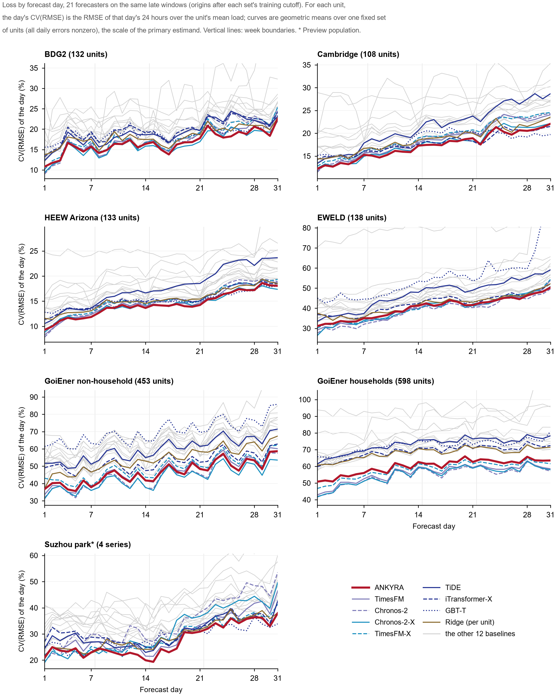

# Evaluation

All numbers below are in [`results/`](../results). The figures are regenerated from those files by
`figures/make_figures.py`.

## Populations and tiers

| Population | Country | Units / windows (all / late) | Tier | ANKYRA design status | Source |
|---|---|---|---|---|---|
| BDG2 2017, building meters | USA / Europe | 178 / 934 · 142 / 474 | test | seen | Miller et al., *Sci. Data* 2020, [doi:10.1038/s41597-020-00712-x](https://doi.org/10.1038/s41597-020-00712-x) |
| University of Cambridge estate | UK | 119 / 1,456 · 108 / 730 | test | first read | Langtry & Choudhary 2024, [doi:10.5281/zenodo.10955332](https://doi.org/10.5281/zenodo.10955332) (CC BY 4.0) |
| HEEW, Arizona State University | USA | 142 / 1,282 · 138 / 658 | test | first read | Dong et al., *Sci. Data* 2025, [doi:10.1038/s41597-025-06010-8](https://doi.org/10.1038/s41597-025-06010-8) |
| EWELD industrial and commercial meters | China | 274 / 1,023 · 197 / 523 | test | seen | Liu et al., *Sci. Data* 2023, [doi:10.1038/s41597-023-02503-6](https://doi.org/10.1038/s41597-023-02503-6) |
| GoiEner non-household supply points | Spain | 486 / 1,237 · 481 / 890 | test | seen | Quesada et al., *Sci. Data* 2024, [doi:10.1038/s41597-023-02846-0](https://doi.org/10.1038/s41597-023-02846-0) |
| GoiEner households | Spain | 1,109 / 1,258 · 696 / 696 | test | seen | as above |
| COFACTOR-SBHUB Oslo schools | Norway | 45 / 1,147 · 41 / 581 | preview | seen | Lien et al., *Data in Brief* 2025, [doi:10.1016/j.dib.2025.112288](https://doi.org/10.1016/j.dib.2025.112288) |
| COFACTOR Drammen municipal buildings | Norway | 45 / 1,375 · 43 / 689 | preview | seen | Lien et al., *Sci. Data* 2025, [doi:10.1038/s41597-025-04708-3](https://doi.org/10.1038/s41597-025-04708-3) |
| CINELDI industrial customers | Norway | 45 / 929 · 45 / 475 | preview | first read | Sandell et al., *Data in Brief* 2023, [doi:10.1016/j.dib.2023.109121](https://doi.org/10.1016/j.dib.2023.109121) |
| Suzhou industrial park (4 category aggregates) | China | 4 / 127 · 4 / 64 | preview | seen | Zhou et al., *Sci. Data* 2023, [doi:10.1038/s41597-023-02786-9](https://doi.org/10.1038/s41597-023-02786-9) |
| Low Carbon London households | UK | 965 / 1,215 · 710 / 710 | reserved | seen | UK Power Networks, [London Datastore](https://data.london.gov.uk/dataset/smartmeter-energy-consumption-data-in-london-households-vqm0d) |

**Design status.**

- **Seen:** results for the population were known when some ANKYRA component was specified.
  - The annual candidate followed a diagnosis on the Suzhou park.
  - The foundation-model candidate and the handover were developed on the Spanish development store (not listed).
  - The off-state rule followed the EWELD and household results.
- **First read:** the population was scored for the first time after the handover had been fixed.

**Tiers of the equal-information comparison.** ANKYRA was fixed first. The covariate-informed baselines were then
generated for every population and scored in two steps:

1. a preview on four populations, used for diagnosis;
2. after all model development had ended, one scoring of the six test populations.

LCL was held in reserve. Between the two steps, four versions of a within-day extension were developed on the
development store and the preview populations. None passed its no-harm criterion, so the test populations were never
used for development. ANKYRA's univariate comparisons on the test populations had been scored before the covariate
baselines.

A window needs a completely observed 1,344-hour context and 744-hour target, and enough history for six pseudo-origins.
Panels are capped at 1,500 windows per population by a fixed thinning rule. Data are used as released by the
providers, with documented masking of imputed or zero-filled hours. The raw data are not redistributed here; follow
each provider's access route and terms.

## Baselines

| Information | Forecasters |
|---|---|
| Given ANKYRA's information set: 11 past, 10 future, 6 static features, no future observed weather; each model uses the part its architecture accepts | TiDE (all inputs), iTransformer-X (no future covariates), GBT-T (21 derived features), trained per population; Chronos-2-X (no static features), TimesFM-X (covariates through linear XReg), zero-shot |
| Load only, foundation models | TimesFM 2.5, Chronos-2 (zero-shot) |
| Load only, trained per population | DLinear, PatchTST, iTransformer, LSTM |
| Load only, statistical | Holt–Winters (damped, additive, period 168 h), MSTL (24 h and 168 h) |
| Calendar and climatological temperature | per-unit ridge regression refitted at every origin |
| Simple | previous-month, 4-week and last-year profiles; seasonal naive (day, week); a zero-shot gradient-boosting model |

The shared feature set is:

- load;
- temperature (climatology in the horizon);
- the load one year earlier (lag 8,736 h, always before the origin) with its availability mask;
- sines and cosines of hour, weekday and day of year;
- a non-working-day flag;
- the category (one-hot);
- the log ratio of the long-history to the recent mean.

PatchTST is channel-independent, so its load forecast is the same function with or without these channels.

**Training protocol for the trained models.**

- The cutoff is the first day of each population's median origin month.
- All training targets end before the cutoff.
- The learning rate is chosen from {1e-4, 3e-4, 1e-3} on the last 20% of training origins; at most 15 epochs with
  patience 3.
- Predictions are averaged over three seeds.
- Trained models are scored on origins after the cutoff (the *late* windows), on the same windows as every other model.
- Leakage checks (feature time indices, lag indices, normalisation statistics, training-target end) are implemented as
  assertions.

**No information after the origin, on either side.**

- **ANKYRA** uses only pre-origin load and temperature, the forecast month's calendar and a pre-origin temperature
  expectation ([METHOD.md](METHOD.md#information-at-the-origin)). Tests change every value after the origin and check
  that nothing moves. This establishes input isolation in the implementation, not the absence of later information in
  the providers' data preparation, the weather archives or the pretraining corpora.
- **Covariate-informed baselines** receive the same set:
  - future temperature enters as the same climatological expectation, never as observed weather;
  - the one-year load lag always precedes the origin.
- **Trained baselines** are fitted on targets that end before a cutoff and are scored only after it.
- **Test populations** were scored once, after all development had ended.
- **Pretraining corpora** of the foundation models are the one exposure no forecaster controls (see
  [Limitations](#limitations)).

### Correction of the GBT-T baseline

GBT-T is our own implementation: scikit-learn's histogram gradient boosting on 21 features from the shared set, trained
across the units of each population. Its first version normalised every window by the window's own context mean and
standard deviation, with a floor of max(1% of the mean, 10⁻³ kW). On flat or all-zero contexts the floor produced
training targets 10⁵–10⁷ times too large, and the trees then forecast loads up to 18,500,000 kW on EWELD, whose largest
observed load is 13,427 kW. This affected 96% of EWELD's late windows, 12% on GoiEner non-household, 7% on BDG2 and 1%
on households.

The defect was found after the test populations had been scored. Two corrections were written before each was run:

- The first replaced the window scale by each unit's pre-cutoff scale everywhere. It removed the failure but also
  weakened GBT-T where it had worked, for example on Cambridge, HEEW and Oslo.
- The second, reported here, keeps the original scaling and uses the unit's pre-cutoff standard deviation only where
  the floor was active.

GBT-T was therefore scored three times on the test populations; ANKYRA and the other 19 forecasters once. On EWELD the
per-window scaling still overshoots in 41% of windows. There the contexts are almost entirely zero with isolated spikes,
so read GBT-T's EWELD result as a limit of that design, not as an advantage of ANKYRA. The Norwegian diagnostics below
were recomputed with the corrected GBT-T.

## Estimands

**Unit-equal log RMS ratio (primary).** For unit $i$, $R_i$ is the RMS of its hourly errors over its windows, and
$r=N^{-1}\sum_i\log(R_i^{A}/R_i^{B})$. It is reported as the improvement $100[1-\exp(r)]$; positive favours ANKYRA.

**Intervals.** 95% intervals come from 2,000 bootstrap replicates that resample units and target-midpoint months
independently (UM). A contrast is *resolved* when its interval excludes zero.

**Mean per-unit rank.** Models are ranked within each unit by RMSE, with ties averaged. This summary stays defined
where some units have exactly zero error.

**Conventional metrics.** RMSE and MAE (unit mean, kW); CV(RMSE), NMBE and WAPE (unit median, %); WAPE also pooled.
See [`results/conventional_metrics.csv`](../results/conventional_metrics.csv) for the full windows and
[`results/conventional_metrics_late.csv`](../results/conventional_metrics_late.csv) for the late windows, where all 21
forecasters are available.

**Why four summaries.** Pooled and unit-equal summaries can disagree in sign for an algebraic reason. The pooled MSE
ratio weights each unit's squared RMS ratio by its share of the reference error, and those weights are coupled to the
ratios (P19 in [theory/PROOFS.md](../theory/PROOFS.md)). No single summary is therefore reported alone.

## Results

All results below are for **ANKYRA 2.0**. The 1.x results, scored on the same windows, are kept unchanged in
[`results/ankyra_1x/`](../results/ankyra_1x/); 2.0 against 1.x is in the ablation table and in
[Within-day anchoring (2.0)](#within-day-anchoring-20), which also states how the 2.0 evidence differs in status from
the 1.x evidence.

### Test populations (late windows, 21 forecasters)

Primary estimand first: the unit-equal improvement $100[1-\exp(r)]$ in hourly RMS against each forecaster. The rank
rows at the bottom are a secondary summary.

| | BDG2 | Cambridge | HEEW | EWELD | GoiEner NH | GoiEner HH |
|---|---:|---:|---:|---:|---:|---:|
| vs TiDE | +14.4 * | +18.7 * | +19.5 * | +33.3 * | +17.1 * | +14.6 * |
| vs iTransformer-X | +4.4 | +1.5 | +6.0 * | +20.6 * | +9.4 * | +11.9 * |
| vs GBT-T ‡ | +15.9 * | +5.4 | +6.4 * | +46.2 * | +32.3 * | +15.9 * |
| vs Chronos-2-X | −38.3 † | +2.5 | +1.8 | +14.5 * | +1.4 | +0.1 |
| vs TimesFM-X | +6.5 | +9.8 * | +5.7 * | +16.7 * | +8.2 * | +2.8 |
| vs TimesFM (load only) | −53.4 † | +8.3 * | +3.6 | +2.5 | +5.5 | −3.9 (+) |
| vs ANKYRA 1.x (own earlier version) | +0.9 * | +2.9 * | +0.8 * | +0.4 | +3.8 * | −0.1 |
| Resolved better than, of 20 | 10 | 17 | 17 | 18 | 17 | 16 |
| Resolved worse than, of 20 | 0 | 0 | 0 | 0 | 0 | 1 |
| ANKYRA mean per-unit rank | **4.6** | **4.6** | **4.8** | **6.6** | **5.2** | 7.2 |
| ANKYRA position | 1 | 1 | 1 | 1 | 1 | 2 |

\* resolved in ANKYRA's favour; (+) resolved against ANKYRA. ‡ Corrected implementation; see
[Correction of the GBT-T baseline](#correction-of-the-gbt-t-baseline).

† BDG2 unit means are dominated by three meters reading about 0.0002 kW. The full result is kept, and a sensitivity
analysis is reported beside it:

- without the three meters (11 of 474 windows), the improvement is +2.5% against TimesFM and −2.1% against Chronos-2-X;
- the intervals stay wide, because other low-load units also carry extreme ratios;
- ANKYRA's mean rank is 4.60 with the three meters and 4.37 without them, first either way;
- against all nine models of Figure 3, the median unit favours ANKYRA (58–92% of units).

The three meters are the BDG2 units whose largest hourly load over their panel windows is at most 0.001 kW
(Lamb_education_Harold, Lamb_education_Hillary, Lamb_office_Jo). Both versions of every comparison, full and late
windows, are in [`results/bdg2_near_zero_sensitivity.csv`](../results/bdg2_near_zero_sensitivity.csv).

Mean per-unit rank averaged over the six test populations:

| Forecaster | Mean rank |
|---|---:|
| **ANKYRA 2.0** | **5.51** |
| per-unit ridge | 7.30 |
| Chronos-2-X | 7.84 |
| iTransformer-X | 8.17 |
| TimesFM | 8.45 |
| TimesFM-X | 8.56 |

(ANKYRA 1.x: 6.00.) By position, ANKYRA 2.0 is first on five of the six test populations and second on households. No
other forecaster is in the top two on more than two of them (Figure 12).

### Rank significance tests

The primary estimand is a ratio with a bootstrap interval. The forecasting literature also uses rank tests across
series, so the same late-window forecasts were tested that way: per-unit RMSE of the 21 forecasters, units as blocks,
Friedman's test, the Nemenyi critical difference at 5%, and paired Wilcoxon signed-rank tests of ANKYRA against each
forecaster with Holm's correction ([`results/rank_tests.csv`](../results/rank_tests.csv)). Computed after scoring.

- **Six test populations pooled (1,762 units).** Friedman's test rejects equal ranks (p < 10⁻³⁰⁰). ANKYRA's mean rank
  is 6.04; the next forecaster, the per-unit ridge, is at 7.07, and the critical difference is 0.75, so **no forecaster
  is within the critical difference of ANKYRA**. The Holm-corrected Wilcoxon tests put ANKYRA ahead of all 20.
- **Per test population.** ANKYRA is significantly better than 20 of the 20 baselines on BDG2, EWELD and GoiEner
  non-household, 19 on HEEW (Chronos-2-X not separated), 17 on Cambridge (Chronos-2-X, GBT-T and iTransformer-X not
  separated) and 18 on households.
- **Where a baseline is significantly better.** On households the per-unit ridge beats ANKYRA for the typical unit;
  on Oslo GBT-T does, and on Drammen Chronos-2-X does. These are the same three deficits the mean ranks show.
- **Households and TimesFM.** The primary estimand's one resolved deficit is against TimesFM on households (−3.9% in
  the unit-equal log ratio). The rank test reads the other way: ANKYRA has the lower RMSE on most household units
  (mean rank 7.25 against TimesFM's twelfth place) and the paired test favours ANKYRA. The two statements are both
  true. The log ratio is moved by units on which TimesFM's error is a small fraction of ANKYRA's, typically low-load
  units for which a median-type forecast near zero is right; the rank test counts units.
- The Suzhou park has four series, and no paired test can separate anything there.

### Scaled errors

For comparison with the forecasting literature, [`results/scaled_errors.csv`](../results/scaled_errors.csv) gives
RMSSE and MASE for all 21 forecasters: each window's error divided by the in-sample error of the weekly seasonal-naive
forecast over its 1,344-hour context (lag 168 h), aggregated per unit and summarised by the median and the geometric
mean over units.

| Population | ANKYRA RMSSE (geometric mean) | Position | Lowest | ANKYRA MASE | Position | Lowest |
|---|---:|---:|---|---:|---:|---|
| BDG2 | 1.136 | 2 | Chronos-2-X 1.092 | 1.245 | 3 | Chronos-2-X 1.151 |
| Cambridge | 1.207 | 1 | — | 1.180 | 2 | Chronos-2-X 1.175 |
| HEEW | 1.143 | 1 | — | 1.287 | 5 | TimesFM 1.208 |
| EWELD | 0.744 | 1 | — | 0.930 | 2 | TimesFM 0.901 |
| GoiEner non-household | 0.906 | 1 | — | 1.112 | 4 | Chronos-2-X 0.984 |
| GoiEner households | 0.767 | 2 | TimesFM 0.738 | 0.944 | 5 | TimesFM 0.808 |
| Oslo | 1.251 | 6 | GBT-T 1.090 | 1.328 | 4 | GBT-T 1.186 |
| Drammen | 1.366 | 5 | Chronos-2-X 1.313 | 1.320 | 2 | Chronos-2-X 1.251 |
| CINELDI | 1.043 | 1 | — | 1.113 | 3 | Chronos-2 1.061 |
| Suzhou park | 1.400 | 2 | GBT-T 1.291 | 1.261 | 1 | — |

- On the squared-error scale (RMSSE) ANKYRA is lowest on four of the six test populations and second on the other two.
- On the absolute-error scale (MASE) the zero-shot foundation models are lower on most populations. Absolute error is
  minimised by the median of the predictive distribution and squared error by its mean; the foundation models' point
  forecasts are medians, ANKYRA's level and daily path are mean-type. This is the same pattern as in the MAE and WAPE
  panels of Figure 8.
- Values above 1 do not mean a forecaster is worse than a naive forecast: the scale is the naive forecast's one-week-ahead
  in-sample error, and the forecasts are scored up to 31 days ahead. Out of sample the weekly seasonal naive forecast
  itself scores 1.05–1.72.

### Preview and reserved populations

- **Oslo:** GBT-T (−12.8%) is resolvably better than ANKYRA 2.0; iTransformer-X (−4.4%) is not resolved. ANKYRA ranks
  3rd of 21 in the late windows (1.x: 5th, with GBT-T −18.0% and iTransformer-X −9.2%).
- **Drammen:** 2nd of 21; no contrast resolved against ANKYRA (1.x: 7th).
- **CINELDI:** 1st of 21 (1.x: 3rd).
- **Suzhou park:** 1st of 21.
- **LCL** was not scored for 2.0; it remains the reserved population. The 1.x load-only comparison (3rd of 14) is in
  [`results/ankyra_1x/`](../results/ankyra_1x/).

Across the ten scored populations ANKYRA 2.0's mean rank is 4.92, ahead of the per-unit ridge (6.96), iTransformer-X
(7.10) and Chronos-2-X (7.63).

**Full windows.** The comparison without the trained models covers 14 forecasters on the ten populations scored for
2.0 (LCL, the reserved population, was scored for 1.x only):

- ANKYRA 2.0 ranks first on 8 and second on the other two (Drammen, households);
- its mean rank is 2.73, against 4.06 for the ridge and 4.23 for Chronos-2-X;
- no contrast is resolved against it.

### Loss metrics of every forecaster

Figure 8 gives the conventional losses of all 21 forecasters on the same late windows, for the six test populations and
the Suzhou industrial park (a preview population with four aggregate series). The values were computed when the panel
was scored; the export reads them and recomputes nothing. RMSE and MAE are means over units in kW, so larger units weigh
more; CV(RMSE) and WAPE are taken at the median unit.

| ANKYRA's position among 21 | BDG2 | Cambridge | HEEW | EWELD | GoiEner NH | GoiEner HH | Suzhou park |
|---|:---:|:---:|:---:|:---:|:---:|:---:|:---:|
| RMSE (unit mean) | 1 | 2 | 2 | 2 | 2 | 2 | 1 |
| MAE (unit mean) | 1 | 2 | 2 | 3 | 2 | 5 | 1 |
| CV(RMSE) (median unit) | 2 | 2 | 2 | 1 | 2 | 2 | 2 |
| WAPE (median unit) | 2 | 2 | 3 | 2 | 4 | 5 | 1 |
| WAPE (pooled) | 2 | 2 | 2 | 3 | 3 | 5 | 1 |

- ANKYRA is between first and fifth on every metric and population, and first in 6 of the 28 cells of the figure. No
  baseline is lower on all of them.
- The forecasters lower than ANKYRA most often are Chronos-2-X (10 of the 28 cells), Chronos-2 (6), TimesFM (5) and the
  per-unit ridge (4). The file also carries ANKYRA 1.x as a row, so that the 2.0 change can be read metric by metric.
- MAE and WAPE are minimised by the median of the predictive distribution, squared-error metrics by its mean. On MAE and
  WAPE, zero-shot Chronos-2 or TimesFM variants are lower than ANKYRA on EWELD and on both GoiEner populations.
- These metrics weight units differently from the unit-equal log ratio, which remains the primary estimand.
- GBT-T's EWELD errors remain the largest among the same-information models (unit-mean RMSE 153.9 kW, against 99.5
  for ANKYRA), because its per-window scaling still overshoots there (see the GBT-T correction below).

### Energy as the month accumulates

Figure 9 follows the error of the energy delivered through each forecast day. For unit $u$ and day $d$, $c_{u,d}$ is
the RMS, over the unit's windows, of the error of the mean load over days 1 to $d$, and the curves are geometric means
of $100\,c_{u,d}/ar y_u$ over one fixed set of units (nonzero mean load and nonzero errors for all 21 forecasters),
the aggregation of Figure 9b applied to energy instead of hourly load. Day 31 is the monthly energy error. The same
file gives the error of each single day's energy ([`results/lead_day_energy.csv`](../results/lead_day_energy.csv)).
Computed after scoring, as a description.

| Population | ANKYRA lowest of 21 (days of 31) | Position at day 31 | ANKYRA at day 31 | Next or better forecaster | Below all four foundation-model variants from day 8 (of 24) |
|---|---:|---:|---:|---|---:|
| BDG2 | 25 | 1 | 7.9% | Chronos-2-X 8.2% | 22 |
| Cambridge | 19 | 2 | 8.5% | iTransformer-X 8.1% | 24 |
| HEEW | 18 | 1 | 7.6% | Chronos-2-X 7.7% | 18 |
| EWELD | 20 | 1 | 16.7% | PatchTST 17.5% | 19 |
| GoiEner non-household | 29 | 1 | 11.5% | per-unit ridge 13.1% | 24 |
| GoiEner households | 0 | 6 | 11.7% | per-unit ridge 10.0% | 24 |
| Suzhou park (4 series) | 0 | 2 | 14.4% | TimesFM-X 13.8% | 0 |

- The foundation models' energy error grows through the month as their level drifts (TimesFM at day 31: 9.4%, 9.9%,
  8.1%, 18.3%, 15.9%, 17.4% on the six test populations); ANKYRA's stays the lowest or close to it because the level and
  daily path are anchored to the unit's history.
- On households ANKYRA is a third below the foundation models but behind the per-unit ridge and three profile
  forecasters (10.0–11.4%); on the Suzhou park the covariate-conditioned TimesFM is lower on every day.
- For a single day's energy (not accumulated) ANKYRA ranks first or second of 21 on six of the seven populations and
  fifth on EWELD.

### Loss by forecast day

Figures 9b and 10 split the hourly error of the same late-window forecasts by forecast day. For unit $u$ and day $d$, $r_{u,d}$ is the RMSE
of that day's 24 hours over all the unit's windows and $\bar y_u$ the unit's mean load. The curves are geometric means of
$100\,r_{u,d}/\bar y_u$ over one fixed set of units whose daily errors are nonzero for all 21 forecasters: 132 of 142
units on BDG2, 108 of 108 on Cambridge, 133 of 138 on HEEW, 138 of 153 on EWELD, 453 of 477 on GoiEner non-household,
598 of 679 on households and all four Suzhou series. On this scale the ratio of two curves on day $d$ is the unit-equal
RMS ratio of the primary estimand restricted to that day.

The values come from the scored forecasts, and pooled over the month they give back the scored metrics and the primary
estimand exactly. The split was made after scoring; it is a description, and nothing was tuned on it.
[`results/lead_day_metrics.csv`](../results/lead_day_metrics.csv) also gives unit-mean RMSE and MAE in kW, and
median-unit CV(RMSE) and normalised MAE, for every day.

- **Position.** On every forecast day of every population in the figure ANKYRA 2.0 is among the six forecasters with
  the lowest loss of 21. It is the lowest on 9 of 31 days on BDG2, 16 on Cambridge, 12 on HEEW and 13 on the Suzhou
  park, and the lowest or second-lowest on 23–24 days of each of those four (1.x: lowest on 8, 11, 7 and 9 days).
- **Growth with lead time.** From week 1 to week 4 ANKYRA's loss grows by ×1.19–1.55. That is less than TimesFM's
  (×1.24–1.68) and Chronos-2's (×1.25–1.80) on all seven populations.
- **The first day.** The zero-shot foundation models are lower on day 1 everywhere, and ANKYRA ranks third to fifth of 21.
- **From the second week.** On BDG2, Cambridge, HEEW and the Suzhou park ANKYRA is lowest or second-lowest on 17–21 of
  the 24 days from day 8 (1.x: 13–16). On EWELD it is on 8 of them.
- **GoiEner.** On the non-household set ANKYRA 2.0 is lower than TimesFM on 19 of 31 days (1.x: 0) but Chronos-2 and
  Chronos-2-X stay lower on every day; on households all four foundation-model variants are lower on every day, as for
  1.x. The within-day anchoring does not act on households (see below).

**Why the monthly comparison differs.** With $R_u$ the unit's RMS over the whole window, $R_u^2$ is the mean of its 31
daily MSEs. So $\log R_u$ is the mean of $\log r_{u,d}$ over the days plus $J_u\ge0$ (Jensen), and $J_u$ grows with how
uneven the unit's daily errors are. Averaged over units, the primary estimand splits exactly:

$$\frac1N\sum_u\log\frac{R_u^{A}}{R_u^{B}}=\frac1{31N}\sum_{u,d}\log\frac{r^{A}_{u,d}}{r^{B}_{u,d}}+\frac1N\sum_u\big(J^{A}_u-J^{B}_u\big).$$

The daily errors of TimesFM, Chronos-2 and Chronos-2-X are more uneven than ANKYRA's on all seven populations. Over the
month their larger-error days weigh more, so the monthly comparison moves towards ANKYRA. Against TiDE, iTransformer-X,
GBT-T and the per-unit ridge the unevenness runs the other way, except for GBT-T on EWELD.

| Fixed unit set, improvement $100[1-\exp(r)]$ | vs TimesFM: daily | month | vs Chronos-2: daily | month | vs Chronos-2-X: daily | month |
|---|---:|---:|---:|---:|---:|---:|
| BDG2 | +2.9 | +5.8 | +4.3 | +10.2 | −2.4 | +1.4 |
| Cambridge | +6.2 | +8.3 | +7.7 | +9.9 | +1.8 | +2.5 |
| HEEW | +1.9 | +3.7 | +4.4 | +6.4 | 0.0 | +0.8 |
| EWELD | −1.8 | +2.9 | −4.7 | +0.8 | −0.8 | +4.7 |
| GoiEner non-household | +0.7 | +5.8 | −4.9 | +3.6 | −7.3 | +0.9 |
| GoiEner households | −7.5 | −0.8 | −10.0 | −0.8 | −9.3 | −0.7 |
| Suzhou park | +8.1 | +10.5 | +19.5 | +22.7 | +11.5 | +15.2 |

"Daily" is the average of the daily log ratios, "month" the monthly log ratio on the same units; positive favours
ANKYRA. On all units the month column becomes the primary estimand of the test table. The fixed set leaves out units
whose error is exactly zero on some day for some forecaster: meters that are off, read near zero or hold a constant
value. On BDG2 these are 10 units, among them the three near-zero meters. On EWELD they are 59: 44 with a mean load below
10⁻⁶ kW and 15 that switch off on some days. There the month column differs from the primary estimand on all units.

### Monthly energy error

A month's energy error is $744\,\ell(e)$ kWh, 744 times the level error (P3). ANKYRA's design acts on this quantity:
its level and daily path come from the unit's own history, and its within-day shape is TimesFM's. On the same late
windows, Figure 11 compares the monthly energy error of ANKYRA with that of each of the 20 baselines. The estimand is the
unit-equal RMS ratio of the primary estimand applied to the level error, with the same unit-and-month bootstrap
intervals. It was computed after scoring and is a description, not a planned test
([`results/energy_error.csv`](../results/energy_error.csv), which also gives the median-unit absolute percentage energy
error of every forecaster).

- **No resolved deficit.** On all seven populations ANKYRA is never resolvably worse than any of the 20 baselines. It is
  resolvably better than 17 of them on GoiEner non-household, 14 on Cambridge and EWELD, 11 on households, 9 on HEEW,
  6 on the Suzhou park and 4 on BDG2. (The energy error is computed on the delivered, projected trajectories; the 2.0
  values differ from 1.x by at most 0.3 points, one household contrast having moved across the resolution boundary.)
- **Where the hourly view favours the foundation models.** On GoiEner households ANKYRA's monthly energy error is 22–27%
  lower than that of TimesFM, Chronos-2, Chronos-2-X and TimesFM-X, each resolved; on GoiEner non-household it is 18–25%
  lower, resolved against three of them. The within-day shape, where the foundation models are as good or better, carries
  most of these populations' hourly error (about 80% at the median unit), and energy is the part that ANKYRA changes.
- **Against TimesFM**, whose within-day shape ANKYRA uses, the energy error is 4–25% lower on six populations, resolved
  on Cambridge and both GoiEner sets.
- **BDG2.** The unit means are dominated by the three near-zero meters. The comparisons with the three zero-shot
  foundation models, MSTL and the previous-month profile are negative and unresolved. Without the three meters every
  point estimate favours ANKYRA, and five are resolved.
- **Small unresolved deficits** remain against the per-unit ridge and three profile or naive models on households (3–6%),
  iTransformer-X on Cambridge (4%) and TimesFM-X on the Suzhou park (4%).

### Where the error sits: block attribution

Because the three blocks are orthogonal (P1), each forecast's hourly MSE on a window is exactly the sum of its level,
daily-path and within-day MSE. Figure 14 splits the late-window errors of ANKYRA 2.0, ANKYRA 1.x, TimesFM and
Chronos-2-X this way ([`results/block_shares.csv`](../results/block_shares.csv); descriptive, computed after scoring).

- **Shares.** At the median unit the within-day block carries 33–48% of ANKYRA 2.0's error on the building populations
  (38% on EWELD) and 80–85% on the two Spanish populations; the level carries 20–27% on the buildings and 3–4% on the
  Spanish populations.
- **Where the gain over TimesFM comes from.** The level on every population (GoiEner non-household 25%, households 25%,
  Suzhou park 16%, Cambridge 15%, EWELD 8%, HEEW 4%); the daily path on the buildings (Cambridge 6%, Suzhou park 7%,
  EWELD 3%, HEEW 3%) but not on households (−9%); and, new in 2.0, the within-day block (Cambridge 6%, Suzhou park 8%,
  GoiEner non-household 5%, HEEW 2%, EWELD 1%; households −1%). In 1.x the within-day block was TimesFM's and its
  contrast was zero up to the projection and the off-state rule.
- **Households.** The level gain (25%) is outweighed on the hourly scale by the daily-path (−9%) and within-day blocks,
  which is why TimesFM is ahead there on hourly error while ANKYRA is ahead on energy.

### History length

ANKYRA's weights are estimated from completed pseudo-origins, so its advantage should depend on how much history a
unit has. Panel windows need six pseudo-origins (at least 5,808 hours); beyond that, the annual candidate needs 10,248
hours. [`results/history_length.csv`](../results/history_length.csv) splits all windows of the ten populations by the
hours between the unit's first observation and the origin (descriptive; computed after scoring).

| History at the origin | Windows / units | 2.0 vs TimesFM | 2.0 vs 1.x | 2.0 vs fixed division |
|---|---|---:|---:|---:|
| below 10,248 h (no annual candidate) | 1,043 / 1,037 | −0.8% | 0.0% | +8.1% * |
| 10,248 h to 2 years | 4,093 / 1,892 | −1.4% | +1.4% * | +11.7% * |
| 2 to 3 years | 1,658 / 442 | +7.6% * | +2.8% * | +14.9% * |
| 3 years or more | 3,974 / 494 | +6.0% * | +2.2% * | +13.7% * |

Pooled over the ten populations, units weighted equally; * interval excludes zero. The strata are confounded with the population: the two short
strata are mostly the Spanish supply points, the long ones the campuses and municipal buildings. Within populations the
pattern is the same but weaker: on GoiEner non-household ANKYRA is 1.2% behind TimesFM below 10,248 hours and 5.1%
ahead above; on Cambridge it is 2.0% ahead with under two years and 8.7–10.6% ahead with more; on households it is
behind in both strata. The within-day anchoring adds nothing below 10,248 hours, where analog days are not yet
available. **With less than two years of history ANKYRA is not separated from the foundation model alone** (−0.8% and −1.4%,
intervals including zero), although it already improves on the fixed division by 8–12%; with two or more years it is
resolved better than the foundation model by 6–8%.

### Why ANKYRA loses on Norwegian schools

The deficit is in the within-day block and falls on specific days. ANKYRA's within-day error is higher than GBT-T's
by:

| Day type (Oslo) | ANKYRA's within-day error vs GBT-T |
|---|---:|
| ordinary working days | +22% |
| closure-like working days | +42% |
| public holidays | +53% |
| weekends | level |

Closure-like days are calendar working days whose load fell below half of the recent working-day level. They are
identified from the load itself, not from operating calendars. The gap grows with the forecast week.

- **The shape is unlikely to be the main cause.** An oracle rescales each day's TimesFM shape by its best factor, using
  the realised data. It closes the gap to GBT-T on Oslo (+2.0%, unresolved).
- **A constant amplitude error is not the cause either.** A constant per-unit factor recovers under 2%.
- **This is consistent with a missing day-level activity signal.** In Oslo and Drammen, closure-like days are shared
  across units: when a unit has one, 7–14 times more other units have one on the same date than usual. They also
  recur: a unit with one on a date a year earlier has one again with probability 23–31%.

Cross-unit models trained with calendar features and the one-year lag can learn such regularities. A unit's own history
combined with a foundation model that sees eight weeks cannot.

The oracle bound and the correlations narrow the cause down but do not identify it. A free per-day factor can also
absorb other errors, and the operating reasons behind the closure-like days are unknown.

### A condition-matched extension that was not adopted

Condition-matched analog days from the unit's own history (same day type, same season, same daylight-saving state,
similar temperature) are the most informative pre-origin source of day-level activity in every population. On
holidays they are informative everywhere.

Four versions supplying this information to ANKYRA were tested against a fixed no-harm criterion on the development
store (within-day upper interval bound ≤ +0.01):

| Version | What the analog days supply | Development-store result |
|---|---|---|
| 1 | full 24-hour shape (±45 days) | revised before scoring |
| 2 | full 24-hour shape | 13.6% worse |
| 3 | one absolute amplitude factor per day | +0.001 [−0.005, +0.016] |
| 4 | one relative activity factor per day | +0.004 [−0.000, +0.012] |

- None passed, so none was tested or adopted.
- Holidays improved consistently (1.3–1.7%).
- The remaining harm sat on ordinary days of the Spanish population, whose departures are not predictable from any
  pre-origin source, and in strength estimates from only three pseudo-origins.

### What the handover contributes

An ablation specified before it was run varied only the weight on the model's daily means. It kept the candidates, the
within-day shape and the off-state rule fixed, and compared four weights:

- no weight (A0);
- a fixed half (A½);
- one weight per unit and month, estimated like the weekly ones (AM);
- ANKYRA's four weekly weights (AW).

LCL, the reserved set, was not used. The recomputed AW reproduces the evaluated ANKYRA forecasts to within 0.002 kW.

| Test population | A½ vs A0 | AW vs A½ | AW vs AM | Share of AW's gain captured by A½ |
|---|---:|---:|---:|---:|
| BDG2 2017 | +3.6 * | +2.0 | +0.4 | 0.64 |
| Cambridge | +0.1 | +1.2 * | −0.2 | 0.10 |
| HEEW Arizona | +3.7 * | +0.2 | +0.2 | 0.96 |
| EWELD | +3.3 * | +1.6 | −0.1 | 0.67 |
| GoiEner non-household | +1.8 * | +1.0 * | −0.2 (+) | 0.63 |
| GoiEner households | +2.2 * | +0.8 * | −0.1 | 0.74 |

Unit-equal improvement of the first arm; * resolved in its favour, (+) resolved against it.

- **Mixing.** Mixing in the model's daily means at a fixed half weight gives most of the gain on five test populations.
- **Per-unit weights.** Estimating the weight per unit adds 0.8–1.2%, resolved on three test populations.
- **Weekly weights.** Separate weekly weights add nothing over one weight per unit and month.
- **Preview populations.** On the four preview populations, where the fixed division is already strong, a fixed half
  weight lowers accuracy (unresolved). The per-unit weights reduce this loss.

The plan fixed the wording in advance: the claim is per-unit, error-weighted mixing, not weekly resolution. All ten
populations and the weekly breakdown are in [`results/handover_granularity.csv`](../results/handover_granularity.csv).

### Within-day anchoring (2.0)

In 1.x the within-day block was the foundation model's, unchanged, although it carries 36–45% of the hourly squared
error on the building populations and about 80% on the GoiEner populations. ANKYRA 2.0 anchors it as the other two
blocks are anchored: the unit's own analog-day shape competes with the foundation model's shape, weighted by the unit's
errors at completed pseudo-origins ([METHOD.md](METHOD.md#within-day-shape)).

**How the rule was obtained.** The rule is the sixth version of a similar-day idea (the A-series of the study record).
Versions 1–4 (2026-09-29) were judged first on the GoiEner non-household development store and did not pass its no-harm
gate. Version 5 (a half blend switched on by a shape-repeatability threshold) passed the development gates and the
validation populations but failed the pre-registered no-harm gate on the test populations (BDG2, EWELD and households
above the +0.01 upper bound; households resolvably 0.4% worse) and was not adopted. Version 6 replaced the threshold by
the unit's own pseudo-origin errors; it was chosen from a family of six trust functions written down in advance,
selected on nine design faces — the three development populations (GoiEner non-household store, Oslo, Drammen) and
the **pre-cutoff** windows of the six test cohorts, the period on which the trained baselines are fitted — then
validated on CINELDI and the Suzhou park (mean hourly log ratio −0.025 against a +0.005 limit) and evaluated once on
the **post-cutoff** windows of the six test cohorts under a frozen protocol: HT1a (improvement on at least two of
BDG2, Cambridge, HEEW) and HT1b (no test population with an upper bound above +0.01) both held. A third round
(six pseudo-origins instead of three, an analog-day daily-path candidate, finer handover blocks) adopted nothing: the
first fell 0.01 points short of its own 0.2% gain threshold, the second was harmful on BDG2 and EWELD, the third had no
measurable effect.

**Evidence status.** The 1.x test evidence is a single read of the six test populations after the model was fixed.
The 2.0 within-day rule was developed after that read; its test windows had been seen once for 1.x and once for the
rejected version 5. The 2.0 test numbers are therefore a **re-evaluation under a frozen protocol, not a first read**,
and the development used the same cohorts' earlier windows. LCL, the reserved population, was not read. This is the
one respect in which the 2.0 evidence is weaker than the 1.x evidence; everything else in the evaluation is identical.

**What it changes** (post-cutoff windows; the unit-equal improvement of 2.0 over 1.x, 95% unit-and-month interval):

| Population | Windows with a nonzero trust | Mean trust ω | Hourly, 2.0 vs 1.x | Within-day block |
|---|---:|---:|---|---:|
| BDG2 | 91% | 0.21 | +0.9% [+0.4, +1.3] | +1.3% |
| Cambridge | 99% | 0.24 | +2.9% [+1.7, +3.9] | +6.0% |
| HEEW | 97% | 0.20 | +0.8% [+0.2, +1.5] | +2.0% |
| EWELD | 49% | 0.10 | +0.4% [−0.2, +1.1] | +1.0% |
| GoiEner non-household | 83% | 0.18 | +3.8% [+0.6, +5.9] | +4.4% |
| GoiEner households | 48% | 0.08 | −0.1% [−0.5, +0.1] | −0.8% |
| Oslo (development, all windows) | 99% | 0.30 | +4.2% [+3.3, +5.4] | +9.2% |
| Drammen (development, all windows) | 100% | 0.33 | +3.4% [+2.4, +4.6] | +7.7% |
| CINELDI (validation, all windows) | 99% | 0.24 | +2.0% [+1.1, +3.2] | +3.8% |
| Suzhou park (validation, all windows) | 100% | 0.30 | +2.9% [+0.6, +5.9] | +7.5% |

- The gain is largest on buildings with fixed schedules (institutional and commercial) and on the GoiEner
  non-household points; on households the trust stays near zero and the forecast is unchanged.
- The level, daily path, energy readout and peak readout are identical to 1.x by construction (pre-projection daily
  means agree to 2×10⁻¹² kW on every population).
- No further foundation-model call: the three pseudo-origin forecasts are among the six already computed.
- Loss by forecast day: 2.0 is lower than 1.x on 30–31 of the 31 days on BDG2, Cambridge, HEEW and GoiEner
  non-household, with the gain growing with lead time (Cambridge: +0.6% on days 1–3, +4.0% on days 22–31).

Full records: `EO_WITHIN_ANCHOR_RESULTS_v1_20261002`, `EO_WITHIN_ANCHOR_R2_RESULTS_v1_20261002`,
`EO_WITHIN_ANCHOR_R3_RESULTS_v1_20261003` of the study record.

### Departures from normal operation persist

The weekly handover and the off-state rule rest on a measured property of the load rather than on tuned thresholds.
The analyses below are descriptive. They were specified in writing before they were run, and they read only stored
records and saved forecasts.

**Definition.** A day departs from normal operation when its mean falls outside hysteresis bands around a calendar
expectation. The expectation is the median of same-type days around the same date one year earlier. The four states
are off (below 5%), low (below 55%), high (above 150%) and normal. Recurring holidays and school breaks are part of the
expectation, so a departure is unscheduled by construction.

**Duration dependence.** The statistic compares exit rates in days 1–3 of a departure with days 8–30, within each unit
(Mantel–Haenszel log ratio). A value above zero means that a departure that has lasted longer is more likely to
continue.

| Population | Low | Off | High |
|---|---|---|---|
| Spanish development (4 categories) | 0.76–1.00 | 0.73–1.14 | 0.81–1.00 |
| EWELD (3 categories) | 0.65–0.79 | 0.82–1.01 | 0.77–1.02 |
| Drammen | 1.97 [1.57, 2.48] | — | 0.77 [0.62, 0.95] |
| Oslo | 1.12 [0.88, 1.36] | — | 0.85 [0.65, 1.06] |
| Cambridge | 0.75 [0.59, 0.91] | — | 1.05 [0.88, 1.21] |
| CINELDI | 0.92 [0.63, 1.20] | — | 0.94 [0.54, 1.32] |
| GoiEner households | 0.42 [0.37, 0.47] | 0.21 [−0.07, 0.42] | 0.67 [0.61, 0.73] |

- Pooled survival curves overstate duration dependence, because mixing units with different constant exit rates
  produces falling pooled rates. The within-unit ratios are 20–50% smaller than the pooled ones, but remain above zero.
- Gamma-frailty Weibull shapes are below one in most calendar-referenced cells (0.67–0.97; households 1.03–1.07).
- Out of time, a semi-Markov model beats a Markov model in 12 of 19 cells, with 5 favouring Markov and 2 ties.
- After temperature normalisation, the within-unit ratio stays above zero in 27 of 31 estimable cells.

**What this means for the forecast.** If departures were Markov, the value of the foundation model's recent
information would not depend on how long the current departure had lasted. It does.

- Windows whose departure had lasted at least 15 days at the origin favoured TimesFM over the fixed division more than
  windows with departures of at most 3 days.
  - Within units, excluding EWELD, the difference in ½ log MSE ratio was +0.28 [0.15, 0.42] in days 1–7 and
    +0.16 [0.05, 0.28] in days 15–31. This comparison was written after the pre-specified pooled one (+1.13 and
    +1.12), which EWELD shutdowns dominate.
  - Elapsed duration therefore marks the model's relative accuracy over the whole horizon, not a slower decay of it.
- ANKYRA uses this through its error weights, not through an explicit duration rule.
  - A rule that raised the model weight with elapsed duration (F1-τ) failed its fixed criterion.
  - It failed because the weights already move towards the model during long departures. On windows with departures
    of at least 15 days, the mean ½ log MSE ratio to TimesFM fell from F0 to F1 as follows: development 0.69 → 0.30,
    Cambridge 0.46 → 0.06, CINELDI 0.30 → 0.05.
- A zero week is the most persistent departure. 343 of 349 zero months in EWELD were preceded by one, and in that case
  the off-state rule hands the whole window to the model.

### Readouts

- **Peak operator** (unchanged by 2.0 up to the nonnegativity projection):
  - against the maximum of the same trajectory, 18–65% lower peak error on all 10 scored populations (all resolved);
  - against last month's observed peak, better on Drammen, Oslo and HEEW (12–16%, resolved) and worse on CINELDI (19%)
    and EWELD (20%), both resolved.
  See [`results/peak_readout.csv`](../results/peak_readout.csv).
- **Interval (GoiEner households):**
  - 79.4% coverage at nominal 80%, 88.2% at 90%;
  - Winkler score 4.4% better than the same interval around the fixed division and 7.5% better than TimesFM's native
    band (both resolved);
  - not distinguishable from Chronos-2's native quantiles (0.5% behind).
  See [`results/intervals_households.json`](../results/intervals_households.json) and Figure 13.

**Intervals on all ten populations.** The households result above was the only interval evaluation in 1.x. The same
interval (unchanged residual model) was afterwards applied to all windows of the ten scored populations, with the native
quantiles of TimesFM 2.5 and Chronos-2 computed from the same contexts
([`results/intervals_by_population.csv`](../results/intervals_by_population.csv); descriptive, computed after scoring).

| Population | Coverage at nominal 80%: ANKYRA / Chronos-2 / TimesFM | At nominal 90%: ANKYRA / Chronos-2 | ANKYRA by week 1–4 | Winkler(80), ANKYRA vs TimesFM | vs Chronos-2 |
|---|---:|---:|---:|---:|---:|
| BDG2 | 75.8 / 64.9 / 37.2 | 84.8 / 79.4 | 81, 76, 76, 72 | −0.4% | −17.9% (+) |
| Cambridge | 77.0 / 71.2 / 39.7 | 86.2 / 83.9 | 84, 79, 75, 72 | +14.5% * | −1.9% |
| HEEW | 80.2 / 73.2 / 38.9 | 88.2 / 85.4 | 86, 81, 80, 76 | +9.4% * | −4.1% (+) |
| EWELD | 82.2 / 78.6 / 56.6 | 88.0 / 87.3 | 86, 84, 81, 79 | −19.1% | −54.7% (+) |
| GoiEner non-household | 79.0 / 71.5 / 43.2 | 87.3 / 84.9 | 81, 80, 79, 77 | +6.3% * | −10.4% (+) |
| GoiEner households | 79.4 / 68.8 / 36.1 | 88.2 / 82.1 | 82, 80, 78, 78 | +7.5% * | −0.5% |
| Oslo | 80.4 / 66.7 / 36.6 | 89.1 / 80.7 | 85, 82, 79, 77 | +18.4% * | +0.9% |
| Drammen | 81.3 / 71.7 / 37.6 | 88.9 / 83.6 | 86, 84, 81, 77 | +18.2% * | −0.6% |
| CINELDI | 80.6 / 73.6 / 43.1 | 88.9 / 85.9 | 84, 82, 80, 77 | +13.6% * | −6.4% (+) |
| Suzhou park | 80.8 / 69.2 / 35.4 | 88.7 / 82.3 | 87, 83, 79, 76 | +15.4% * | +2.5% |

Winkler contrasts are unit-equal improvements; * resolved in ANKYRA's favour, (+) against it.

- **Coverage is close to nominal everywhere**: 75.8–82.2% at 80% and 84.8–89.1% at 90%. Chronos-2's native intervals
  cover 65–79% and 79–87%, and TimesFM's native 0.1–0.9 band 35–57%.
- **Not sharper than Chronos-2.** ANKYRA's bands are wider than Chronos-2's, so on the Winkler score, which rewards
  sharpness, ANKYRA is not separated from Chronos-2 on five populations and resolvably worse on five (BDG2, HEEW, EWELD,
  GoiEner non-household, CINELDI). Against TimesFM's band it is resolvably better on eight.
- **Coverage falls with lead time.** The residual quantiles are pooled over the whole pseudo-window, so the first week
  is over-covered (81–87%) and the fourth under-covered (72–79%). TimesFM's native band collapses from 64–77% to
  16–43%; Chronos-2's is flat but below nominal.
- **Intermittent loads.** On EWELD the interval's mean width is meaningless (about 10⁶ kW): a unit that was off at a
  pseudo-origin has its residuals divided by a scale at its floor, and the resulting quantiles are enormous. Coverage
  is unaffected, the Winkler score is ruined. The interval should not be used for units that switch off.

### Sensitivity to the shrinkage constants

The shrinkage constants were fixed on development data and never re-selected. To show how much rides on them, each was
changed alone and the forecaster re-scored on the nine design faces only (the development populations and the
pre-cutoff windows; [`results/constants_sensitivity.csv`](../results/constants_sensitivity.csv); hourly unit-equal log
ratio against 2.0, negative better).

| Constant (ANKYRA's value) | Alternatives | Nine-face mean against 2.0 | Largest change on a face |
|---|---|---:|---:|
| handover shrinkage $K_0$ (2) | 0, 1, 4, 8 | −0.004 to +0.0003 | +0.006 (HEEW, $K_0=0$) |
| handover pseudo-origins (6) | 2, 3, 4 | −0.0015 to −0.0005 | +0.008 (EWELD) |
| within-day shrinkage $K_0$ (2) | 1, 4 | −0.0009, +0.0027 | +0.008 (Oslo, $K_0=4$) |
| within-day cap (½) | 0.3, 1 | +0.0031, −0.0004 | +0.008 (Oslo, cap 0.3) |
| within-day pseudo-origins (3) | 2, 6 | +0.0022, −0.0019 | +0.008 (Oslo, 2 pairs) |

Every alternative stays within 0.5% of the forecaster on the nine-face mean and within 0.8% on any single face, with one
exception: on the BDG2 pre-cutoff face the handover variants with no shrinkage or fewer pseudo-origins move the unit
mean by 2–4.5%, which is the near-zero meters again (below). The forecaster is flat around its constants.

### The near-zero meters and a micro-load rule

The off-state rule fires when the last week is zero. Nine BDG2 meters at one site read about 0.0002 kW for months at a
time: not zero, but below the scale floor (10⁻³ kW) of the normalisation in which the historical estimator works. On
those windows ANKYRA predicts a few watts and the foundation models predict the truth, and because the primary estimand
is a ratio, these units dominate the BDG2 unit means (the † cells). A rule specified after this was seen hands a
window to the foundation model when the whole 1,344-hour context is at or below that floor (no new constant).

- On the other nine populations the rule changes no forecast: it either never fires or fires only where the off-state
  rule already does (EWELD).
- On BDG2 it changes 13 pre-cutoff windows (6 units) and 33 post-cutoff windows (9 units). On the post-cutoff windows
  ANKYRA's contrast with TimesFM moves from −53.4% to +2.5%, with Chronos-2-X from −38.3% to +12.0%, and with
  Chronos-2 from −54.9% to +1.5%; on the pre-cutoff windows the effect is the same in kind.
- **Status.** The rule was written after the BDG2 test result and is therefore not part of the evaluated forecaster or
  of the tables above; the BDG2 numbers with and without it are reported side by side, like the sensitivity analysis
  of the three always-near-zero meters. Whether it enters a later release is recorded in the study record.

### Robustness to corrupted contexts

The evaluation windows have complete, cleaned contexts. To see what happens when they are not, the 64 Drammen windows
of the cost benchmark were re-forecast with the public package after corrupting only the context (the targets are
untouched); TimesFM alone is the comparator ([`results/robustness.csv`](../results/robustness.csv); a development
population; one level of each corruption, fixed before the run).

| Corruption of the 1,344-hour context | ANKYRA: hourly error vs clean | TimesFM alone | ANKYRA level (energy) change, median / max | Peak readout change, median |
|---|---:|---:|---:|---:|
| 5% of hours missing, filled by linear interpolation | −0.0% | −0.1% | +0.04% / 3.7% | −0.04% |
| 20% of hours missing, filled | +0.3% | +1.4% | +0.09% / 6.2% | −0.3% |
| a 24-hour zero-filled block in the last week | +2.2% | +3.8% | −3.3% / 11.0% | −0.6% |
| context shifted by +1 hour | +8.2% | +9.7% | +0.3% / 4.3% | +0.02% |
| context shifted by −1 hour | +5.2% | +6.4% | −0.06% / 8.6% | −0.08% |
| **one spike at 10× the context maximum, 36 hours before the origin** | **+16.7%** | +2.6% | +3.3% / 16.2% | **+984%** |
| whole history scaled by 0.5 or 2 | 0 (exactly equivariant) | 0 | 0 | 0 |

- ANKYRA is at least as robust as the foundation model alone to gaps, zero-filled blocks and clock shifts, and keeps
  its lead over TimesFM under each of them (10–12% on these windows). It is exactly scale-equivariant.
- The package refuses a context with missing hours (an input error, not a silent fill): gaps have to be filled
  upstream, as they were here.
- **A single large spike is the weak point.** It moves the recent-level candidates and the normalisation scale, and
  the peak envelope, which takes the largest recent excursion, reads the spike as the unit's peak. On these windows the
  spike cancels ANKYRA's lead over TimesFM and makes the peak readout useless.
- **Spike guard (not part of 2.0.0).** A guard specified after this result replaces isolated hours (runs of at most
  three) that exceed five times the context's 99.5th percentile by linear interpolation. With the guard the spike's
  effect disappears (hourly error +0.03%, peak readout unchanged), and on the clean Drammen contexts the guard changes
  nothing. On the evaluation populations it would never act on BDG2, HEEW, Oslo, Drammen or the Suzhou park, and would
  act on 3–4% of the windows of the two Spanish populations, whose records contain isolated hours of that size.
  Evaluated on the design faces (the development store and the pre-cutoff windows), the guarded forecaster was not
  worse in any point estimate (hourly −1.7% on the development store, peak readout −4.2% there, resolved), but on the
  household face fewer than half of the changed windows improved and the no-harm bound was not met (hourly upper bound
  +2.5%): in those records an isolated spike is often real load. The guard is therefore not part of the evaluated
  forecaster; it is an input-quality option for deployments with meter glitches.

## Cost

Timed on one machine: RTX 5060 Laptop GPU (8 GB), Ryzen 9 8940HX, 16 GB RAM. The sample is 64 Drammen windows; no
targets are used. Each value is the median of three timed repeats after a warm-up. CPU parts run on one thread.

| Per 744-hour window | First run | Pseudo-origins reused | Model load (once) | GPU memory |
|---|---:|---:|---:|---:|
| TimesFM alone, per-core batch 64 | 18 ms | — | 2.3 s | 3.0 GiB |
| TimesFM alone, study configuration (per-core batch 1) | 0.72 s | — | 2.3 s | 0.9 GiB |
| ANKYRA 2.0, batch 64 | 0.56 s | 0.13 s | 2.3 s | 3.0 GiB |
| ANKYRA 2.0, study configuration | 5.5 s | 0.83 s | 2.3 s | 0.9 GiB |
| Chronos-2-X | 80 ms | — | 9.7 s | 0.5 GiB |
| Per-unit ridge (CPU) | 108 ms | — | — | — |

ANKYRA's parts (2.0; the within-day anchoring adds the analog shapes at four origins and no model call):

- reference estimator at the origin: 108 ms;
- six fixed-division pseudo-forecasts: 0.32 s;
- seven TimesFM contexts at batch 64: 0.13 s;
- peak readout: 42 µs;
- interval, when requested: 0.56 s.

The 1.x timings on the same machine (0.50 s first run, 0.11 s reused) are in
[`results/ankyra_1x/cost_per_window.csv`](../results/ankyra_1x/cost_per_window.csv); the run-to-run spread of this
benchmark is of the order of the difference.

The two TimesFM configurations give forecasts within 3×10⁻⁵ kW of each other.

"Pseudo-origins reused" assumes the six pseudo-origin forecasts come from earlier runs. This holds when forecasts are
issued every 744 hours, or when a window is re-run.

## Limitations

- **Pretraining exposure.** Most populations were public before TimesFM 2.5 and Chronos-2 were trained. Seven BDG2
  sites are in their pretraining corpora.
- **Design exposure.** Eight of the eleven populations were seen when some component was specified. The three
  first-read populations (Cambridge, CINELDI, HEEW) are the clean evidence for the handover. The 2.0 within-day rule
  was selected using the pre-cutoff windows of all six test cohorts and evaluated on their post-cutoff windows, which
  had been read twice before (1.x and a rejected candidate); its test evidence is a re-evaluation under a frozen
  protocol, not a first read ([Within-day anchoring (2.0)](#within-day-anchoring-20)).
- **Data.** Oslo temperature is used as a proxy for CINELDI. The Suzhou park has four aggregate series, so read its
  point estimates only.
- **Near-zero meters.** The off-state threshold misses near-zero but non-zero meters (three BDG2 meters).
- **Interval.** The interval was evaluated on households only.

## Reproduction record

[`results/REPRODUCTION_CHECK.json`](../results/REPRODUCTION_CHECK.json) records the check of the 2.0 package against
the evaluated forecasts: on 150 sampled windows of six populations (Cambridge, households, GoiEner non-household and
BDG2 post-cutoff windows; Oslo and the Suzhou park), `ankyra.forecast` reproduces the evaluated 2.0 trajectories to the
precision of their float32 storage (largest relative difference 5.6×10⁻⁸) and, with `within_anchor=False`, the
evaluated 1.x trajectories exactly (largest absolute difference 1.1×10⁻¹³ kW). The 1.x record — ANKYRA forecasts on
613 windows of two populations including every off-state window, the TimesFM adapter, the peak operator, the
within-day default and the household intervals, all exact — is kept as
[`results/ankyra_1x/REPRODUCTION_CHECK.json`](../results/ankyra_1x/REPRODUCTION_CHECK.json); those components are
unchanged in 2.0.
