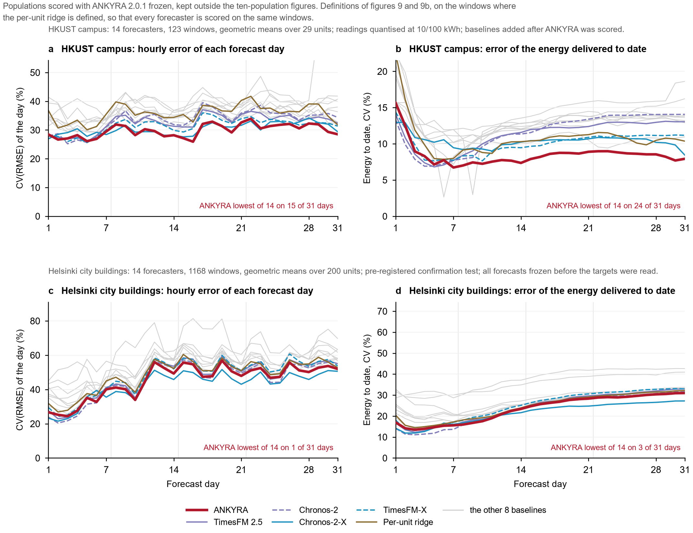

# Checks with the forecaster frozen (4–5 October 2026)

Both were run after ANKYRA 2.0.1 was fixed, with the public package and all its defaults. Neither changes the
forecaster, the result tables of the ten populations, or the figures. Each protocol was written before its run.

- [Another foundation model](#another-foundation-model): Chronos-2 in place of TimesFM; with the Chronos-2-X run, three foundation models on the same windows.
- [A population never used before](#a-population-never-used-before): the HKUST campus, scored once.
- [A pre-registered confirmation test (Helsinki)](#a-pre-registered-confirmation-test-helsinki): criteria fixed in advance; not confirmed.
- [A post-hoc exploration: ANKYRA anchored to Chronos-2-X](#a-post-hoc-exploration-ankyra-anchored-to-chronos-2-x): twelve populations; not a test.

Numbers are improvements in the unit-equal log RMS ratio (positive = the first model has the lower error) with the
95% unit-and-month bootstrap interval of the log ratio (an interval below zero = resolved in favour of the first
model). See [EVALUATION.md](EVALUATION.md) for the estimand.

*Figure 17. a: anchoring gain with either foundation model (ten populations, all windows). b, c: HKUST campus, ANKYRA against each comparator. Filled markers: the 95% interval excludes zero; diamonds: borderline.*

## Another foundation model

**Question.** Does the gain from anchoring depend on TimesFM?

**What was done.** `ankyra.forecast` takes the foundation model's forecasts as an argument. They were replaced by
Chronos-2 point forecasts at the origin and at the six pseudo-origins; nothing else changed and no constant was
chosen again. The result is called ANKYRA-C here. All windows of the ten populations were scored. These populations
had been scored before, so this is a re-evaluation with a pre-specified new arm. It is a descriptive table: the
released forecaster stays the TimesFM-based one.

| Population | Windows | ANKYRA-C vs Chronos-2 (hourly) | ANKYRA vs TimesFM (hourly) | ANKYRA-C vs ANKYRA (hourly) | ANKYRA-C vs Chronos-2 (monthly energy) |
|---|---|---|---|---|---|
| GoiEner non-household | 1,237 | +4.3% [-0.070, +0.018] | +4.3% [-0.072, +0.013] | +1.1% [-0.044, +0.013] | +20.0% [-0.440, -0.102] |
| GoiEner households | 1,258 | -0.9% [-0.009, +0.068] | -2.5% [-0.003, +0.108] | -2.9% [+0.005, +0.075] | +31.9% [-0.518, -0.206] |
| EWELD | 1,023 | +2.5% [-0.042, -0.005] | +3.0% [-0.050, -0.005] | -1.7% [-0.031, +0.131] | +8.3% [-0.200, +0.016] |
| BDG2 2017 | 934 | +6.9% [-0.090, +0.242] | +5.7% [-0.077, +0.225] | +1.9% [-0.128, +0.027] | +16.5% [-0.266, +0.117] |
| Cambridge | 1,456 | +11.4% [-0.141, -0.088] | +9.6% [-0.122, -0.071] | -1.8% [-0.004, +0.036] | +18.9% [-0.278, -0.147] |
| Arizona (HEEW) | 1,282 | +7.7% [-0.104, -0.030] | +4.5% [-0.065, +0.000] | -1.9% [-0.001, +0.042] | +14.6% [-0.248, -0.028] |
| Oslo | 1,147 | +11.7% [-0.152, -0.093] | +10.9% [-0.141, -0.088] | -0.0% [-0.027, +0.027] | +17.9% [-0.266, -0.090] |
| Drammen | 1,375 | +9.8% [-0.138, -0.069] | +11.3% [-0.157, -0.086] | +1.7% [-0.041, +0.007] | +19.3% [-0.327, -0.126] |
| CINELDI | 929 | +5.9% [-0.085, -0.034] | +6.6% [-0.097, -0.036] | +1.5% [-0.037, +0.003] | +16.3% [-0.271, -0.081] |
| Suzhou park | 127 | +17.7% [-0.301, -0.087] | +11.8% [-0.205, -0.045] | -2.7% [-0.021, +0.065] | +22.9% [-0.472, -0.112] |

**Reading.**

- Anchoring improves Chronos-2 in the same pattern as TimesFM: resolved on 7 of ten populations
  (TimesFM: 6), never resolvably worse, and negative only on households, as with TimesFM.
- On the windows after each population's training cutoff the count is 5 of ten for both foundation models.
- Monthly energy error improves resolvably on 8 of ten.
- The two finished forecasters are not separated on nine populations. On households the Chronos-2-based one is
  2.9% worse; Chronos-2 itself is 4.6% worse than TimesFM there.
- Limits: two foundation models were tested, not foundation models in general; the constants were selected under
  TimesFM; the populations were not new. The ANKYRA-vs-TimesFM column is recomputed with this experiment's bootstrap
  seed, so its intervals can differ in the third decimal from `benchmark_pairwise.csv`.

File: [`results/carrier_swap.csv`](../results/carrier_swap.csv) (all windows and late windows, hourly and energy).

### Three foundation models on the same windows

The Chronos-2 run above and the post-hoc Chronos-2-X run
([below](#a-post-hoc-exploration-ankyra-anchored-to-chronos-2-x)) re-scored together with the released TimesFM-anchored forecaster
on one set of windows (units with mean load of at least 10⁻⁶ kW) with one bootstrap seed (20261005). Gain of each anchored version
over its own foundation model; `*` resolved in its favour; none resolved against it; `—` not run. On these windows the TimesFM count
is 7 of 12 hourly (6 of ten in the table above, whose EWELD windows include near-zero meters).

|Population|Windows|Hourly: TimesFM|Hourly: Chronos-2|Hourly: Chronos-2-X|Energy: TimesFM|Energy: Chronos-2|Energy: Chronos-2-X|
|---|---:|---:|---:|---:|---:|---:|---:|
|BDG2|934|+5.7%|+6.9%|+4.1%|+17.4%|+16.5%|+20.5%|
|Cambridge|1,456|+9.6%*|+11.4%*|+4.6%*|+15.7%*|+18.9%*|+8.9%*|
|HEEW|1,282|+4.5%*|+7.7%*|+4.7%*|+10.1%|+14.6%*|+12.2%*|
|EWELD|931|+3.1%*|+2.8%*|+3.6%*|+5.3%|+9.4%|+7.6%|
|GoiEner non-household|1,234|+4.3%|+4.3%|+3.3%|+16.7%*|+20.1%*|+19.5%*|
|GoiEner households|1,232|-0.1%|+0.2%|+0.1%|+29.7%*|+33.3%*|+31.1%*|
|Oslo|1,147|+10.9%*|+11.7%*|+6.0%*|+16.1%*|+17.9%*|+8.2%*|
|Drammen|1,375|+11.3%*|+9.8%*|+4.3%*|+20.1%*|+19.3%*|+9.0%*|
|CINELDI|929|+6.6%*|+5.9%*|+5.4%*|+17.1%*|+16.3%*|+16.4%*|
|Suzhou park|127|+11.8%*|+17.7%*|+14.3%*|+16.4%*|+22.9%*|+20.2%*|
|HKUST campus|120|+8.1%|—|+5.4%*|+37.9%*|—|+12.0%|
|Helsinki|1,165|+4.3%|—|+0.7%|+6.0%|—|+0.6%|

File: [`results/carrier_swap_combined.csv`](../results/carrier_swap_combined.csv) (intervals included, plus the finished forecasters
against each other).

## A population never used before

**Question.** What does the frozen forecaster do on data the project had never read? This is a blind test in the
following sense: no rule or constant of ANKYRA was chosen with this population in view, the units and the scoring
plan were fixed before any load value was opened, inputs were truncated at each origin, and the forecasts were saved
before any target loss was computed. It is not blind for the foundation models, whose pretraining data were not checked.

**Data.** The smart-meter database of the Hong Kong University of Science and Technology campus (Li, Wang, Qu, Chui and Leung-Shea, *Scientific Data* 11, 1284, 2024, doi:10.1038/s41597-024-04106-1; data on Dryad,
doi:10.5061/dryad.k3j9kd5h6, CC0; 1 January 2022 to 27 May 2024). Units are the meters of the incomer circuit
breakers named in the dataset's Brick metadata - the metering points closest to the total of a supply zone. 46 are
named, 38 have cleaned files. The files hold cumulative readings; hourly energy is their difference. Temperature is
ERA5 reanalysis for the campus; Hong Kong general holidays are day type 7; the category is `Public`.

**Procedure.** The unit definition and the scoring plan were written before any load value was opened. Forecasts
were saved with a hash before any target loss was computed, and the first read was one scoring pass. Comparators, a
carrier exploration and a correction of the temperature scale were added afterwards (below); the tables on this page
are from the recomputed forecasts. The usual eligibility rule
(complete load for the context, the six pseudo-origins and the target) leaves **134 windows on 33 units in 19
months**. Three incomers read zero throughout; there the off-state and micro-load rules return TimesFM, both errors
are zero, and the units drop out of the ratio (30 effective units). 125 windows have less than two years of history.

| ANKYRA against | Hourly error | Monthly energy error |
|---|---|---|
| Chronos-2-X (added afterwards) | +3.3% [-0.129, +0.018] | +4.0% [-0.600, +0.659] |
| TimesFM-X (added afterwards) | +4.7% [-0.174, +0.033] | +27.6% [-0.627, +0.123] |
| TimesFM 2.5 | +8.1% [-0.226, -0.001] | +37.9% [-0.802, -0.098] |
| Chronos-2 | +11.0% [-0.290, +0.000] | +42.2% [-0.909, +0.135] |
| Seasonal naive (day) | +22.9% [-0.424, -0.142] | +38.4% [-1.043, +0.259] |
| Seasonal naive (week) | +23.8% [-0.440, -0.168] | +40.8% [-0.911, +0.239] |
| Four-week profile | +12.1% [-0.224, -0.068] | +40.7% [-0.808, +0.136] |
| Previous-month profile | +11.7% [-0.223, -0.054] | +38.8% [-0.763, +0.027] |
| Last-year profile | +18.7% [-0.384, -0.101] | +25.8% [-0.641, +0.244] |
| Per-unit ridge | +15.9% [-0.716, +0.022] | +23.5% [-0.656, +0.086] |

Mean unit rank among the eight models first scored on all windows: ANKYRA 2.03, TimesFM 3.45; among ten, with the two
added models: ANKYRA 2.52, TimesFM-X 4.03, TimesFM 4.58, Chronos-2-X 4.76.
The per-unit ridge is defined on 123 windows of 32 units. Baselines that must be trained on the population were not fitted.

**The two covariate-informed foundation models** (Chronos-2-X and TimesFM-X, which receive the same information as
ANKYRA) were run afterwards on the same windows, with the features and calls of the ten-population comparison. ANKYRA's
forecasts were already frozen and scored, so this completes the comparison and is not a second blind test. ANKYRA is
not separated from either, on hourly or energy error, under any of six bootstrap seeds; its mean unit rank stays
first. This matches the ten populations, where Chronos-2-X is the closest competitor.

**Three more baselines and the per-day curves** (Holt-Winters, MSTL and the zero-shot GBT, which need no training on
the population) were then run the same way, again against the frozen forecasts and again not a blind test. With them
the HKUST comparison has the same 14 forecasters as the full-window comparison of the ten populations. ANKYRA's hourly
error is 15%, 22% and 57% lower than theirs, each resolved under every seed; on monthly energy it is resolved only
against MSTL (50%). Mean unit rank among the 14 on the 123 ridge-defined windows: ANKYRA 3.23, per-unit ridge 4.20,
TimesFM-X 5.31, TimesFM 5.73. Figure 18 shows the per-day curves with the definitions of figures 9 and 9b: ANKYRA has
the lowest hourly error of the 14 on 15 of 31 days and the lowest energy error to date on 24.

*Figure 18. Per-day curves of 14 forecasters: HKUST (a, b; `results/hkust_by_day.csv`; quantised readings flatten the
hourly curves) and Helsinki (c, d; `results/helsinki_by_day.csv`).*

**Reading - weaker than the table looks.**

- Every point estimate favours ANKYRA, but the two hourly intervals against the foundation models end at zero.
  An independent recomputation with five bootstrap seeds excluded zero once against TimesFM and four times against
  Chronos-2. Both are borderline.
- The meters are coarsely quantised (steps of 10 or 100 kWh). On the 11 units whose step is at least a quarter of
  their mean load, ANKYRA and TimesFM are level (mean log ratio -0.007); the hourly gain is in the other 19 (-0.129).
- Monthly energy error, which quantisation does not affect, is 38% below TimesFM's, with an interval that excludes
  zero under every seed tried. Against the other comparators the energy intervals include zero.
- The sample is small and uneven: 1 to 17 windows per unit, 59 of the 134 windows in two months.
- One constant, the temperature scale, was first computed from the first 244 days as planned, which for the four
  windows issued on 1 September 2022 included 24 hours after the origin. It was then refitted on the 243 days before
  the first origin and every ANKYRA forecast on HKUST was run again: forecasts change by at most 4.4 × 10⁻⁵ of their
  peak, every result changes by at most 0.001 percentage points and no decision changes. The result files
  (`results/hkust_*`, `results/carrier_swap_*`) and Figures 17-18 come from the recomputed forecasts. No forecaster and
  no constant uses information after its origin.
- Whether TimesFM or Chronos-2 was pretrained on this dataset (published 2024) was not checked.

This is one population scored once. It is not merged into the ten-population tables and it does not show that the
forecaster generalises; it shows that the frozen forecaster did not fail on first contact with an unseen estate.

File: [`results/hkust_first_read.csv`](../results/hkust_first_read.csv). The column `resolved_at_seed_20261004` is the
reading under one bootstrap seed; see the first bullet above. `units_better_strict` counts units with a strictly lower
summed error and so includes the three all-zero units for Chronos-2 (26 of the 30 non-zero units are better).

## A pre-registered confirmation test (Helsinki)

**Question.** Does the frozen forecaster's advantage hold on a new, large population under criteria written before
any load value is read?

**Data.** Energy consumption of the City of Helsinki's service properties, Nuuka Open API (City of Helsinki, Urban
Environment Division; licence listed as CC BY 4.0 in the regional and national open-data catalogues). Hourly electricity,
2023-01-01 to 2026-10-03, pulled on 5 October 2026 and not redistributed. Preparation: [DATA.md](DATA.md).

**Procedure.** The protocol fixed the sample (300 property codes drawn by SHA-256 of the code, after excluding three
properties looked at during a format check), the units (one electricity series each), the grid (fixed UTC+2; the
provider's two-hour autumn record split evenly and flagged), the window rules of the ten populations, eleven origins
(2025-11 to 2026-09, after the public release of TimesFM 2.5 and Chronos-2), the 14 forecasters of the full-window
comparison, the estimand and the criteria. It was frozen with the hashes of all 978 raw files before any load value
was parsed. Inputs were truncated at each origin and all 14 forecasts were saved with a hash before any target loss was computed;
the targets were scored once. A
first scoring attempt stopped while loading the targets (memory) before any statistic was computed; this is recorded.

**Criteria (seed 20261005).** Primary: monthly energy error, ANKYRA against TimesFM 2.5, upper end of the 95%
unit-and-month interval below zero. Secondary: hourly error, lower end at or below zero. Confirmation needs both.

**Result: not confirmed.**

| Criterion | Improvement | Interval of the log ratio | Outcome |
|---|---|---|---|
| Monthly energy vs TimesFM | 6.0% | [−0.152, +0.104] | failed |
| Hourly vs TimesFM | 4.3% | [−0.093, +0.022] | passed |

Five further bootstrap seeds and an independent recomputation (own code, another seed) give the same decisions.

| ANKYRA against | Hourly | Monthly energy |
|---|---|---|
| TimesFM 2.5 | +4.3% | +6.0% |
| Chronos-2 | +1.9% | +1.7% |
| Chronos-2-X | **−6.3% (resolved against)** | **−13.9% (resolved against)** |
| TimesFM-X | +4.5% | +6.0% |
| Per-unit ridge | +4.5% * | +3.7% |
| GBT (zero-shot) | +14.2% * | +2.8% |
| Holt-Winters | +7.6% * | +3.5% |
| MSTL | +9.8% * | +8.0% |
| Seasonal naive (day / week) | +27.8% * / +11.0% * | +27.3% * / +5.6% |
| Four-week / previous-month / last-year profile | +5.1% / +11.4% * / +21.5% * | +0.0% / +2.8% / +24.3% * |

\* resolved in ANKYRA's favour. 200 units with non-zero load, 1,165 windows. Mean unit rank among the 14: Chronos-2-X
4.08, ANKYRA 4.33, Chronos-2 4.92, TimesFM-X 5.93, TimesFM 6.05. Per-day curves: Figure 18 c, d (ANKYRA below TimesFM
on 25 of 31 days on both curves, below Chronos-2-X on 3 and 6). Files: `results/helsinki_confirmation.csv`,
`results/helsinki_criteria.json`, `results/helsinki_by_day.csv`.

**Reading.** On a new country with long, finely metered histories, the frozen forecaster is not separated from
TimesFM on either error and is resolvably worse than the covariate-conditioned Chronos-2-X. The energy advantage seen
on the ten populations and on HKUST is therefore not confirmed. Post-hoc descriptions locate, but do not explain, the
difference. In the exact block split, ANKYRA's error is higher than Chronos-2-X's mainly in the monthly level (by 13.9%,
resolved; the largest block of the error) and by 4.2% in the within-day block (resolved); against its own carrier
TimesFM, ANKYRA's within-day error is 6.1% lower (resolved). Temperature sensitivity is not the reason: the share of daily-load variance that temperature
explains beyond the calendar is 0.10 at the median Helsinki unit, inside the range of the ten populations
(0.05–0.70), unrelated to the gap to Chronos-2-X across them, and the gap is similar in the least and most
temperature-sensitive thirds of the Helsinki units. Boundary of use: on a new population, a covariate-informed
foundation model can forecast the monthly level better than ANKYRA's history-weighted level.

## A post-hoc exploration: ANKYRA anchored to Chronos-2-X

**Status.** Requested after the Helsinki result; no criterion fixed in advance; all twelve populations scored before (Helsinki for
the fourth time); nothing in ANKYRA 2.0.1 changed, constants selected with TimesFM. An exploration, not a test.

**Procedure.** `ankyra.forecast` received Chronos-2-X point forecasts as its foundation forecasts: at the origin the forecasts already
scored, at the pseudo-origins k = 1..6 new forecasts with the covariates of the equal-information set built at each pseudo-origin from
data before it (about 60,000 contexts). Unit-equal log RMS ratio, 95% unit-and-month interval (seed 20261005), all windows.

|Population|Windows|vs Chronos-2-X, hourly|vs Chronos-2-X, energy|vs ANKYRA, hourly|vs ANKYRA, energy|
|---|---:|---:|---:|---:|---:|
|BDG2|934|+4.1%|+20.5%|-10.5%|+0.6%|
|Cambridge|1,456|+4.6%*|+8.9%*|+5.4%*|+8.9%*|
|HEEW|1,282|+4.7%*|+12.2%*|+1.3%|+3.6%|
|EWELD|931|+3.6%*|+7.6%|-0.3%|-8.0%|
|GoiEner non-household|1,234|+3.3%|+19.5%*|+0.6%|+4.9%|
|GoiEner households|1,232|+0.1%|+31.1%*|-0.2%|+2.5%|
|Oslo|1,147|+6.0%*|+8.2%*|+6.2%*|+11.5%*|
|Drammen|1,375|+4.3%*|+9.0%*|+4.5%*|+9.4%|
|CINELDI|929|+5.4%*|+16.4%*|+2.4%|+4.0%|
|Suzhou park|127|+14.3%*|+20.2%*|+1.5%|+4.2%|
|HKUST campus|120|+5.4%*|+12.0%|+2.2%|+8.4%|
|Helsinki|1,165|+0.7%|+0.6%|+6.6%*|+12.7%*|

`*` resolved in favour of ANKYRA-X; no interval excludes zero against it. The BDG2 hourly contrast against ANKYRA (−10.5%) has a wide
interval and is driven by the near-zero meters. File: `results/carrier_swap_x.csv` (intervals included).
