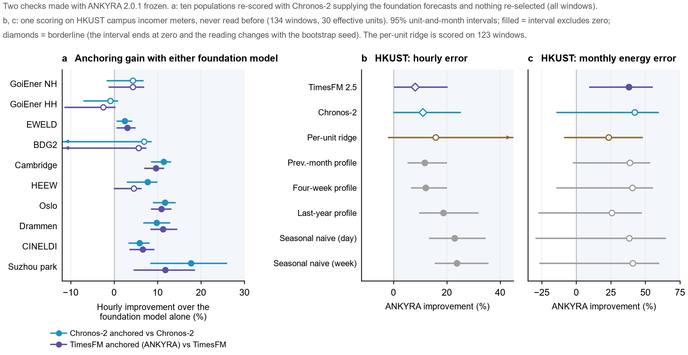

# Two checks with the forecaster frozen (4 October 2026)

Both were run after ANKYRA 2.0.1 was fixed, with the public package and all its defaults. Neither changes the
forecaster, the result tables of the ten populations, or the figures. Each protocol was written before its run.

- [Another foundation model](#another-foundation-model): Chronos-2 in place of TimesFM.
- [A population never used before](#a-population-never-used-before): the HKUST campus, scored once.

Numbers are improvements in the unit-equal log RMS ratio (positive = the first model has the lower error) with the
95% unit-and-month bootstrap interval of the log ratio (an interval below zero = resolved in favour of the first
model). See [EVALUATION.md](EVALUATION.md) for the estimand.

*Figure 17. a: anchoring gain with either foundation model (ten populations, all windows). b, c: HKUST campus, ANKYRA against each comparator. Filled markers: the 95% interval excludes zero; diamonds: borderline.*

## Another foundation model

**Question.** Does the gain from anchoring depend on TimesFM?

**What was done.** `ankyra.forecast` takes the foundation model's forecasts as an argument. They were replaced by
Chronos-2 point forecasts at the origin and at the six pseudo-origins; nothing else changed and no constant was
chosen again. The result is called ANKYRA-C here. All windows of the ten populations were scored. These populations
had been scored before, so this is a re-evaluation with a pre-specified new arm. It is a descriptive table: the
released forecaster stays the TimesFM-based one.

| Population | Windows | ANKYRA-C vs Chronos-2 (hourly) | ANKYRA vs TimesFM (hourly) | ANKYRA-C vs ANKYRA (hourly) | ANKYRA-C vs Chronos-2 (monthly energy) |
|---|---|---|---|---|---|
| GoiEner non-household | 1,237 | +4.3% [-0.070, +0.018] | +4.3% [-0.072, +0.013] | +1.1% [-0.044, +0.013] | +20.0% [-0.440, -0.102] |
| GoiEner households | 1,258 | -0.9% [-0.009, +0.068] | -2.5% [-0.003, +0.108] | -2.9% [+0.005, +0.075] | +31.9% [-0.518, -0.206] |
| EWELD | 1,023 | +2.5% [-0.042, -0.005] | +3.0% [-0.050, -0.005] | -1.7% [-0.031, +0.131] | +8.3% [-0.200, +0.016] |
| BDG2 2017 | 934 | +6.9% [-0.090, +0.242] | +5.7% [-0.077, +0.225] | +1.9% [-0.128, +0.027] | +16.5% [-0.266, +0.117] |
| Cambridge | 1,456 | +11.4% [-0.141, -0.088] | +9.6% [-0.122, -0.071] | -1.8% [-0.004, +0.036] | +18.9% [-0.278, -0.147] |
| Arizona (HEEW) | 1,282 | +7.7% [-0.104, -0.030] | +4.5% [-0.065, +0.000] | -1.9% [-0.001, +0.042] | +14.6% [-0.248, -0.028] |
| Oslo | 1,147 | +11.7% [-0.152, -0.093] | +10.9% [-0.141, -0.088] | -0.0% [-0.027, +0.027] | +17.9% [-0.266, -0.090] |
| Drammen | 1,375 | +9.8% [-0.138, -0.069] | +11.3% [-0.157, -0.086] | +1.7% [-0.041, +0.007] | +19.3% [-0.327, -0.126] |
| CINELDI | 929 | +5.9% [-0.085, -0.034] | +6.6% [-0.097, -0.036] | +1.5% [-0.037, +0.003] | +16.3% [-0.271, -0.081] |
| Suzhou park | 127 | +17.7% [-0.301, -0.087] | +11.8% [-0.205, -0.045] | -2.7% [-0.021, +0.065] | +22.9% [-0.472, -0.112] |

**Reading.**

- Anchoring improves Chronos-2 in the same pattern as TimesFM: resolved on 7 of ten populations
  (TimesFM: 6), never resolvably worse, and negative only on households, as with TimesFM.
- On the windows after each population's training cutoff the count is 5 of ten for both foundation models.
- Monthly energy error improves resolvably on 8 of ten.
- The two finished forecasters are not separated on nine populations. On households the Chronos-2-based one is
  2.9% worse; Chronos-2 itself is 4.6% worse than TimesFM there.
- Limits: two foundation models were tested, not foundation models in general; the constants were selected under
  TimesFM; the populations were not new. The ANKYRA-vs-TimesFM column is recomputed with this experiment's bootstrap
  seed, so its intervals can differ in the third decimal from `benchmark_pairwise.csv`.

File: [`results/carrier_swap.csv`](../results/carrier_swap.csv) (all windows and late windows, hourly and energy).

## A population never used before

**Question.** What does the frozen forecaster do on data the project had never read?

**Data.** The smart-meter database of the Hong Kong University of Science and Technology campus (Li, Wang, Qu, Chui and Leung-Shea, *Scientific Data* 11, 1284, 2024, doi:10.1038/s41597-024-04106-1; data on Dryad,
doi:10.5061/dryad.k3j9kd5h6, CC0; 1 January 2022 to 27 May 2024). Units are the meters of the incomer circuit
breakers named in the dataset's Brick metadata - the metering points closest to the total of a supply zone. 46 are
named, 38 have cleaned files. The files hold cumulative readings; hourly energy is their difference. Temperature is
ERA5 reanalysis for the campus; Hong Kong general holidays are day type 7; the category is `Public`.

**Procedure.** The unit definition and the scoring plan were written before any load value was opened. Forecasts
were saved with a hash before the targets were read, and the targets were scored once. The usual eligibility rule
(complete load for the context, the six pseudo-origins and the target) leaves **134 windows on 33 units in 19
months**. Three incomers read zero throughout; there the off-state and micro-load rules return TimesFM, both errors
are zero, and the units drop out of the ratio (30 effective units). 125 windows have less than two years of history.

| ANKYRA against | Hourly error | Monthly energy error |
|---|---|---|
| TimesFM 2.5 | +8.1% [-0.226, -0.001] | +37.9% [-0.802, -0.098] |
| Chronos-2 | +11.0% [-0.290, +0.000] | +42.2% [-0.909, +0.135] |
| Seasonal naive (day) | +22.9% [-0.424, -0.142] | +38.4% [-1.043, +0.259] |
| Seasonal naive (week) | +23.8% [-0.440, -0.168] | +40.8% [-0.911, +0.239] |
| Four-week profile | +12.1% [-0.224, -0.068] | +40.7% [-0.808, +0.136] |
| Previous-month profile | +11.7% [-0.223, -0.054] | +38.8% [-0.763, +0.027] |
| Last-year profile | +18.7% [-0.384, -0.101] | +25.8% [-0.641, +0.244] |
| Per-unit ridge | +15.9% [-0.716, +0.022] | +23.5% [-0.656, +0.086] |

Mean unit rank among the eight models scored on all windows: ANKYRA 2.03, TimesFM 3.45.
The per-unit ridge is defined on 123 windows of 32 units. Baselines that must be trained on the population were not fitted.

**Reading - weaker than the table looks.**

- Every point estimate favours ANKYRA, but the two hourly intervals against the foundation models end at zero.
  An independent recomputation with five bootstrap seeds excluded zero once against TimesFM and four times against
  Chronos-2. Both are borderline.
- The meters are coarsely quantised (steps of 10 or 100 kWh). On the 11 units whose step is at least a quarter of
  their mean load, ANKYRA and TimesFM are level (mean log ratio -0.007); the hourly gain is in the other 19 (-0.129).
- Monthly energy error, which quantisation does not affect, is 38% below TimesFM's, with an interval that excludes
  zero under every seed tried. Against the other comparators the energy intervals include zero.
- The sample is small and uneven: 1 to 17 windows per unit, 59 of the 134 windows in two months.
- One constant, the temperature scale, was computed from the first 244 days as planned; for four windows that
  includes 24 hours after the origin (0.2% of its value). No forecaster reads load or temperature after its origin.
- Whether TimesFM or Chronos-2 was pretrained on this dataset (published 2024) was not checked.

This is one population scored once. It is not merged into the ten-population tables and it does not show that the
forecaster generalises; it shows that the frozen forecaster did not fail on first contact with an unseen estate.

File: [`results/hkust_first_read.csv`](../results/hkust_first_read.csv). The column `resolved_at_seed_20261004` is the
reading under one bootstrap seed; see the first bullet above. `units_better_strict` counts units with a strictly lower
summed error and so includes the three all-zero units for Chronos-2 (26 of the 30 non-zero units are better).
